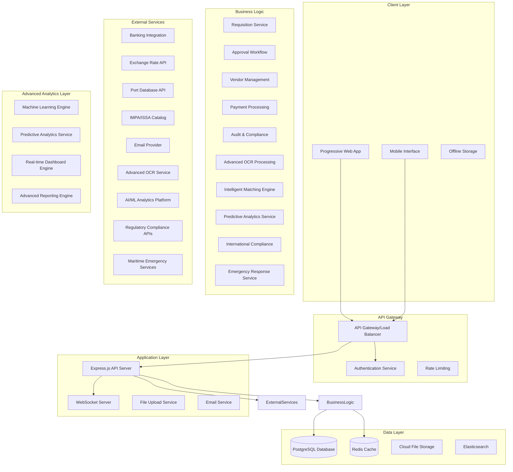
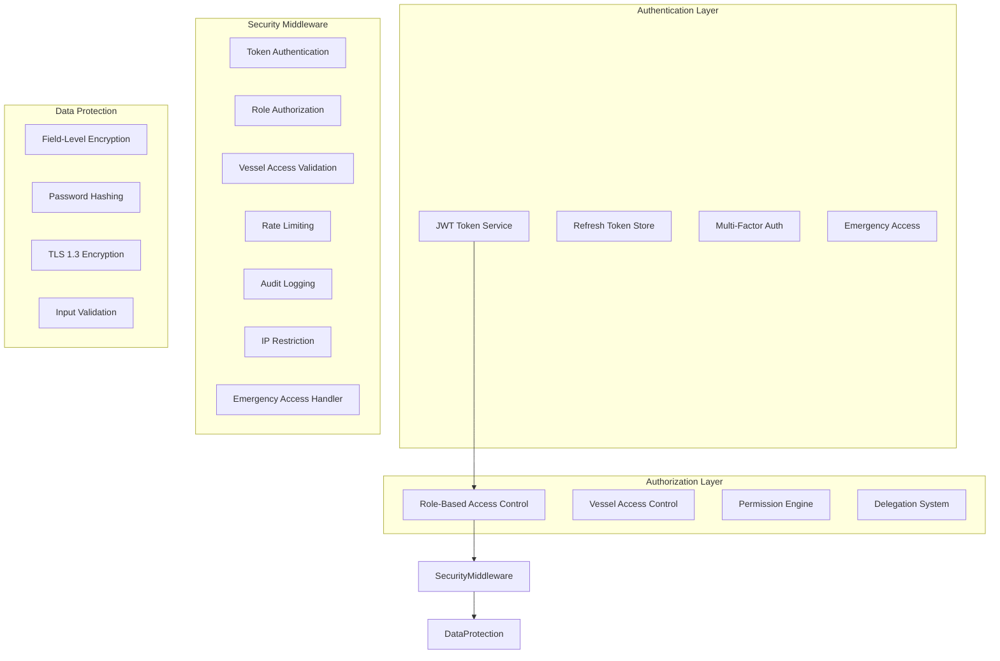
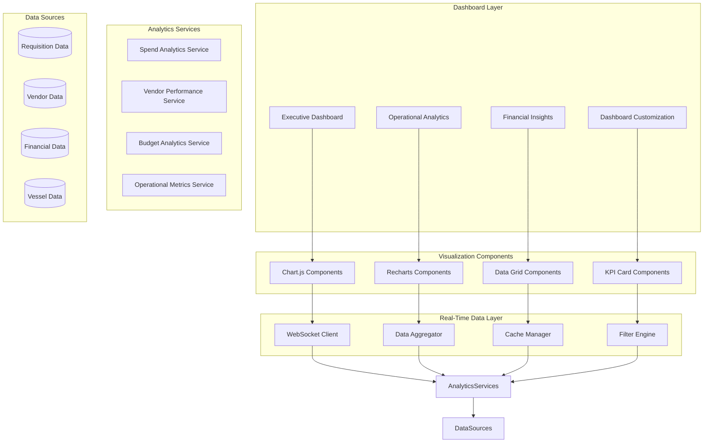
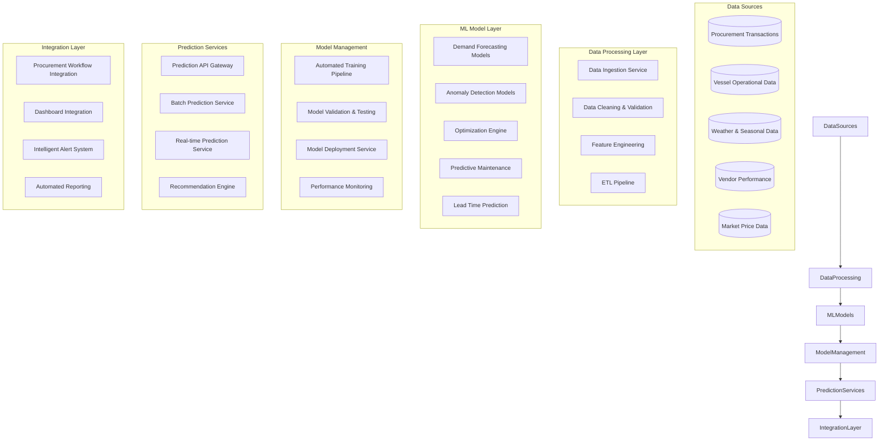
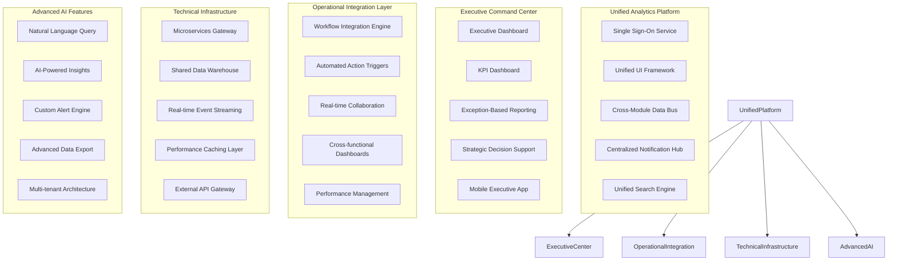
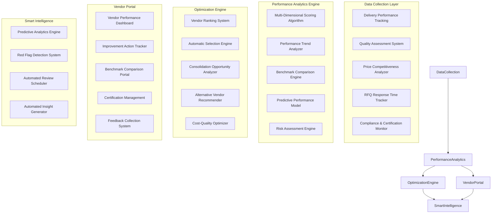
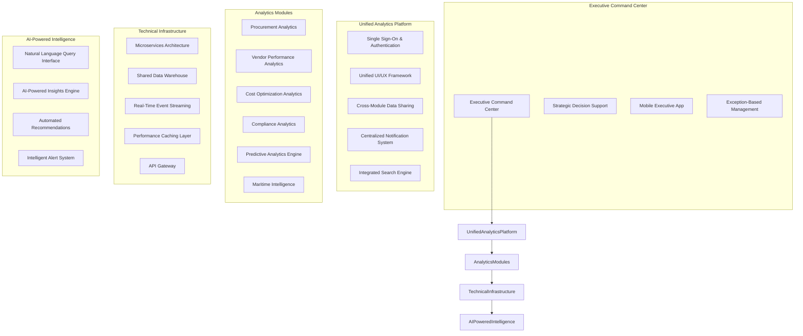

# FlowMarine Design Document

## Overview

FlowMarine is a comprehensive maritime procurement workflow platform built with a modern, scalable architecture. The system uses a React TypeScript frontend with a Node.js/Express backend, PostgreSQL database, and implements robust security measures specifically designed for maritime operations. The platform supports offline capabilities for vessel operations, real-time notifications, and comprehensive audit trails for regulatory compliance.

## Architecture

### High-Level Architecture



### Security Architecture



## Components and Interfaces

### Frontend Architecture

#### Component Structure
```
src/
├── components/
│   ├── common/
│   │   ├── Layout/
│   │   ├── Navigation/
│   │   ├── Forms/
│   │   └── DataTable/
│   ├── auth/
│   │   ├── LoginForm/
│   │   ├── PasswordReset/
│   │   └── ProfileManagement/
│   ├── requisitions/
│   │   ├── RequisitionForm/
│   │   ├── RequisitionList/
│   │   ├── ItemCatalog/
│   │   └── ApprovalWorkflow/
│   ├── vendors/
│   │   ├── VendorManagement/
│   │   ├── RFQGeneration/
│   │   └── QuoteComparison/
│   ├── orders/
│   │   ├── PurchaseOrders/
│   │   ├── DeliveryTracking/
│   │   └── InvoiceProcessing/
│   ├── analytics/
│   │   ├── Dashboard/
│   │   ├── Reports/
│   │   ├── ComplianceReports/
│   │   ├── PredictiveAnalytics/
│   │   ├── RealTimeDashboard/
│   │   ├── ExecutiveDashboard/
│   │   ├── OperationalAnalytics/
│   │   ├── FinancialInsights/
│   │   └── DashboardCustomization/
│   ├── financial/
│   │   ├── AdvancedInvoiceProcessing/
│   │   ├── ThreeWayMatching/
│   │   ├── MultiCurrencyPayments/
│   │   └── BankingIntegration/
│   ├── maritime/
│   │   ├── IMPACatalogIntegration/
│   │   ├── PortLogistics/
│   │   ├── RouteBasedProcurement/
│   │   └── EmergencyResponse/
│   └── compliance/
│       ├── InternationalCompliance/
│       ├── RegulatoryReporting/
│       └── ComplianceAutomation/
├── hooks/
│   ├── useAuth.ts
│   ├── useOfflineSync.ts
│   ├── useWebSocket.ts
│   └── usePermissions.ts
├── store/
│   ├── slices/
│   │   ├── authSlice.ts
│   │   ├── requisitionSlice.ts
│   │   ├── vendorSlice.ts
│   │   └── notificationSlice.ts
│   └── api/
│       ├── authApi.ts
│       ├── requisitionApi.ts
│       └── vendorApi.ts
└── utils/
    ├── offlineStorage.ts
    ├── encryption.ts
    └── validation.ts
```

#### Redux Store Structure
```typescript
interface RootState {
  auth: {
    user: User | null;
    token: string | null;
    permissions: Permission[];
    isAuthenticated: boolean;
    vessels: Vessel[];
  };
  requisitions: {
    items: Requisition[];
    filters: RequisitionFilters;
    loading: boolean;
    offline: OfflineRequisition[];
  };
  vendors: {
    vendors: Vendor[];
    rfqs: RFQ[];
    quotes: Quote[];
  };
  notifications: {
    items: Notification[];
    unreadCount: number;
  };
  offline: {
    isOnline: boolean;
    pendingSync: SyncItem[];
    lastSync: Date;
  };
}
```

### Backend Architecture

#### API Structure
```
src/
├── controllers/
│   ├── authController.ts
│   ├── requisitionController.ts
│   ├── vendorController.ts
│   ├── orderController.ts
│   ├── analyticsController.ts
│   ├── advancedFinancialController.ts
│   ├── predictiveAnalyticsController.ts
│   ├── complianceController.ts
│   ├── emergencyController.ts
│   └── maritimeIntegrationController.ts
├── middleware/
│   ├── authentication.ts
│   ├── authorization.ts
│   ├── vesselAccess.ts
│   ├── rateLimiting.ts
│   ├── auditLogging.ts
│   ├── ipRestriction.ts
│   └── emergencyAccess.ts
├── services/
│   ├── authService.ts
│   ├── requisitionService.ts
│   ├── approvalService.ts
│   ├── vendorService.ts
│   ├── paymentService.ts
│   ├── notificationService.ts
│   ├── auditService.ts
│   ├── advancedOCRService.ts
│   ├── threeWayMatchingService.ts
│   ├── multiCurrencyPaymentService.ts
│   ├── bankingIntegrationService.ts
│   ├── predictiveAnalyticsService.ts
│   ├── realTimeAnalyticsService.ts
│   ├── complianceAutomationService.ts
│   ├── portLogisticsService.ts
│   ├── routeOptimizationService.ts
│   ├── emergencyResponseService.ts
│   └── internationalComplianceService.ts
├── models/
│   ├── User.ts
│   ├── Vessel.ts
│   ├── Requisition.ts
│   ├── Vendor.ts
│   └── AuditLog.ts
├── utils/
│   ├── encryption.ts
│   ├── validation.ts
│   ├── emailService.ts
│   └── fileUpload.ts
└── config/
    ├── database.ts
    ├── security.ts
    └── external-apis.ts
```

#### Security Middleware Implementation

```typescript
// Authentication Middleware
export const authenticateToken = async (req: Request, res: Response, next: NextFunction) => {
  const authHeader = req.headers['authorization'];
  const token = authHeader && authHeader.split(' ')[1];
  
  if (!token) {
    return res.status(401).json({ error: 'Access token required' });
  }
  
  try {
    const decoded = jwt.verify(token, process.env.JWT_SECRET!) as JWTPayload;
    
    // Check if token is close to expiry and refresh if needed
    if (decoded.exp - Date.now() / 1000 < 300) { // 5 minutes
      const refreshToken = await RefreshToken.findOne({ userId: decoded.userId });
      if (refreshToken && !refreshToken.isExpired()) {
        const newToken = generateAccessToken(decoded.userId);
        res.setHeader('X-New-Token', newToken);
      }
    }
    
    req.user = await User.findById(decoded.userId).populate('vessels permissions');
    next();
  } catch (error) {
    return res.status(403).json({ error: 'Invalid or expired token' });
  }
};

// Role-Based Authorization
export const authorizeRole = (requiredPermissions: string[]) => {
  return (req: Request, res: Response, next: NextFunction) => {
    const userPermissions = req.user.permissions.map(p => p.name);
    const hasPermission = requiredPermissions.some(permission => 
      userPermissions.includes(permission)
    );
    
    if (!hasPermission) {
      auditLogger.log({
        userId: req.user.id,
        action: 'UNAUTHORIZED_ACCESS_ATTEMPT',
        resource: req.path,
        requiredPermissions,
        userPermissions,
        ip: req.ip
      });
      return res.status(403).json({ error: 'Insufficient permissions' });
    }
    
    next();
  };
};

// Vessel Access Control
export const validateVesselAccess = (req: Request, res: Response, next: NextFunction) => {
  const vesselId = req.params.vesselId || req.body.vesselId;
  const userVessels = req.user.vessels.map(v => v.id);
  
  if (vesselId && !userVessels.includes(vesselId)) {
    auditLogger.log({
      userId: req.user.id,
      action: 'VESSEL_ACCESS_DENIED',
      vesselId,
      userVessels,
      ip: req.ip
    });
    return res.status(403).json({ error: 'Access denied to vessel' });
  }
  
  next();
};
```

## Data Models

### Core Database Schema

```typescript
// User Management
interface User {
  id: string;
  email: string;
  passwordHash: string;
  firstName: string;
  lastName: string;
  role: UserRole;
  isActive: boolean;
  emailVerified: boolean;
  lastLogin: Date;
  failedLoginAttempts: number;
  accountLockedUntil?: Date;
  vessels: Vessel[];
  permissions: Permission[];
  createdAt: Date;
  updatedAt: Date;
}

interface Vessel {
  id: string;
  name: string;
  imoNumber: string;
  vesselType: string;
  flag: string;
  engineType: string;
  cargoCapacity: number;
  fuelConsumption: number;
  crewComplement: number;
  currentPosition: {
    latitude: number;
    longitude: number;
    lastUpdate: Date;
  };
  currentVoyage?: {
    departure: string;
    destination: string;
    eta: Date;
    route: string;
  };
  certificates: VesselCertificate[];
  specifications: VesselSpecification[];
  createdAt: Date;
  updatedAt: Date;
}

// Procurement Entities
interface Requisition {
  id: string;
  requisitionNumber: string;
  vesselId: string;
  requestedBy: string;
  urgencyLevel: 'ROUTINE' | 'URGENT' | 'EMERGENCY';
  status: RequisitionStatus;
  totalAmount: number;
  currency: string;
  deliveryLocation: string;
  deliveryDate: Date;
  justification: string;
  items: RequisitionItem[];
  approvals: Approval[];
  createdAt: Date;
  updatedAt: Date;
}

interface ItemCatalog {
  id: string;
  impaCode: string;
  issaCode: string;
  name: string;
  description: string;
  category: ItemCategory;
  criticalityLevel: 'SAFETY_CRITICAL' | 'OPERATIONAL_CRITICAL' | 'ROUTINE';
  specifications: Record<string, any>;
  compatibleVesselTypes: string[];
  compatibleEngineTypes: string[];
  unitOfMeasure: string;
  averagePrice: number;
  leadTime: number;
  createdAt: Date;
  updatedAt: Date;
}

// Vendor Management
interface Vendor {
  id: string;
  name: string;
  code: string;
  contactInfo: ContactInfo;
  bankingDetails: EncryptedBankingDetails;
  serviceAreas: ServiceArea[];
  portCapabilities: PortCapability[];
  paymentTerms: string;
  creditLimit: number;
  qualityRating: number;
  deliveryRating: number;
  priceRating: number;
  overallScore: number;
  certifications: string[];
  isActive: boolean;
  createdAt: Date;
  updatedAt: Date;
}

// Financial Management
interface PurchaseOrder {
  id: string;
  poNumber: string;
  requisitionId: string;
  vendorId: string;
  vesselId: string;
  totalAmount: number;
  currency: string;
  exchangeRate: number;
  paymentTerms: string;
  deliveryTerms: string;
  status: POStatus;
  items: POLineItem[];
  deliveries: Delivery[];
  invoices: Invoice[];
  createdAt: Date;
  updatedAt: Date;
}
```

### Prisma Schema Structure

```prisma
generator client {
  provider = "prisma-client-js"
}

datasource db {
  provider = "postgresql"
  url      = env("DATABASE_URL")
}

model User {
  id                    String    @id @default(cuid())
  email                 String    @unique
  passwordHash          String
  firstName             String
  lastName              String
  role                  UserRole
  isActive              Boolean   @default(true)
  emailVerified         Boolean   @default(false)
  emailVerificationToken String?
  lastLogin             DateTime?
  failedLoginAttempts   Int       @default(0)
  accountLockedUntil    DateTime?
  
  // Relationships
  vessels               VesselAssignment[]
  permissions           UserPermission[]
  requisitions          Requisition[]
  approvals             Approval[]
  auditLogs             AuditLog[]
  refreshTokens         RefreshToken[]
  
  createdAt             DateTime  @default(now())
  updatedAt             DateTime  @updatedAt
  
  @@map("users")
  @@index([email])
  @@index([role])
}

model Vessel {
  id                String     @id @default(cuid())
  name              String
  imoNumber         String     @unique
  vesselType        String
  flag              String
  engineType        String
  cargoCapacity     Float
  fuelConsumption   Float
  crewComplement    Int
  
  // Position tracking
  currentLatitude   Float?
  currentLongitude  Float?
  positionUpdatedAt DateTime?
  
  // Current voyage
  currentDeparture  String?
  currentDestination String?
  currentETA        DateTime?
  currentRoute      String?
  
  // Relationships
  assignments       VesselAssignment[]
  requisitions      Requisition[]
  certificates      VesselCertificate[]
  specifications    VesselSpecification[]
  purchaseOrders    PurchaseOrder[]
  
  createdAt         DateTime   @default(now())
  updatedAt         DateTime   @updatedAt
  
  @@map("vessels")
  @@index([imoNumber])
  @@index([vesselType])
}

model ItemCatalog {
  id                    String            @id @default(cuid())
  impaCode              String?           @unique
  issaCode              String?           @unique
  name                  String
  description           String?
  category              ItemCategory
  criticalityLevel      CriticalityLevel
  specifications        Json?
  compatibleVesselTypes String[]
  compatibleEngineTypes String[]
  unitOfMeasure         String
  averagePrice          Float?
  leadTime              Int?              // in days
  
  // Relationships
  requisitionItems      RequisitionItem[]
  quoteLineItems        QuoteLineItem[]
  
  createdAt             DateTime          @default(now())
  updatedAt             DateTime          @updatedAt
  
  @@map("item_catalog")
  @@index([impaCode])
  @@index([issaCode])
  @@index([category])
  @@index([criticalityLevel])
}

model Requisition {
  id                String              @id @default(cuid())
  requisitionNumber String              @unique
  vesselId          String
  requestedById     String
  urgencyLevel      UrgencyLevel
  status            RequisitionStatus   @default(DRAFT)
  totalAmount       Float               @default(0)
  currency          String              @default("USD")
  deliveryLocation  String?
  deliveryDate      DateTime?
  justification     String?
  
  // Relationships
  vessel            Vessel              @relation(fields: [vesselId], references: [id])
  requestedBy       User                @relation(fields: [requestedById], references: [id])
  items             RequisitionItem[]
  approvals         Approval[]
  rfqs              RFQ[]
  
  createdAt         DateTime            @default(now())
  updatedAt         DateTime            @updatedAt
  
  @@map("requisitions")
  @@index([vesselId])
  @@index([requestedById])
  @@index([status])
  @@index([urgencyLevel])
}

// Additional models for comprehensive system...
```

## Error Handling

### Centralized Error Handling Strategy

```typescript
// Custom Error Classes
export class AppError extends Error {
  statusCode: number;
  isOperational: boolean;
  errorCode: string;
  
  constructor(message: string, statusCode: number, errorCode: string) {
    super(message);
    this.statusCode = statusCode;
    this.isOperational = true;
    this.errorCode = errorCode;
    
    Error.captureStackTrace(this, this.constructor);
  }
}

// Maritime-specific errors
export class VesselAccessError extends AppError {
  constructor(vesselId: string, userId: string) {
    super(`Access denied to vessel ${vesselId}`, 403, 'VESSEL_ACCESS_DENIED');
    this.name = 'VesselAccessError';
  }
}

export class EmergencyProcedureError extends AppError {
  constructor(message: string) {
    super(message, 400, 'EMERGENCY_PROCEDURE_ERROR');
    this.name = 'EmergencyProcedureError';
  }
}

// Global Error Handler
export const globalErrorHandler = (
  err: Error,
  req: Request,
  res: Response,
  next: NextFunction
) => {
  let error = { ...err };
  error.message = err.message;
  
  // Log error
  logger.error({
    error: err,
    request: {
      method: req.method,
      url: req.url,
      headers: req.headers,
      body: req.body,
      user: req.user?.id
    }
  });
  
  // Audit security-related errors
  if (err instanceof VesselAccessError || err.name === 'UnauthorizedError') {
    auditService.logSecurityEvent({
      userId: req.user?.id,
      action: 'SECURITY_ERROR',
      error: err.message,
      ip: req.ip,
      userAgent: req.get('User-Agent')
    });
  }
  
  // Send appropriate response
  if (error.isOperational) {
    res.status(error.statusCode).json({
      success: false,
      error: error.message,
      code: error.errorCode
    });
  } else {
    res.status(500).json({
      success: false,
      error: 'Internal server error',
      code: 'INTERNAL_ERROR'
    });
  }
};
```

## Testing Strategy

### Test Structure
```
tests/
├── unit/
│   ├── services/
│   ├── middleware/
│   ├── utils/
│   └── models/
├── integration/
│   ├── auth/
│   ├── requisitions/
│   ├── vendors/
│   └── payments/
├── e2e/
│   ├── user-workflows/
│   ├── security/
│   └── maritime-scenarios/
└── security/
    ├── penetration/
    ├── vulnerability/
    └── compliance/
```

### Security Testing Requirements

```typescript
// Security Test Examples
describe('Authentication Security', () => {
  test('should prevent brute force attacks', async () => {
    // Test account lockout after 5 failed attempts
    for (let i = 0; i < 6; i++) {
      await request(app)
        .post('/api/auth/login')
        .send({ email: 'test@example.com', password: 'wrong' });
    }
    
    const response = await request(app)
      .post('/api/auth/login')
      .send({ email: 'test@example.com', password: 'correct' });
    
    expect(response.status).toBe(423); // Account locked
  });
  
  test('should enforce vessel access control', async () => {
    const token = generateTestToken({ userId: 'user1', vessels: ['vessel1'] });
    
    const response = await request(app)
      .get('/api/vessels/vessel2/requisitions')
      .set('Authorization', `Bearer ${token}`);
    
    expect(response.status).toBe(403);
    expect(response.body.error).toBe('Access denied to vessel');
  });
});

describe('Maritime Emergency Procedures', () => {
  test('should allow captain emergency override', async () => {
    const captainToken = generateTestToken({ 
      userId: 'captain1', 
      role: 'CAPTAIN',
      vessels: ['vessel1'] 
    });
    
    const response = await request(app)
      .post('/api/requisitions/emergency-override')
      .set('Authorization', `Bearer ${captainToken}`)
      .send({
        requisitionId: 'req1',
        reason: 'Safety critical equipment failure',
        vesselId: 'vessel1'
      });
    
    expect(response.status).toBe(200);
    expect(response.body.requiresPostApproval).toBe(true);
  });
});
```

## Real-Time Analytics Dashboard Architecture

### Dashboard Component Architecture



### Executive Dashboard Components

#### Fleet-Wide Spend Visualization
```typescript
interface SpendVisualizationProps {
  timeRange: 'monthly' | 'quarterly' | 'yearly';
  vessels: Vessel[];
  categories: string[];
}

interface SpendData {
  period: string;
  totalSpend: number;
  currency: string;
  breakdown: {
    category: string;
    amount: number;
    percentage: number;
    trend: 'up' | 'down' | 'stable';
  }[];
  vesselBreakdown: {
    vesselId: string;
    vesselName: string;
    amount: number;
    percentage: number;
  }[];
}
```

#### Budget Utilization Tracking
```typescript
interface BudgetUtilizationProps {
  budgetPeriod: string;
  vessels: Vessel[];
  realTimeUpdates: boolean;
}

interface BudgetData {
  totalBudget: number;
  utilized: number;
  remaining: number;
  utilizationPercentage: number;
  variance: {
    amount: number;
    percentage: number;
    status: 'under' | 'over' | 'on-track';
  };
  projectedSpend: number;
  alerts: BudgetAlert[];
}
```

#### Vendor Performance Scorecards
```typescript
interface VendorScorecardProps {
  topVendorsCount: number;
  performanceMetrics: string[];
  timeRange: DateRange;
}

interface VendorPerformance {
  vendorId: string;
  vendorName: string;
  overallScore: number;
  deliveryScore: number;
  qualityScore: number;
  priceScore: number;
  totalOrders: number;
  onTimeDeliveryRate: number;
  averageDeliveryTime: number;
  costSavings: number;
  trend: 'improving' | 'declining' | 'stable';
}
```

### Operational Analytics Components

#### Cycle Time Tracking
```typescript
interface CycleTimeAnalyticsProps {
  vessels: Vessel[];
  categories: string[];
  timeRange: DateRange;
}

interface CycleTimeData {
  averageCycleTime: number;
  cycleTimeByStage: {
    stage: 'requisition' | 'approval' | 'rfq' | 'quote' | 'po' | 'delivery';
    averageTime: number;
    bottlenecks: Bottleneck[];
  }[];
  vesselComparison: {
    vesselId: string;
    vesselName: string;
    averageCycleTime: number;
    efficiency: number;
  }[];
}
```

#### Port Efficiency Analytics
```typescript
interface PortEfficiencyProps {
  ports: string[];
  metrics: string[];
  timeRange: DateRange;
}

interface PortEfficiencyData {
  portId: string;
  portName: string;
  totalDeliveries: number;
  onTimeDeliveryRate: number;
  averageDeliveryTime: number;
  costEfficiency: number;
  customsClearanceTime: number;
  rating: number;
}
```

### Financial Insights Components

#### Multi-Currency Consolidation
```typescript
interface MultiCurrencyDashboardProps {
  baseCurrency: string;
  includedCurrencies: string[];
  exchangeRateSource: string;
}

interface CurrencyConsolidationData {
  totalSpendBaseCurrency: number;
  currencyBreakdown: {
    currency: string;
    amount: number;
    amountInBaseCurrency: number;
    exchangeRate: number;
    percentage: number;
  }[];
  exchangeRateImpact: {
    gainLoss: number;
    percentage: number;
    trend: 'favorable' | 'unfavorable';
  };
}
```

#### Payment Terms Optimization
```typescript
interface PaymentOptimizationProps {
  vendors: Vendor[];
  analysisTimeRange: DateRange;
}

interface PaymentOptimizationData {
  currentTerms: {
    vendor: string;
    terms: string;
    averagePaymentTime: number;
    discountOpportunities: number;
  }[];
  optimizationOpportunities: {
    vendor: string;
    currentTerms: string;
    recommendedTerms: string;
    potentialSavings: number;
    riskAssessment: 'low' | 'medium' | 'high';
  }[];
  earlyPaymentDiscounts: {
    captured: number;
    missed: number;
    potentialSavings: number;
  };
}
```

### Real-Time Data Management

#### WebSocket Integration
```typescript
class DashboardWebSocketManager {
  private connections: Map<string, WebSocket> = new Map();
  private subscriptions: Map<string, string[]> = new Map();
  
  subscribe(dashboardId: string, dataTypes: string[]): void {
    const ws = new WebSocket(`${WS_URL}/dashboard/${dashboardId}`);
    
    ws.onopen = () => {
      ws.send(JSON.stringify({
        type: 'SUBSCRIBE',
        dataTypes: dataTypes
      }));
    };
    
    ws.onmessage = (event) => {
      const data = JSON.parse(event.data);
      this.handleRealTimeUpdate(dashboardId, data);
    };
    
    this.connections.set(dashboardId, ws);
    this.subscriptions.set(dashboardId, dataTypes);
  }
  
  private handleRealTimeUpdate(dashboardId: string, data: any): void {
    // Update dashboard components with real-time data
    store.dispatch(updateDashboardData({
      dashboardId,
      data,
      timestamp: new Date()
    }));
  }
}
```

#### Data Aggregation Service
```typescript
class DashboardDataAggregator {
  async getExecutiveDashboardData(filters: DashboardFilters): Promise<ExecutiveDashboardData> {
    const [spendData, budgetData, vendorData, savingsData] = await Promise.all([
      this.getSpendVisualizationData(filters),
      this.getBudgetUtilizationData(filters),
      this.getVendorPerformanceData(filters),
      this.getCostSavingsData(filters)
    ]);
    
    return {
      spendVisualization: spendData,
      budgetUtilization: budgetData,
      vendorPerformance: vendorData,
      costSavings: savingsData,
      lastUpdated: new Date()
    };
  }
  
  async getOperationalAnalyticsData(filters: DashboardFilters): Promise<OperationalAnalyticsData> {
    const [cycleTimeData, bottleneckData, vesselData, portData] = await Promise.all([
      this.getCycleTimeAnalytics(filters),
      this.getBottleneckAnalysis(filters),
      this.getVesselSpendingPatterns(filters),
      this.getPortEfficiencyData(filters)
    ]);
    
    return {
      cycleTimeAnalytics: cycleTimeData,
      bottleneckAnalysis: bottleneckData,
      vesselSpendingPatterns: vesselData,
      portEfficiency: portData,
      lastUpdated: new Date()
    };
  }
}
```

### Dashboard Customization System

#### Role-Based Dashboard Configuration
```typescript
interface DashboardConfiguration {
  userId: string;
  role: UserRole;
  customLayouts: {
    executive: DashboardLayout;
    operational: DashboardLayout;
    financial: DashboardLayout;
  };
  preferences: {
    defaultTimeRange: string;
    defaultCurrency: string;
    refreshInterval: number;
    notifications: boolean;
  };
}

interface DashboardLayout {
  widgets: DashboardWidget[];
  layout: GridLayout[];
}

interface DashboardWidget {
  id: string;
  type: 'chart' | 'kpi' | 'table' | 'gauge';
  title: string;
  dataSource: string;
  configuration: Record<string, any>;
  permissions: string[];
}
```

### Export and Reporting System

#### PDF Export Service
```typescript
class DashboardExportService {
  async exportToPDF(dashboardId: string, options: ExportOptions): Promise<Buffer> {
    const dashboardData = await this.getDashboardData(dashboardId);
    const charts = await this.renderChartsAsImages(dashboardData);
    
    const pdf = new PDFDocument();
    
    // Add header with company logo and dashboard title
    this.addHeader(pdf, options.title);
    
    // Add executive summary
    this.addExecutiveSummary(pdf, dashboardData);
    
    // Add charts and visualizations
    charts.forEach(chart => {
      pdf.addPage();
      pdf.image(chart.buffer, 50, 50, { width: 500 });
      pdf.text(chart.title, 50, 30);
    });
    
    // Add data tables
    this.addDataTables(pdf, dashboardData);
    
    return pdf.end();
  }
  
  async exportToExcel(dashboardId: string, options: ExportOptions): Promise<Buffer> {
    const workbook = new ExcelJS.Workbook();
    const dashboardData = await this.getDashboardData(dashboardId);
    
    // Create worksheets for different data types
    const summarySheet = workbook.addWorksheet('Executive Summary');
    const spendSheet = workbook.addWorksheet('Spend Analysis');
    const vendorSheet = workbook.addWorksheet('Vendor Performance');
    const operationalSheet = workbook.addWorksheet('Operational Metrics');
    
    // Populate worksheets with data
    this.populateSpendAnalysis(spendSheet, dashboardData.spendData);
    this.populateVendorPerformance(vendorSheet, dashboardData.vendorData);
    this.populateOperationalMetrics(operationalSheet, dashboardData.operationalData);
    
    return await workbook.xlsx.writeBuffer();
  }
}
```

### Advanced Interactive Features

#### Multi-Level Drill-Down System
```typescript
interface DrillDownManager {
  currentLevel: 'fleet' | 'vessel' | 'category' | 'order';
  breadcrumb: DrillDownLevel[];
  filters: DrillDownFilters;
  
  drillDown(level: string, id: string): Promise<DrillDownData>;
  drillUp(): void;
  resetToFleet(): void;
}

interface DrillDownLevel {
  level: string;
  id: string;
  name: string;
  filters: Record<string, any>;
}

interface DrillDownData {
  level: string;
  data: any[];
  aggregations: Record<string, number>;
  availableFilters: FilterOption[];
  childLevels: string[];
}
```

#### Time-Series Comparison Engine
```typescript
interface TimeSeriesComparison {
  baselineData: TimeSeriesData;
  comparisonData: TimeSeriesData;
  comparisonType: 'YoY' | 'MoM' | 'QoQ' | 'custom';
  variance: {
    absolute: number;
    percentage: number;
    trend: 'up' | 'down' | 'stable';
  };
  seasonalAdjustment?: boolean;
}

interface TimeSeriesData {
  period: string;
  values: DataPoint[];
  aggregations: {
    total: number;
    average: number;
    min: number;
    max: number;
  };
}
```

#### Custom KPI Builder
```typescript
interface CustomKPI {
  id: string;
  name: string;
  description: string;
  formula: KPIFormula;
  dataSource: string[];
  filters: KPIFilter[];
  visualization: VisualizationType;
  thresholds: KPIThreshold[];
  permissions: string[];
}

interface KPIFormula {
  expression: string;
  variables: KPIVariable[];
  aggregation: 'sum' | 'avg' | 'count' | 'ratio';
  timeWindow: string;
}

interface KPIThreshold {
  level: 'warning' | 'critical' | 'target';
  operator: '>' | '<' | '=' | '>=' | '<=';
  value: number;
  action: 'alert' | 'notify' | 'escalate';
}
```

### Geographic Analytics and Visualization

#### Interactive Geographic Mapping
```typescript
interface GeographicSpendMap {
  mapProvider: 'mapbox' | 'google' | 'leaflet';
  layers: MapLayer[];
  interactions: MapInteraction[];
  clustering: ClusteringConfig;
}

interface MapLayer {
  id: string;
  type: 'ports' | 'vessels' | 'suppliers' | 'routes' | 'spend';
  data: GeoJSONFeature[];
  styling: LayerStyle;
  visibility: boolean;
  interactive: boolean;
}

interface SpendHeatmap {
  geographic: {
    ports: PortSpendData[];
    regions: RegionSpendData[];
    routes: RouteSpendData[];
  };
  temporal: {
    seasonal: SeasonalPattern[];
    monthly: MonthlyPattern[];
    weekly: WeeklyPattern[];
  };
  categorical: {
    itemCategories: CategorySpendData[];
    urgencyLevels: UrgencySpendData[];
  };
}
```

#### Vendor Network Analysis
```typescript
interface VendorNetworkDiagram {
  nodes: NetworkNode[];
  edges: NetworkEdge[];
  layout: 'force' | 'circular' | 'hierarchical';
  clustering: NetworkClustering;
  metrics: NetworkMetrics;
}

interface NetworkNode {
  id: string;
  type: 'vessel' | 'vendor' | 'port' | 'category';
  name: string;
  size: number; // based on spend volume
  color: string; // based on performance
  position?: { x: number; y: number };
  metadata: Record<string, any>;
}

interface NetworkEdge {
  source: string;
  target: string;
  weight: number; // transaction volume
  type: 'procurement' | 'delivery' | 'payment';
  frequency: number;
  metadata: Record<string, any>;
}
```

### Real-Time Fleet Status System

#### Fleet Status Indicators
```typescript
interface FleetStatusDashboard {
  vessels: VesselStatus[];
  aggregatedMetrics: FleetMetrics;
  alerts: FleetAlert[];
  realTimeUpdates: boolean;
}

interface VesselStatus {
  vesselId: string;
  name: string;
  position: GeoPosition;
  status: 'operational' | 'maintenance' | 'emergency' | 'port';
  procurement: {
    pendingRequisitions: number;
    activeOrders: number;
    deliveriesInTransit: number;
    budgetUtilization: number;
  };
  alerts: VesselAlert[];
  lastUpdate: Date;
}

interface FleetAlert {
  id: string;
  type: 'budget' | 'delivery' | 'emergency' | 'compliance';
  severity: 'low' | 'medium' | 'high' | 'critical';
  vesselId?: string;
  message: string;
  timestamp: Date;
  acknowledged: boolean;
  actions: AlertAction[];
}
```

### Mobile-Optimized Interactions

#### Touch-Friendly Chart Components
```typescript
interface MobileChartConfig {
  touchGestures: {
    pan: boolean;
    zoom: boolean;
    pinch: boolean;
    tap: boolean;
    longPress: boolean;
  };
  responsiveBreakpoints: {
    mobile: number;
    tablet: number;
    desktop: number;
  };
  adaptiveLayout: {
    stackCharts: boolean;
    hideLabels: boolean;
    simplifyData: boolean;
    enlargeTooltips: boolean;
  };
}

interface MobileDashboardLayout {
  orientation: 'portrait' | 'landscape';
  widgets: MobileWidget[];
  navigation: MobileNavigation;
  gestures: MobileGestures;
}
```

### Performance Optimization

#### Caching Strategy
```typescript
class DashboardCacheManager {
  private redis: Redis;
  private cacheKeys = {
    executiveDashboard: (filters: string) => `dashboard:executive:${filters}`,
    operationalAnalytics: (filters: string) => `dashboard:operational:${filters}`,
    financialInsights: (filters: string) => `dashboard:financial:${filters}`
  };
  
  async getCachedData<T>(key: string): Promise<T | null> {
    const cached = await this.redis.get(key);
    return cached ? JSON.parse(cached) : null;
  }
  
  async setCachedData<T>(key: string, data: T, ttl: number = 300): Promise<void> {
    await this.redis.setex(key, ttl, JSON.stringify(data));
  }
  
  async invalidateCache(pattern: string): Promise<void> {
    const keys = await this.redis.keys(pattern);
    if (keys.length > 0) {
      await this.redis.del(...keys);
    }
  }
}
```

## AI-Powered Predictive Analytics Architecture

### Machine Learning Pipeline Architecture



### Demand Forecasting Models

#### Vessel Consumption Pattern Analysis
```python
class VesselConsumptionPredictor:
    def __init__(self):
        self.models = {
            'arima': ARIMAModel(),
            'prophet': ProphetModel(),
            'lstm': LSTMModel(),
            'ensemble': EnsembleModel()
        }
        self.feature_engineering = MaritimeFeatureEngineer()
    
    def predict_consumption(self, vessel_id: str, item_category: str, 
                          forecast_horizon: int) -> PredictionResult:
        """
        Predict vessel consumption patterns using ensemble of models
        """
        # Extract vessel-specific features
        features = self.feature_engineering.extract_vessel_features(
            vessel_id, item_category
        )
        
        # Generate predictions from multiple models
        predictions = {}
        for model_name, model in self.models.items():
            pred = model.predict(features, forecast_horizon)
            predictions[model_name] = pred
        
        # Combine predictions using weighted ensemble
        final_prediction = self.ensemble_predictions(predictions)
        
        return PredictionResult(
            vessel_id=vessel_id,
            item_category=item_category,
            predictions=final_prediction,
            confidence_interval=self.calculate_confidence_interval(predictions),
            model_accuracy=self.get_model_accuracy(),
            factors=self.explain_prediction(features)
        )

class MaritimeFeatureEngineer:
    def extract_vessel_features(self, vessel_id: str, item_category: str) -> Dict:
        """
        Extract maritime-specific features for ML models
        """
        return {
            'vessel_characteristics': self.get_vessel_specs(vessel_id),
            'operational_patterns': self.get_operational_data(vessel_id),
            'route_features': self.extract_route_features(vessel_id),
            'seasonal_patterns': self.get_seasonal_patterns(item_category),
            'maintenance_schedule': self.get_maintenance_data(vessel_id),
            'weather_impact': self.get_weather_correlations(vessel_id),
            'port_efficiency': self.get_port_performance_data(vessel_id)
        }
```

#### Route-Based Procurement Predictions
```python
class RouteBasedPredictor:
    def __init__(self):
        self.route_analyzer = RouteAnalyzer()
        self.consumption_model = ConsumptionModel()
        self.weather_service = WeatherService()
    
    def predict_route_procurement(self, vessel_id: str, route: Route) -> RoutePrediction:
        """
        Predict procurement needs based on planned route
        """
        route_features = self.route_analyzer.analyze_route(route)
        
        predictions = {
            'fuel_consumption': self.predict_fuel_needs(vessel_id, route_features),
            'spare_parts': self.predict_spare_parts(vessel_id, route_features),
            'provisions': self.predict_provisions(vessel_id, route_features),
            'safety_equipment': self.predict_safety_needs(vessel_id, route_features)
        }
        
        # Factor in weather impact
        weather_impact = self.weather_service.get_route_weather_impact(route)
        adjusted_predictions = self.adjust_for_weather(predictions, weather_impact)
        
        return RoutePrediction(
            vessel_id=vessel_id,
            route=route,
            procurement_needs=adjusted_predictions,
            optimal_procurement_ports=self.identify_optimal_ports(route, adjusted_predictions),
            cost_optimization=self.calculate_cost_optimization(adjusted_predictions),
            risk_assessment=self.assess_procurement_risks(route, adjusted_predictions)
        )
```

### Predictive Maintenance Integration

#### Maintenance-Driven Procurement Forecasting
```python
class PredictiveMaintenanceIntegration:
    def __init__(self):
        self.maintenance_predictor = MaintenancePredictor()
        self.parts_catalog = PartsCatalogService()
        self.inventory_optimizer = InventoryOptimizer()
    
    def predict_maintenance_procurement(self, vessel_id: str) -> MaintenanceProcurementPlan:
        """
        Predict spare parts needs based on predictive maintenance
        """
        # Get maintenance predictions
        maintenance_schedule = self.maintenance_predictor.predict_maintenance_needs(vessel_id)
        
        procurement_plan = []
        for maintenance_item in maintenance_schedule:
            # Identify required parts
            required_parts = self.parts_catalog.get_maintenance_parts(
                equipment_id=maintenance_item.equipment_id,
                maintenance_type=maintenance_item.type
            )
            
            # Calculate optimal procurement timing
            for part in required_parts:
                procurement_timing = self.calculate_optimal_timing(
                    part, maintenance_item.predicted_date
                )
                
                procurement_plan.append(ProcurementRecommendation(
                    part_id=part.id,
                    quantity=part.required_quantity,
                    procurement_date=procurement_timing.order_date,
                    delivery_date=procurement_timing.delivery_date,
                    confidence=maintenance_item.confidence * part.availability_confidence,
                    cost_estimate=self.estimate_cost(part, procurement_timing)
                ))
        
        return MaintenanceProcurementPlan(
            vessel_id=vessel_id,
            recommendations=procurement_plan,
            total_cost_estimate=sum(r.cost_estimate for r in procurement_plan),
            risk_mitigation=self.assess_maintenance_risks(procurement_plan)
        )
```

### Anomaly Detection System

#### Spending Pattern Anomaly Detection
```python
class SpendingAnomalyDetector:
    def __init__(self):
        self.isolation_forest = IsolationForest(contamination=0.1)
        self.lstm_autoencoder = LSTMAutoencoder()
        self.statistical_detector = StatisticalAnomalyDetector()
    
    def detect_anomalies(self, vessel_id: str, time_window: int = 30) -> List[Anomaly]:
        """
        Detect anomalous spending patterns using multiple algorithms
        """
        # Get recent spending data
        spending_data = self.get_spending_data(vessel_id, time_window)
        
        # Apply multiple detection methods
        anomalies = []
        
        # Isolation Forest for multivariate anomalies
        if_anomalies = self.isolation_forest.detect(spending_data)
        
        # LSTM Autoencoder for sequence anomalies
        lstm_anomalies = self.lstm_autoencoder.detect(spending_data)
        
        # Statistical methods for threshold-based anomalies
        stat_anomalies = self.statistical_detector.detect(spending_data)
        
        # Combine and rank anomalies
        combined_anomalies = self.combine_anomaly_results(
            if_anomalies, lstm_anomalies, stat_anomalies
        )
        
        # Generate explanations
        for anomaly in combined_anomalies:
            anomaly.explanation = self.explain_anomaly(anomaly, spending_data)
            anomaly.severity = self.calculate_severity(anomaly)
            anomaly.recommendations = self.generate_recommendations(anomaly)
        
        return combined_anomalies
```

### Optimization Engine

#### Smart Procurement Recommendations
```python
class ProcurementOptimizationEngine:
    def __init__(self):
        self.cost_optimizer = CostOptimizer()
        self.vendor_analyzer = VendorAnalyzer()
        self.inventory_optimizer = InventoryOptimizer()
        self.bulk_purchase_analyzer = BulkPurchaseAnalyzer()
    
    def generate_recommendations(self, vessel_id: str) -> OptimizationRecommendations:
        """
        Generate comprehensive procurement optimization recommendations
        """
        current_needs = self.get_current_procurement_needs(vessel_id)
        
        recommendations = OptimizationRecommendations()
        
        # Cost optimization recommendations
        cost_optimizations = self.cost_optimizer.analyze(current_needs)
        recommendations.cost_savings = cost_optimizations
        
        # Vendor consolidation opportunities
        vendor_consolidation = self.vendor_analyzer.find_consolidation_opportunities(
            current_needs
        )
        recommendations.vendor_consolidation = vendor_consolidation
        
        # Bulk purchase recommendations
        bulk_opportunities = self.bulk_purchase_analyzer.identify_opportunities(
            current_needs
        )
        recommendations.bulk_purchases = bulk_opportunities
        
        # Inventory optimization
        inventory_optimization = self.inventory_optimizer.optimize_levels(
            vessel_id, current_needs
        )
        recommendations.inventory_optimization = inventory_optimization
        
        # Calculate total potential savings
        recommendations.total_savings = self.calculate_total_savings(recommendations)
        
        return recommendations

class BulkPurchaseAnalyzer:
    def identify_opportunities(self, procurement_needs: List[ProcurementNeed]) -> List[BulkOpportunity]:
        """
        Identify bulk purchase opportunities across fleet
        """
        # Group similar items across vessels
        item_groups = self.group_similar_items(procurement_needs)
        
        opportunities = []
        for group in item_groups:
            if self.meets_bulk_criteria(group):
                opportunity = BulkOpportunity(
                    items=group.items,
                    total_quantity=group.total_quantity,
                    potential_savings=self.calculate_bulk_savings(group),
                    recommended_vendor=self.select_optimal_vendor(group),
                    delivery_plan=self.create_delivery_plan(group),
                    risk_assessment=self.assess_bulk_risks(group)
                )
                opportunities.append(opportunity)
        
        return sorted(opportunities, key=lambda x: x.potential_savings, reverse=True)
```

### Model Management and MLOps

#### Automated Model Training Pipeline
```python
class MLModelManager:
    def __init__(self):
        self.model_registry = ModelRegistry()
        self.data_validator = DataValidator()
        self.model_trainer = ModelTrainer()
        self.model_evaluator = ModelEvaluator()
        self.deployment_manager = DeploymentManager()
    
    def automated_retraining_pipeline(self):
        """
        Automated pipeline for model retraining and deployment
        """
        # Check for data drift
        if self.detect_data_drift():
            logger.info("Data drift detected, initiating retraining")
            
            # Validate new data
            new_data = self.get_latest_training_data()
            if not self.data_validator.validate(new_data):
                logger.error("Data validation failed")
                return
            
            # Train new models
            new_models = self.model_trainer.train_all_models(new_data)
            
            # Evaluate model performance
            evaluation_results = self.model_evaluator.evaluate(new_models)
            
            # Deploy if performance improved
            for model_name, model in new_models.items():
                current_performance = self.get_current_model_performance(model_name)
                new_performance = evaluation_results[model_name]
                
                if new_performance.accuracy > current_performance.accuracy:
                    self.deployment_manager.deploy_model(model, model_name)
                    logger.info(f"Deployed improved {model_name} model")
    
    def monitor_model_performance(self):
        """
        Continuous monitoring of model performance in production
        """
        active_models = self.model_registry.get_active_models()
        
        for model in active_models:
            # Check prediction accuracy
            recent_predictions = self.get_recent_predictions(model.name)
            actual_outcomes = self.get_actual_outcomes(recent_predictions)
            
            accuracy = self.calculate_accuracy(recent_predictions, actual_outcomes)
            
            if accuracy < model.performance_threshold:
                self.trigger_model_retraining(model.name)
                self.send_performance_alert(model.name, accuracy)
```

### API Integration Layer

#### Prediction Service APIs
```python
from fastapi import FastAPI, HTTPException
from pydantic import BaseModel
from typing import List, Optional

app = FastAPI(title="FlowMarine Predictive Analytics API")

class PredictionRequest(BaseModel):
    vessel_id: str
    item_category: Optional[str] = None
    forecast_horizon: int = 30
    confidence_level: float = 0.95

class PredictionResponse(BaseModel):
    vessel_id: str
    predictions: List[PredictionPoint]
    confidence_interval: ConfidenceInterval
    model_accuracy: float
    explanation: str

@app.post("/api/predictions/demand", response_model=PredictionResponse)
async def predict_demand(request: PredictionRequest):
    """
    Generate demand predictions for vessel procurement
    """
    try:
        predictor = VesselConsumptionPredictor()
        result = predictor.predict_consumption(
            vessel_id=request.vessel_id,
            item_category=request.item_category,
            forecast_horizon=request.forecast_horizon
        )
        return PredictionResponse(**result.dict())
    except Exception as e:
        raise HTTPException(status_code=500, detail=str(e))

@app.post("/api/recommendations/optimization")
async def get_optimization_recommendations(vessel_id: str):
    """
    Get procurement optimization recommendations
    """
    try:
        optimizer = ProcurementOptimizationEngine()
        recommendations = optimizer.generate_recommendations(vessel_id)
        return recommendations
    except Exception as e:
        raise HTTPException(status_code=500, detail=str(e))

@app.get("/api/anomalies/{vessel_id}")
async def detect_spending_anomalies(vessel_id: str, days: int = 30):
    """
    Detect anomalous spending patterns
    """
    try:
        detector = SpendingAnomalyDetector()
        anomalies = detector.detect_anomalies(vessel_id, days)
        return {"anomalies": anomalies}
    except Exception as e:
        raise HTTPException(status_code=500, detail=str(e))
```

## Advanced Maritime AI Intelligence

### Route Optimization and Cost Correlation Engine

```python
class RouteOptimizationAnalyzer:
    def __init__(self):
        self.route_optimizer = RouteOptimizer()
        self.cost_correlator = CostCorrelator()
        self.fuel_analyzer = FuelAnalyzer()
        self.port_efficiency_scorer = PortEfficiencyScorer()
    
    def analyze_route_procurement_impact(self, vessel_id: str, proposed_route: Route) -> RouteImpactAnalysis:
        """
        Analyze the comprehensive impact of route changes on procurement costs
        """
        current_route = self.get_current_route(vessel_id)
        
        # Calculate route optimization metrics
        route_optimization = self.route_optimizer.optimize(proposed_route)
        
        # Analyze procurement cost impacts
        procurement_impact = self.analyze_procurement_costs(
            current_route, proposed_route, vessel_id
        )
        
        # Fuel price correlation analysis
        fuel_impact = self.fuel_analyzer.analyze_fuel_procurement_correlation(
            proposed_route, vessel_id
        )
        
        # Port efficiency impact
        port_impact = self.analyze_port_efficiency_impact(
            proposed_route, procurement_impact
        )
        
        return RouteImpactAnalysis(
            route_optimization=route_optimization,
            procurement_cost_delta=procurement_impact.cost_difference,
            fuel_correlation_impact=fuel_impact,
            port_efficiency_gains=port_impact,
            total_cost_benefit=self.calculate_total_benefit(
                route_optimization, procurement_impact, fuel_impact, port_impact
            )
        )
```

## Unified Analytics Platform Architecture

### Platform Integration Layer



### Single Sign-On and Authentication Architecture

```typescript
interface UnifiedAuthenticationService {
  // Single sign-on across all analytics modules
  authenticateUser(credentials: UserCredentials): Promise<UnifiedAuthToken>;
  validateToken(token: string): Promise<TokenValidation>;
  refreshToken(refreshToken: string): Promise<UnifiedAuthToken>;
  
  // Cross-module session management
  createUnifiedSession(userId: string): Promise<UnifiedSession>;
  validateModuleAccess(userId: string, moduleId: string): Promise<boolean>;
  syncPermissions(userId: string): Promise<void>;
}

interface UnifiedAuthToken {
  accessToken: string;
  refreshToken: string;
  expiresIn: number;
  modulePermissions: ModulePermission[];
  userProfile: UnifiedUserProfile;
}

interface ModulePermission {
  moduleId: string;
  moduleName: string;
  permissions: string[];
  dataAccess: DataAccessLevel[];
}

interface UnifiedUserProfile {
  userId: string;
  email: string;
  name: string;
  role: UserRole;
  preferences: UnifiedPreferences;
  lastLogin: Date;
  activeModules: string[];
}

interface UnifiedPreferences {
  defaultDashboard: string;
  theme: 'light' | 'dark' | 'auto';
  language: string;
  timezone: string;
  notifications: NotificationPreferences;
  dataRefreshInterval: number;
}
```

### Unified UI Framework

```typescript
interface UnifiedUIFramework {
  // Consistent design system
  designTokens: DesignTokens;
  componentLibrary: ComponentLibrary;
  layoutSystem: LayoutSystem;
  
  // Cross-module navigation
  navigationService: NavigationService;
  breadcrumbService: BreadcrumbService;
  contextualMenus: ContextualMenuService;
}

interface DesignTokens {
  colors: {
    primary: ColorPalette;
    secondary: ColorPalette;
    semantic: SemanticColors;
    neutral: NeutralColors;
  };
  typography: TypographyScale;
  spacing: SpacingScale;
  shadows: ShadowScale;
  borderRadius: BorderRadiusScale;
  breakpoints: ResponsiveBreakpoints;
}

interface ComponentLibrary {
  // Unified analytics components
  charts: ChartComponents;
  dashboards: DashboardComponents;
  dataVisualization: VisualizationComponents;
  forms: FormComponents;
  navigation: NavigationComponents;
  
  // Cross-module shared components
  dataTable: DataTableComponent;
  filterPanel: FilterPanelComponent;
  exportTools: ExportToolsComponent;
  searchInterface: SearchInterfaceComponent;
}

interface LayoutSystem {
  // Responsive grid system
  gridSystem: GridSystemConfig;
  
  // Dashboard layout engine
  dashboardLayout: DashboardLayoutEngine;
  
  // Module container system
  moduleContainer: ModuleContainerSystem;
  
  // Adaptive layouts
  responsiveLayouts: ResponsiveLayoutConfig;
}
```

### Cross-Module Data Sharing Architecture

```typescript
interface CrossModuleDataBus {
  // Data sharing between modules
  shareData(sourceModule: string, targetModule: string, data: SharedData): Promise<void>;
  subscribeToData(moduleId: string, dataType: string, callback: DataCallback): void;
  publishData(moduleId: string, dataType: string, data: any): Promise<void>;
  
  // Real-time data synchronization
  syncData(modules: string[], dataTypes: string[]): Promise<void>;
  
  // Data transformation for cross-module compatibility
  transformData(data: any, sourceSchema: DataSchema, targetSchema: DataSchema): any;
}

interface SharedData {
  id: string;
  type: string;
  source: string;
  timestamp: Date;
  data: any;
  metadata: DataMetadata;
  permissions: DataPermissions;
}

interface DataMetadata {
  version: string;
  schema: string;
  tags: string[];
  relationships: DataRelationship[];
  quality: DataQualityMetrics;
}

interface DataRelationship {
  relatedDataId: string;
  relationshipType: 'parent' | 'child' | 'sibling' | 'reference';
  strength: number; // 0-1 correlation strength
}

// Cross-module insight generation
interface CrossModuleInsightEngine {
  generateCrossModuleInsights(modules: string[]): Promise<CrossModuleInsight[]>;
  correlateData(dataPoints: DataPoint[]): Promise<CorrelationAnalysis>;
  identifyPatterns(crossModuleData: CrossModuleData): Promise<Pattern[]>;
}

interface CrossModuleInsight {
  id: string;
  title: string;
  description: string;
  involvedModules: string[];
  confidence: number;
  impact: 'low' | 'medium' | 'high';
  actionable: boolean;
  recommendations: Recommendation[];
  supportingData: SupportingData[];
}
```

### Centralized Notification System

```typescript
interface CentralizedNotificationHub {
  // Unified notification management
  createNotification(notification: UnifiedNotification): Promise<string>;
  subscribeToNotifications(userId: string, preferences: NotificationPreferences): void;
  getNotifications(userId: string, filters: NotificationFilters): Promise<UnifiedNotification[]>;
  
  // Cross-module alert aggregation
  aggregateAlerts(modules: string[]): Promise<AggregatedAlert[]>;
  
  // Intelligent notification routing
  routeNotification(notification: UnifiedNotification): Promise<void>;
  
  // Notification analytics
  getNotificationAnalytics(timeRange: DateRange): Promise<NotificationAnalytics>;
}

interface UnifiedNotification {
  id: string;
  type: NotificationType;
  severity: 'info' | 'warning' | 'error' | 'critical';
  title: string;
  message: string;
  sourceModule: string;
  targetUsers: string[];
  channels: NotificationChannel[];
  timestamp: Date;
  expiresAt?: Date;
  actions: NotificationAction[];
  metadata: NotificationMetadata;
}

interface NotificationChannel {
  type: 'in-app' | 'email' | 'sms' | 'push' | 'webhook';
  config: ChannelConfig;
  enabled: boolean;
}

interface AggregatedAlert {
  category: string;
  count: number;
  severity: 'info' | 'warning' | 'error' | 'critical';
  latestAlert: UnifiedNotification;
  trend: 'increasing' | 'decreasing' | 'stable';
  affectedModules: string[];
  recommendedActions: string[];
}
```

### Integrated Search Architecture

```typescript
interface UnifiedSearchEngine {
  // Cross-module search capabilities
  search(query: SearchQuery): Promise<SearchResults>;
  indexData(moduleId: string, data: SearchableData[]): Promise<void>;
  
  // Advanced search features
  semanticSearch(query: string): Promise<SemanticSearchResults>;
  facetedSearch(query: string, facets: SearchFacet[]): Promise<FacetedSearchResults>;
  
  // Search analytics
  getSearchAnalytics(timeRange: DateRange): Promise<SearchAnalytics>;
  
  // Auto-complete and suggestions
  getSuggestions(partialQuery: string): Promise<SearchSuggestion[]>;
}

interface SearchQuery {
  query: string;
  modules: string[];
  filters: SearchFilter[];
  sortBy: SortOption[];
  pagination: PaginationOptions;
  includeHighlights: boolean;
}

interface SearchResults {
  totalResults: number;
  results: SearchResult[];
  facets: SearchFacet[];
  suggestions: SearchSuggestion[];
  executionTime: number;
}

interface SearchResult {
  id: string;
  title: string;
  description: string;
  moduleId: string;
  dataType: string;
  relevanceScore: number;
  highlights: SearchHighlight[];
  metadata: SearchResultMetadata;
  actions: SearchResultAction[];
}

interface SemanticSearchResults extends SearchResults {
  semanticClusters: SemanticCluster[];
  conceptMatches: ConceptMatch[];
  entityRecognition: EntityRecognition[];
}
```

## Executive Command Center Architecture

### Fleet-Wide Operational Overview

```typescript
interface ExecutiveCommandCenter {
  // Fleet-wide operational dashboard
  getFleetOverview(): Promise<FleetOverview>;
  getKPIDashboard(executive: ExecutiveProfile): Promise<ExecutiveKPIDashboard>;
  getExceptionReports(filters: ExceptionFilters): Promise<ExceptionReport[]>;
  
  // Strategic decision support
  getDecisionSupportData(scenario: DecisionScenario): Promise<DecisionSupportData>;
  runScenarioAnalysis(scenarios: Scenario[]): Promise<ScenarioAnalysisResults>;
  
  // Mobile executive access
  getMobileExecutiveSummary(executiveId: string): Promise<MobileExecutiveSummary>;
}

interface FleetOverview {
  totalVessels: number;
  activeVessels: number;
  vesselsInPort: number;
  vesselsAtSea: number;
  
  // Operational metrics
  fleetUtilization: number;
  averageSpeed: number;
  fuelEfficiency: FleetFuelEfficiency;
  
  // Procurement overview
  activeProcurements: number;
  pendingApprovals: number;
  totalSpend: MonetaryAmount;
  budgetUtilization: number;
  
  // Performance indicators
  onTimeDelivery: number;
  vendorPerformance: number;
  costSavings: MonetaryAmount;
  
  // Alerts and exceptions
  criticalAlerts: number;
  budgetExceptions: number;
  complianceIssues: number;
  
  // Real-time updates
  lastUpdated: Date;
  dataFreshness: DataFreshnessIndicator;
}

interface ExecutiveKPIDashboard {
  // Financial KPIs
  financialKPIs: FinancialKPI[];
  
  // Operational KPIs
  operationalKPIs: OperationalKPI[];
  
  // Strategic KPIs
  strategicKPIs: StrategicKPI[];
  
  // Custom KPIs
  customKPIs: CustomKPI[];
  
  // KPI trends and forecasts
  kpiTrends: KPITrend[];
  kpiForecasts: KPIForecast[];
  
  // Benchmarking
  industryBenchmarks: IndustryBenchmark[];
  peerComparisons: PeerComparison[];
}

interface ExceptionReport {
  id: string;
  type: 'budget' | 'performance' | 'compliance' | 'operational';
  severity: 'low' | 'medium' | 'high' | 'critical';
  title: string;
  description: string;
  affectedVessels: string[];
  financialImpact: MonetaryAmount;
  timeToResolve: number; // estimated hours
  recommendedActions: RecommendedAction[];
  escalationLevel: number;
  assignedTo: string;
  dueDate: Date;
  status: 'open' | 'in-progress' | 'resolved' | 'escalated';
}
```

### Strategic Decision Support Tools

```typescript
interface StrategyDecisionSupportEngine {
  // Scenario modeling
  createScenario(scenario: ScenarioDefinition): Promise<Scenario>;
  runScenarioAnalysis(scenarios: Scenario[]): Promise<ScenarioAnalysisResults>;
  compareScenarios(scenarioIds: string[]): Promise<ScenarioComparison>;
  
  // Impact modeling
  modelDecisionImpact(decision: StrategicDecision): Promise<DecisionImpactAnalysis>;
  
  // Risk assessment
  assessStrategicRisks(strategy: Strategy): Promise<StrategicRiskAssessment>;
  
  // Optimization recommendations
  getOptimizationRecommendations(context: StrategicContext): Promise<OptimizationRecommendation[]>;
}

interface ScenarioDefinition {
  name: string;
  description: string;
  timeHorizon: number; // months
  variables: ScenarioVariable[];
  constraints: ScenarioConstraint[];
  objectives: ScenarioObjective[];
}

interface ScenarioVariable {
  name: string;
  type: 'fuel_price' | 'demand' | 'capacity' | 'route' | 'vendor_performance';
  baseValue: number;
  variation: VariationRange;
  correlation: VariableCorrelation[];
}

interface DecisionImpactAnalysis {
  decision: StrategicDecision;
  
  // Financial impact
  financialImpact: {
    immediateImpact: MonetaryAmount;
    annualImpact: MonetaryAmount;
    netPresentValue: MonetaryAmount;
    paybackPeriod: number; // months
    riskAdjustedReturn: number;
  };
  
  // Operational impact
  operationalImpact: {
    efficiencyGains: number;
    capacityChanges: number;
    serviceQualityImpact: number;
    riskMitigation: RiskMitigationImpact[];
  };
  
  // Strategic alignment
  strategicAlignment: {
    alignmentScore: number;
    strategicObjectives: StrategicObjectiveAlignment[];
    competitiveAdvantage: CompetitiveAdvantageAnalysis;
  };
  
  // Implementation considerations
  implementation: {
    complexity: 'low' | 'medium' | 'high';
    timeToImplement: number; // months
    resourceRequirements: ResourceRequirement[];
    dependencies: ImplementationDependency[];
    risks: ImplementationRisk[];
  };
}
```

### Mobile Executive Summary App

```typescript
interface MobileExecutiveApp {
  // Offline-capable executive summary
  getOfflineExecutiveSummary(executiveId: string): Promise<OfflineExecutiveSummary>;
  syncWhenOnline(): Promise<void>;
  
  // Push notifications for critical issues
  subscribeToCriticalAlerts(executiveId: string): void;
  
  // Quick decision tools
  getQuickDecisionOptions(contextId: string): Promise<QuickDecisionOption[]>;
  makeQuickDecision(decisionId: string, choice: string): Promise<void>;
  
  // Voice interface
  processVoiceQuery(audioData: ArrayBuffer): Promise<VoiceQueryResponse>;
  
  // Gesture-based navigation
  handleGesture(gesture: GestureInput): Promise<GestureResponse>;
}

interface OfflineExecutiveSummary {
  // Critical metrics (cached for offline access)
  criticalMetrics: CriticalMetric[];
  
  // Top alerts
  topAlerts: ExecutiveAlert[];
  
  // Key decisions pending
  pendingDecisions: PendingDecision[];
  
  // Performance highlights
  performanceHighlights: PerformanceHighlight[];
  
  // Market intelligence
  marketIntelligence: MarketIntelligenceItem[];
  
  // Cached timestamp
  lastSync: Date;
  dataValidUntil: Date;
}

interface QuickDecisionOption {
  id: string;
  title: string;
  description: string;
  urgency: 'low' | 'medium' | 'high' | 'critical';
  estimatedImpact: MonetaryAmount;
  timeToDecide: number; // hours
  options: DecisionChoice[];
  recommendedChoice: string;
  reasoning: string;
}

interface VoiceQueryResponse {
  transcription: string;
  intent: string;
  response: string;
  data?: any;
  followUpQuestions?: string[];
  actions?: VoiceAction[];
}
```

## Operational Integration and Workflow Automation

### Workflow Integration Engine

```typescript
interface WorkflowIntegrationEngine {
  // Seamless workflow between analytics and procurement
  createIntegratedWorkflow(workflow: WorkflowDefinition): Promise<IntegratedWorkflow>;
  executeWorkflow(workflowId: string, context: WorkflowContext): Promise<WorkflowExecution>;
  
  // Automated action triggers
  createActionTrigger(trigger: ActionTrigger): Promise<string>;
  evaluateTriggers(context: TriggerContext): Promise<TriggeredAction[]>;
  
  // Workflow optimization
  optimizeWorkflow(workflowId: string): Promise<WorkflowOptimization>;
  
  // Performance monitoring
  getWorkflowPerformance(workflowId: string): Promise<WorkflowPerformanceMetrics>;
}

interface WorkflowDefinition {
  name: string;
  description: string;
  triggers: WorkflowTrigger[];
  steps: WorkflowStep[];
  conditions: WorkflowCondition[];
  outputs: WorkflowOutput[];
  errorHandling: ErrorHandlingStrategy;
}

interface WorkflowStep {
  id: string;
  name: string;
  type: 'analytics' | 'procurement' | 'approval' | 'notification' | 'integration';
  action: WorkflowAction;
  inputs: WorkflowInput[];
  outputs: WorkflowOutput[];
  conditions: WorkflowCondition[];
  timeout: number;
  retryPolicy: RetryPolicy;
}

interface ActionTrigger {
  id: string;
  name: string;
  description: string;
  triggerType: 'threshold' | 'pattern' | 'anomaly' | 'schedule' | 'event';
  conditions: TriggerCondition[];
  actions: AutomatedAction[];
  enabled: boolean;
  priority: number;
}

interface AutomatedAction {
  type: 'create_requisition' | 'send_alert' | 'update_budget' | 'generate_report' | 'escalate_issue';
  parameters: ActionParameters;
  approvalRequired: boolean;
  executionDelay: number; // seconds
  conditions: ActionCondition[];
}

// Example: Automated procurement trigger based on analytics
interface ProcurementAutomationTrigger extends ActionTrigger {
  analyticsConditions: {
    inventoryLevel: ThresholdCondition;
    demandForecast: ForecastCondition;
    priceOptimization: PriceCondition;
    vendorPerformance: PerformanceCondition;
  };
  
  procurementActions: {
    createRequisition: boolean;
    selectPreferredVendor: boolean;
    applyBulkDiscount: boolean;
    scheduleDelivery: boolean;
    notifyStakeholders: boolean;
  };
}
```

### Real-Time Collaboration Tools

```typescript
interface RealTimeCollaborationEngine {
  // Cross-functional team collaboration
  createCollaborationSpace(space: CollaborationSpaceDefinition): Promise<CollaborationSpace>;
  joinCollaborationSpace(spaceId: string, userId: string): Promise<void>;
  
  // Real-time data sharing
  shareDataInRealTime(spaceId: string, data: SharedData): Promise<void>;
  subscribeToDataUpdates(spaceId: string, callback: DataUpdateCallback): void;
  
  // Collaborative decision making
  initiateCollaborativeDecision(decision: CollaborativeDecision): Promise<string>;
  voteOnDecision(decisionId: string, vote: DecisionVote): Promise<void>;
  
  // Real-time communication
  sendMessage(spaceId: string, message: CollaborationMessage): Promise<void>;
  startVideoCall(spaceId: string, participants: string[]): Promise<VideoCallSession>;
  
  // Shared workspaces
  createSharedWorkspace(workspace: SharedWorkspaceDefinition): Promise<SharedWorkspace>;
  updateSharedWorkspace(workspaceId: string, updates: WorkspaceUpdate): Promise<void>;
}

interface CollaborationSpace {
  id: string;
  name: string;
  description: string;
  participants: Participant[];
  sharedData: SharedDataItem[];
  activeDecisions: CollaborativeDecision[];
  messageHistory: CollaborationMessage[];
  permissions: CollaborationPermissions;
  createdAt: Date;
  lastActivity: Date;
}

interface CollaborativeDecision {
  id: string;
  title: string;
  description: string;
  options: DecisionOption[];
  requiredVotes: number;
  currentVotes: DecisionVote[];
  deadline: Date;
  status: 'open' | 'voting' | 'decided' | 'expired';
  impact: DecisionImpact;
  supportingData: SupportingDataItem[];
}

interface SharedWorkspace {
  id: string;
  name: string;
  type: 'dashboard' | 'report' | 'analysis' | 'planning';
  content: WorkspaceContent;
  collaborators: WorkspaceCollaborator[];
  permissions: WorkspacePermissions;
  versionHistory: WorkspaceVersion[];
  realTimeUpdates: boolean;
}

// Real-time dashboard collaboration
interface CollaborativeDashboard extends SharedWorkspace {
  widgets: CollaborativeWidget[];
  layout: CollaborativeLayout;
  annotations: DashboardAnnotation[];
  discussions: DashboardDiscussion[];
}

interface CollaborativeWidget {
  id: string;
  type: string;
  config: WidgetConfig;
  lockedBy?: string; // user currently editing
  lastModified: Date;
  modifiedBy: string;
  comments: WidgetComment[];
}
```

### Cross-Functional Team Dashboards

```typescript
interface CrossFunctionalDashboardEngine {
  // Team-specific dashboards
  createTeamDashboard(team: TeamDefinition): Promise<TeamDashboard>;
  getTeamDashboard(teamId: string): Promise<TeamDashboard>;
  
  // Shared KPIs and objectives
  defineSharedKPIs(teamId: string, kpis: SharedKPI[]): Promise<void>;
  trackTeamObjectives(teamId: string, objectives: TeamObjective[]): Promise<void>;
  
  // Cross-functional insights
  generateCrossFunctionalInsights(teams: string[]): Promise<CrossFunctionalInsight[]>;
  
  // Performance alignment
  alignTeamPerformance(teams: string[]): Promise<PerformanceAlignment>;
}

interface TeamDashboard {
  teamId: string;
  teamName: string;
  members: TeamMember[];
  
  // Shared metrics
  sharedKPIs: SharedKPI[];
  teamObjectives: TeamObjective[];
  
  // Individual contributions
  memberContributions: MemberContribution[];
  
  // Cross-functional dependencies
  dependencies: TeamDependency[];
  
  // Collaboration metrics
  collaborationMetrics: CollaborationMetrics;
  
  // Team performance
  performanceMetrics: TeamPerformanceMetrics;
}

interface SharedKPI {
  id: string;
  name: string;
  description: string;
  formula: KPIFormula;
  target: KPITarget;
  currentValue: number;
  trend: KPITrend;
  contributingTeams: TeamContribution[];
  dependencies: KPIDependency[];
}

interface TeamObjective {
  id: string;
  title: string;
  description: string;
  priority: 'low' | 'medium' | 'high' | 'critical';
  progress: number; // 0-100
  dueDate: Date;
  assignedMembers: string[];
  dependencies: ObjectiveDependency[];
  milestones: ObjectiveMilestone[];
  risks: ObjectiveRisk[];
}

interface CrossFunctionalInsight {
  id: string;
  title: string;
  description: string;
  involvedTeams: string[];
  insightType: 'opportunity' | 'risk' | 'efficiency' | 'collaboration';
  impact: 'low' | 'medium' | 'high';
  confidence: number;
  recommendations: CrossFunctionalRecommendation[];
  supportingData: InsightSupportingData[];
}
```

### Performance Management Workflows

```typescript
interface PerformanceManagementEngine {
  // Automated performance tracking
  trackPerformance(entity: PerformanceEntity): Promise<PerformanceTrackingResult>;
  
  // Performance workflow automation
  createPerformanceWorkflow(workflow: PerformanceWorkflowDefinition): Promise<PerformanceWorkflow>;
  executePerformanceReview(reviewId: string): Promise<PerformanceReviewResult>;
  
  // Goal setting and tracking
  setPerformanceGoals(entityId: string, goals: PerformanceGoal[]): Promise<void>;
  trackGoalProgress(goalId: string): Promise<GoalProgress>;
  
  // Performance analytics
  analyzePerformanceTrends(entityId: string, timeRange: DateRange): Promise<PerformanceTrendAnalysis>;
  
  // Automated reporting
  generatePerformanceReports(criteria: ReportCriteria): Promise<PerformanceReport[]>;
}

interface PerformanceWorkflowDefinition {
  name: string;
  entityType: 'vessel' | 'vendor' | 'team' | 'individual';
  reviewCycle: 'monthly' | 'quarterly' | 'annually';
  metrics: PerformanceMetric[];
  thresholds: PerformanceThreshold[];
  escalationRules: EscalationRule[];
  automatedActions: PerformanceAction[];
}

interface PerformanceMetric {
  id: string;
  name: string;
  category: string;
  formula: MetricFormula;
  weight: number; // relative importance
  target: MetricTarget;
  dataSource: string;
  updateFrequency: string;
}

interface PerformanceAction {
  trigger: PerformanceTrigger;
  action: 'notify' | 'escalate' | 'create_improvement_plan' | 'schedule_review';
  parameters: ActionParameters;
  approvalRequired: boolean;
  delay: number; // hours
}

// Example: Vendor performance management workflow
interface VendorPerformanceWorkflow extends PerformanceWorkflow {
  vendorMetrics: {
    deliveryPerformance: DeliveryMetric;
    qualityMetrics: QualityMetric[];
    costCompetitiveness: CostMetric;
    responsiveness: ResponsivenessMetric;
    compliance: ComplianceMetric;
  };
  
  automatedActions: {
    performanceImprovement: ImprovementPlanAction;
    contractRenegotiation: ContractAction;
    vendorDevelopment: DevelopmentAction;
    escalation: EscalationAction;
  };
  
  reportingSchedule: {
    monthlyReview: boolean;
    quarterlyAssessment: boolean;
    annualEvaluation: boolean;
    adhocReporting: TriggerCondition[];
  };
} ),
            recommendations=self.generate_route_recommendations(
                route_optimization, procurement_impact
            )
        )

class FuelPriceMaintenanceCorrelator:
    def __init__(self):
        self.fuel_price_service = FuelPriceService()
        self.maintenance_predictor = MaintenancePredictor()
        self.correlation_analyzer = CorrelationAnalyzer()
    
    def analyze_fuel_maintenance_correlation(self, vessel_id: str) -> FuelMaintenanceCorrelation:
        """
        Analyze correlation between fuel prices and maintenance needs
        """
        # Get historical fuel price data
        fuel_price_history = self.fuel_price_service.get_historical_prices(
            vessel_id, lookback_days=365
        )
        
        # Get maintenance history
        maintenance_history = self.maintenance_predictor.get_maintenance_history(
            vessel_id, lookback_days=365
        )
        
        # Analyze correlations
        correlations = self.correlation_analyzer.analyze_correlations(
            fuel_prices=fuel_price_history,
            maintenance_events=maintenance_history,
            vessel_operational_data=self.get_operational_data(vessel_id)
        )
        
        # Predict future maintenance needs based on fuel price trends
        fuel_price_forecast = self.fuel_price_service.forecast_prices(vessel_id, 90)
        maintenance_forecast = self.predict_maintenance_from_fuel_trends(
            fuel_price_forecast, correlations
        )
        
        return FuelMaintenanceCorrelation(
            correlation_strength=correlations.correlation_coefficient,
            significant_factors=correlations.significant_factors,
            maintenance_forecast=maintenance_forecast,
            procurement_recommendations=self.generate_fuel_based_procurement_recommendations(
                maintenance_forecast, fuel_price_forecast
            )
        )
```

### Port Efficiency Scoring System

```python
class PortEfficiencyScorer:
    def __init__(self):
        self.port_data_service = PortDataService()
        self.delivery_analyzer = DeliveryAnalyzer()
        self.customs_analyzer = CustomsAnalyzer()
        self.cost_analyzer = CostAnalyzer()
    
    def calculate_port_efficiency_score(self, port_id: str) -> PortEfficiencyScore:
        """
        Calculate comprehensive port efficiency score for procurement planning
        """
        # Gather port performance data
        port_metrics = self.port_data_service.get_port_metrics(port_id)
        
        # Analyze delivery performance
        delivery_performance = self.delivery_analyzer.analyze_port_deliveries(port_id)
        
        # Customs efficiency analysis
        customs_efficiency = self.customs_analyzer.analyze_customs_performance(port_id)
        
        # Cost efficiency analysis
        cost_efficiency = self.cost_analyzer.analyze_port_costs(port_id)
        
        # Calculate weighted efficiency score
        efficiency_score = self.calculate_weighted_score({
            'delivery_time': delivery_performance.average_delivery_time,
            'delivery_reliability': delivery_performance.on_time_percentage,
            'customs_clearance': customs_efficiency.average_clearance_time,
            'cost_competitiveness': cost_efficiency.cost_index,
            'vendor_availability': port_metrics.vendor_count,
            'infrastructure_quality': port_metrics.infrastructure_score
        })
        
        return PortEfficiencyScore(
            port_id=port_id,
            overall_score=efficiency_score,
            delivery_score=delivery_performance.score,
            customs_score=customs_efficiency.score,
            cost_score=cost_efficiency.score,
            recommendations=self.generate_port_recommendations(
                port_id, efficiency_score, port_metrics
            ),
            optimal_procurement_categories=self.identify_optimal_categories(port_id)
        )

class SupplierRiskAssessment:
    def __init__(self):
        self.external_data_service = ExternalDataService()
        self.financial_analyzer = FinancialAnalyzer()
        self.geopolitical_analyzer = GeopoliticalAnalyzer()
        self.supply_chain_analyzer = SupplyChainAnalyzer()
    
    def assess_supplier_risk(self, vendor_id: str) -> SupplierRiskAssessment:
        """
        Comprehensive supplier risk assessment using external data sources
        """
        vendor_info = self.get_vendor_information(vendor_id)
        
        # Financial stability analysis
        financial_risk = self.financial_analyzer.assess_financial_stability(
            vendor_info.company_id
        )
        
        # Geopolitical risk analysis
        geopolitical_risk = self.geopolitical_analyzer.assess_country_risk(
            vendor_info.country
        )
        
        # Supply chain risk analysis
        supply_chain_risk = self.supply_chain_analyzer.assess_supply_chain_risk(
            vendor_id
        )
        
        # External data integration
        external_risk_factors = self.external_data_service.get_risk_factors(
            vendor_info.company_id
        )
        
        # Calculate overall risk score
        overall_risk = self.calculate_risk_score({
            'financial': financial_risk.score,
            'geopolitical': geopolitical_risk.score,
            'supply_chain': supply_chain_risk.score,
            'external_factors': external_risk_factors.score
        })
        
        return SupplierRiskAssessment(
            vendor_id=vendor_id,
            overall_risk_score=overall_risk,
            risk_factors=self.identify_key_risk_factors(
                financial_risk, geopolitical_risk, supply_chain_risk
            ),
            mitigation_strategies=self.generate_mitigation_strategies(overall_risk),
            monitoring_recommendations=self.generate_monitoring_recommendations(
                vendor_id, overall_risk
            )
        )
```

### Maritime-Specific AI Intelligence

```python
class IMPACodeIntelligence:
    def __init__(self):
        self.impa_service = IMPAService()
        self.clustering_engine = ClusteringEngine()
        self.substitution_analyzer = SubstitutionAnalyzer()
        self.demand_predictor = DemandPredictor()
    
    def analyze_impa_demand_clustering(self, vessel_type: str) -> IMPADemandClustering:
        """
        Analyze IMPA code demand patterns and create intelligent clusters
        """
        # Get historical IMPA code usage
        impa_usage_data = self.impa_service.get_usage_patterns(vessel_type)
        
        # Perform clustering analysis
        clusters = self.clustering_engine.cluster_impa_codes(
            impa_usage_data,
            features=['frequency', 'seasonality', 'vessel_type', 'criticality']
        )
        
        # Analyze substitution opportunities
        substitution_opportunities = self.substitution_analyzer.find_substitutions(
            clusters
        )
        
        # Predict demand for each cluster
        cluster_demand_forecasts = {}
        for cluster in clusters:
            forecast = self.demand_predictor.predict_cluster_demand(
                cluster, vessel_type
            )
            cluster_demand_forecasts[cluster.id] = forecast
        
        return IMPADemandClustering(
            vessel_type=vessel_type,
            clusters=clusters,
            substitution_opportunities=substitution_opportunities,
            demand_forecasts=cluster_demand_forecasts,
            optimization_recommendations=self.generate_cluster_optimization_recommendations(
                clusters, substitution_opportunities
            )
        )

class VesselAgeMaintenanceAnalyzer:
    def __init__(self):
        self.vessel_service = VesselService()
        self.maintenance_analyzer = MaintenanceAnalyzer()
        self.age_correlation_engine = AgeCorrelationEngine()
    
    def analyze_vessel_age_impact(self, vessel_id: str) -> VesselAgeImpactAnalysis:
        """
        Analyze how vessel age impacts maintenance procurement patterns
        """
        vessel_info = self.vessel_service.get_vessel_details(vessel_id)
        vessel_age = self.calculate_vessel_age(vessel_info.build_date)
        
        # Analyze age-related maintenance patterns
        age_maintenance_correlation = self.age_correlation_engine.analyze_correlation(
            vessel_age, vessel_info.vessel_type
        )
        
        # Predict maintenance escalation
        maintenance_escalation = self.maintenance_analyzer.predict_age_related_escalation(
            vessel_id, vessel_age
        )
        
        # Calculate procurement impact
        procurement_impact = self.calculate_age_procurement_impact(
            vessel_age, maintenance_escalation
        )
        
        return VesselAgeImpactAnalysis(
            vessel_id=vessel_id,
            vessel_age=vessel_age,
            maintenance_escalation_factor=maintenance_escalation.escalation_factor,
            procurement_cost_increase=procurement_impact.cost_increase_percentage,
            critical_systems_at_risk=maintenance_escalation.critical_systems,
            recommended_preventive_measures=self.generate_preventive_recommendations(
                vessel_id, vessel_age, maintenance_escalation
            ),
            budget_adjustment_recommendations=self.generate_budget_recommendations(
                vessel_id, procurement_impact
            )
        )

class CargoTypeEquipmentAnalyzer:
    def __init__(self):
        self.cargo_analyzer = CargoAnalyzer()
        self.equipment_correlator = EquipmentCorrelator()
        self.procurement_optimizer = ProcurementOptimizer()
    
    def analyze_cargo_equipment_correlation(self, vessel_id: str, cargo_type: str) -> CargoEquipmentAnalysis:
        """
        Analyze how cargo type influences equipment needs and procurement
        """
        # Get cargo-specific equipment requirements
        equipment_requirements = self.cargo_analyzer.get_equipment_requirements(cargo_type)
        
        # Analyze historical correlations
        historical_correlations = self.equipment_correlator.analyze_cargo_equipment_correlation(
            cargo_type, vessel_id
        )
        
        # Predict equipment wear patterns
        wear_predictions = self.predict_cargo_related_wear(
            cargo_type, equipment_requirements
        )
        
        # Generate procurement recommendations
        procurement_recommendations = self.procurement_optimizer.optimize_for_cargo_type(
            vessel_id, cargo_type, wear_predictions
        )
        
        return CargoEquipmentAnalysis(
            vessel_id=vessel_id,
            cargo_type=cargo_type,
            equipment_requirements=equipment_requirements,
            wear_predictions=wear_predictions,
            procurement_recommendations=procurement_recommendations,
            cost_impact_analysis=self.calculate_cargo_cost_impact(
                cargo_type, procurement_recommendations
            )
        )

class ComplianceDeadlineAlertSystem:
    def __init__(self):
        self.compliance_service = ComplianceService()
        self.deadline_tracker = DeadlineTracker()
        self.procurement_planner = ProcurementPlanner()
        self.alert_manager = AlertManager()
    
    def monitor_compliance_deadlines(self, vessel_id: str) -> ComplianceAlertSystem:
        """
        Monitor compliance deadlines and generate procurement alerts
        """
        # Get all compliance requirements
        compliance_requirements = self.compliance_service.get_vessel_compliance_requirements(
            vessel_id
        )
        
        # Track upcoming deadlines
        upcoming_deadlines = self.deadline_tracker.get_upcoming_deadlines(
            compliance_requirements, lookforward_days=180
        )
        
        # Generate procurement alerts
        procurement_alerts = []
        for deadline in upcoming_deadlines:
            required_items = self.compliance_service.get_required_items_for_compliance(
                deadline.compliance_type
            )
            
            for item in required_items:
                procurement_timeline = self.procurement_planner.calculate_procurement_timeline(
                    item, vessel_id, deadline.deadline_date
                )
                
                if procurement_timeline.requires_immediate_action:
                    alert = self.alert_manager.create_compliance_alert(
                        vessel_id, deadline, item, procurement_timeline
                    )
                    procurement_alerts.append(alert)
        
        return ComplianceAlertSystem(
            vessel_id=vessel_id,
            upcoming_deadlines=upcoming_deadlines,
            procurement_alerts=procurement_alerts,
            automated_actions=self.generate_automated_compliance_actions(
                procurement_alerts
            )
        )

class CriticalSparePartsForecaster:
    def __init__(self):
        self.spare_parts_analyzer = SparePartsAnalyzer()
        self.availability_predictor = AvailabilityPredictor()
        self.supply_chain_analyzer = SupplyChainAnalyzer()
        self.lead_time_predictor = LeadTimePredictor()
    
    def forecast_critical_parts_availability(self, vessel_id: str) -> CriticalPartsAvailabilityForecast:
        """
        Forecast availability of critical spare parts with supply chain analysis
        """
        # Identify critical spare parts for vessel
        critical_parts = self.spare_parts_analyzer.identify_critical_parts(vessel_id)
        
        availability_forecasts = {}
        for part in critical_parts:
            # Predict availability
            availability_forecast = self.availability_predictor.predict_availability(
                part.impa_code, vessel_id
            )
            
            # Analyze supply chain risks
            supply_chain_risks = self.supply_chain_analyzer.analyze_part_supply_chain(
                part.impa_code
            )
            
            # Predict lead times
            lead_time_forecast = self.lead_time_predictor.predict_lead_time(
                part.impa_code, vessel_id
            )
            
            availability_forecasts[part.impa_code] = CriticalPartForecast(
                part=part,
                availability_probability=availability_forecast.probability,
                supply_chain_risks=supply_chain_risks,
                predicted_lead_time=lead_time_forecast,
                recommended_action=self.determine_recommended_action(
                    availability_forecast, supply_chain_risks, lead_time_forecast
                )
            )
        
        return CriticalPartsAvailabilityForecast(
            vessel_id=vessel_id,
            forecasts=availability_forecasts,
            high_risk_parts=self.identify_high_risk_parts(availability_forecasts),
            procurement_recommendations=self.generate_critical_parts_recommendations(
                availability_forecasts
            )
        )
```

### Advanced Analytics API Integration

```python
from fastapi import FastAPI, HTTPException
from pydantic import BaseModel
from typing import List, Optional, Dict

app = FastAPI(title="FlowMarine Advanced Maritime AI API")

class RouteOptimizationRequest(BaseModel):
    vessel_id: str
    proposed_route: Dict
    analysis_depth: str = "comprehensive"

class IMPAAnalysisRequest(BaseModel):
    vessel_type: str
    analysis_period_days: int = 365
    include_substitutions: bool = True

@app.post("/api/advanced-analytics/route-optimization")
async def analyze_route_optimization(request: RouteOptimizationRequest):
    """
    Analyze route optimization impact on procurement costs
    """
    try:
        analyzer = RouteOptimizationAnalyzer()
        analysis = analyzer.analyze_route_procurement_impact(
            vessel_id=request.vessel_id,
            proposed_route=Route(**request.proposed_route)
        )
        return analysis
    except Exception as e:
        raise HTTPException(status_code=500, detail=str(e))

@app.post("/api/advanced-analytics/impa-intelligence")
async def analyze_impa_clustering(request: IMPAAnalysisRequest):
    """
    Analyze IMPA code demand clustering and substitution opportunities
    """
    try:
        intelligence = IMPACodeIntelligence()
        clustering = intelligence.analyze_impa_demand_clustering(
            vessel_type=request.vessel_type
        )
        return clustering
    except Exception as e:
        raise HTTPException(status_code=500, detail=str(e))

@app.get("/api/advanced-analytics/vessel-age-impact/{vessel_id}")
async def analyze_vessel_age_impact(vessel_id: str):
    """
    Analyze vessel age impact on maintenance procurement
    """
    try:
        analyzer = VesselAgeMaintenanceAnalyzer()
        impact_analysis = analyzer.analyze_vessel_age_impact(vessel_id)
        return impact_analysis
    except Exception as e:
        raise HTTPException(status_code=500, detail=str(e))

@app.get("/api/advanced-analytics/compliance-alerts/{vessel_id}")
async def get_compliance_alerts(vessel_id: str):
    """
    Get compliance deadline-driven procurement alerts
    """
    try:
        alert_system = ComplianceDeadlineAlertSystem()
        alerts = alert_system.monitor_compliance_deadlines(vessel_id)
        return alerts
    except Exception as e:
        raise HTTPException(status_code=500, detail=str(e))

@app.get("/api/advanced-analytics/critical-parts-forecast/{vessel_id}")
async def forecast_critical_parts(vessel_id: str):
    """
    Forecast critical spare parts availability
    """
    try:
        forecaster = CriticalSparePartsForecaster()
        forecast = forecaster.forecast_critical_parts_availability(vessel_id)
        return forecast
    except Exception as e:
        raise HTTPException(status_code=500, detail=str(e))
```

## Comprehensive Vendor Performance Optimization System

### Vendor Performance Tracking Architecture



### Multi-Dimensional Vendor Scoring System

```python
class VendorPerformanceScorer:
    def __init__(self):
        self.delivery_analyzer = DeliveryPerformanceAnalyzer()
        self.quality_assessor = QualityAssessmentEngine()
        self.price_analyzer = PriceCompetitivenessAnalyzer()
        self.response_tracker = ResponseTimeTracker()
        self.compliance_monitor = ComplianceMonitor()
        self.scoring_weights = self.load_scoring_configuration()
    
    def calculate_comprehensive_score(self, vendor_id: str, evaluation_period: int = 365) -> VendorPerformanceScore:
        """
        Calculate comprehensive vendor performance score across all dimensions
        """
        # Collect performance data
        delivery_performance = self.delivery_analyzer.analyze_delivery_performance(
            vendor_id, evaluation_period
        )
        
        quality_performance = self.quality_assessor.assess_quality_metrics(
            vendor_id, evaluation_period
        )
        
        price_performance = self.price_analyzer.analyze_price_competitiveness(
            vendor_id, evaluation_period
        )
        
        response_performance = self.response_tracker.analyze_response_metrics(
            vendor_id, evaluation_period
        )
        
        compliance_performance = self.compliance_monitor.assess_compliance_status(
            vendor_id
        )
        
        # Calculate weighted scores
        dimension_scores = {
            'delivery': self.calculate_delivery_score(delivery_performance),
            'quality': self.calculate_quality_score(quality_performance),
            'price': self.calculate_price_score(price_performance),
            'responsiveness': self.calculate_response_score(response_performance),
            'compliance': self.calculate_compliance_score(compliance_performance)
        }
        
        # Apply configurable weights
        overall_score = sum(
            score * self.scoring_weights[dimension]
            for dimension, score in dimension_scores.items()
        )
        
        return VendorPerformanceScore(
            vendor_id=vendor_id,
            overall_score=overall_score,
            dimension_scores=dimension_scores,
            performance_grade=self.calculate_performance_grade(overall_score),
            improvement_areas=self.identify_improvement_areas(dimension_scores),
            strengths=self.identify_strengths(dimension_scores),
            trend_analysis=self.analyze_performance_trends(vendor_id, dimension_scores)
        )

class DeliveryPerformanceAnalyzer:
    def __init__(self):
        self.delivery_tracker = DeliveryTracker()
        self.location_validator = LocationValidator()
        self.condition_assessor = ConditionAssessor()
    
    def analyze_delivery_performance(self, vendor_id: str, period_days: int) -> DeliveryPerformanceMetrics:
        """
        Comprehensive delivery performance analysis
        """
        deliveries = self.delivery_tracker.get_vendor_deliveries(vendor_id, period_days)
        
        # On-time delivery analysis
        on_time_deliveries = [d for d in deliveries if d.delivered_on_time]
        on_time_rate = len(on_time_deliveries) / len(deliveries) if deliveries else 0
        
        # Location accuracy analysis
        location_accurate_deliveries = [
            d for d in deliveries 
            if self.location_validator.validate_delivery_location(d)
        ]
        location_accuracy_rate = len(location_accurate_deliveries) / len(deliveries) if deliveries else 0
        
        # Delivery condition analysis
        good_condition_deliveries = [
            d for d in deliveries 
            if self.condition_assessor.assess_delivery_condition(d) >= 4.0
        ]
        condition_score = len(good_condition_deliveries) / len(deliveries) if deliveries else 0
        
        # Calculate delivery time variance
        delivery_time_variance = self.calculate_delivery_time_variance(deliveries)
        
        return DeliveryPerformanceMetrics(
            vendor_id=vendor_id,
            total_deliveries=len(deliveries),
            on_time_rate=on_time_rate,
            location_accuracy_rate=location_accuracy_rate,
            condition_score=condition_score,
            average_delivery_time=self.calculate_average_delivery_time(deliveries),
            delivery_time_variance=delivery_time_variance,
            early_delivery_rate=self.calculate_early_delivery_rate(deliveries),
            late_delivery_impact=self.calculate_late_delivery_impact(deliveries)
        )

class QualityAssessmentEngine:
    def __init__(self):
        self.defect_tracker = DefectTracker()
        self.satisfaction_analyzer = SatisfactionAnalyzer()
        self.compliance_checker = ComplianceChecker()
    
    def assess_quality_metrics(self, vendor_id: str, period_days: int) -> QualityMetrics:
        """
        Comprehensive quality assessment across multiple dimensions
        """
        # Defect rate analysis
        defect_data = self.defect_tracker.get_vendor_defects(vendor_id, period_days)
        defect_rate = self.calculate_defect_rate(defect_data)
        
        # Customer satisfaction analysis
        satisfaction_data = self.satisfaction_analyzer.get_satisfaction_ratings(
            vendor_id, period_days
        )
        average_satisfaction = self.calculate_average_satisfaction(satisfaction_data)
        
        # Compliance score analysis
        compliance_data = self.compliance_checker.check_quality_compliance(
            vendor_id, period_days
        )
        compliance_score = self.calculate_compliance_score(compliance_data)
        
        # Return rate analysis
        return_rate = self.calculate_return_rate(vendor_id, period_days)
        
        return QualityMetrics(
            vendor_id=vendor_id,
            defect_rate=defect_rate,
            average_satisfaction=average_satisfaction,
            compliance_score=compliance_score,
            return_rate=return_rate,
            quality_trend=self.analyze_quality_trend(vendor_id, period_days),
            improvement_areas=self.identify_quality_improvement_areas(defect_data)
        )
```

### Vendor Optimization Engine

```python
class VendorOptimizationEngine:
    def __init__(self):
        self.ranking_algorithm = VendorRankingAlgorithm()
        self.selection_engine = AutomaticSelectionEngine()
        self.consolidation_analyzer = ConsolidationAnalyzer()
        self.risk_assessor = VendorRiskAssessor()
        self.predictive_model = VendorPerformancePredictiveModel()
    
    def optimize_vendor_portfolio(self, procurement_requirements: List[ProcurementRequirement]) -> VendorOptimizationResult:
        """
        Comprehensive vendor portfolio optimization
        """
        # Get all active vendors
        active_vendors = self.get_active_vendors()
        
        # Rank vendors for each requirement
        vendor_rankings = {}
        for requirement in procurement_requirements:
            rankings = self.ranking_algorithm.rank_vendors_for_requirement(
                requirement, active_vendors
            )
            vendor_rankings[requirement.id] = rankings
        
        # Identify consolidation opportunities
        consolidation_opportunities = self.consolidation_analyzer.identify_opportunities(
            procurement_requirements, vendor_rankings
        )
        
        # Assess portfolio risks
        portfolio_risks = self.risk_assessor.assess_portfolio_risk(
            active_vendors, procurement_requirements
        )
        
        # Generate optimization recommendations
        optimization_recommendations = self.generate_optimization_recommendations(
            vendor_rankings, consolidation_opportunities, portfolio_risks
        )
        
        return VendorOptimizationResult(
            vendor_rankings=vendor_rankings,
            consolidation_opportunities=consolidation_opportunities,
            portfolio_risks=portfolio_risks,
            optimization_recommendations=optimization_recommendations,
            projected_savings=self.calculate_projected_savings(optimization_recommendations)
        )

class VendorRankingAlgorithm:
    def __init__(self):
        self.performance_scorer = VendorPerformanceScorer()
        self.capability_matcher = CapabilityMatcher()
        self.cost_analyzer = CostAnalyzer()
        self.risk_evaluator = RiskEvaluator()
    
    def rank_vendors_for_requirement(self, requirement: ProcurementRequirement, vendors: List[Vendor]) -> List[VendorRanking]:
        """
        Rank vendors for specific procurement requirement using multi-criteria analysis
        """
        vendor_rankings = []
        
        for vendor in vendors:
            # Check capability match
            capability_score = self.capability_matcher.calculate_match_score(
                vendor, requirement
            )
            
            if capability_score < 0.5:  # Skip vendors with poor capability match
                continue
            
            # Get performance score
            performance_score = self.performance_scorer.get_cached_score(vendor.id)
            
            # Calculate cost competitiveness
            cost_score = self.cost_analyzer.calculate_cost_competitiveness(
                vendor, requirement
            )
            
            # Assess risk factors
            risk_score = self.risk_evaluator.evaluate_vendor_risk(
                vendor, requirement
            )
            
            # Calculate weighted overall score
            overall_score = self.calculate_weighted_score({
                'performance': performance_score.overall_score,
                'capability': capability_score,
                'cost': cost_score,
                'risk': 1.0 - risk_score  # Invert risk score
            }, requirement.scoring_weights)
            
            vendor_rankings.append(VendorRanking(
                vendor=vendor,
                overall_score=overall_score,
                performance_score=performance_score.overall_score,
                capability_score=capability_score,
                cost_score=cost_score,
                risk_score=risk_score,
                recommendation=self.generate_vendor_recommendation(
                    vendor, overall_score, requirement
                )
            ))
        
        # Sort by overall score (descending)
        return sorted(vendor_rankings, key=lambda x: x.overall_score, reverse=True)
```

### Vendor Portal System

```python
class VendorPortalSystem:
    def __init__(self):
        self.performance_dashboard = VendorPerformanceDashboard()
        self.improvement_tracker = ImprovementTracker()
        self.benchmark_engine = BenchmarkEngine()
        self.certification_manager = CertificationManager()
        self.feedback_system = FeedbackSystem()
    
    def get_vendor_portal_data(self, vendor_id: str) -> VendorPortalData:
        """
        Get comprehensive portal data for vendor
        """
        # Performance dashboard data
        performance_data = self.performance_dashboard.get_dashboard_data(vendor_id)
        
        # Improvement tracking data
        improvement_data = self.improvement_tracker.get_improvement_status(vendor_id)
        
        # Benchmark comparison data
        benchmark_data = self.benchmark_engine.get_benchmark_comparison(vendor_id)
        
        # Certification status
        certification_data = self.certification_manager.get_certification_status(vendor_id)
        
        # Feedback and communication
        feedback_data = self.feedback_system.get_feedback_summary(vendor_id)
        
        return VendorPortalData(
            vendor_id=vendor_id,
            performance_dashboard=performance_data,
            improvement_tracking=improvement_data,
            benchmark_comparison=benchmark_data,
            certification_status=certification_data,
            feedback_summary=feedback_data,
            action_items=self.get_vendor_action_items(vendor_id),
            upcoming_reviews=self.get_upcoming_reviews(vendor_id)
        )

class VendorPerformanceDashboard:
    def __init__(self):
        self.performance_scorer = VendorPerformanceScorer()
        self.trend_analyzer = TrendAnalyzer()
        self.kpi_calculator = KPICalculator()
    
    def get_dashboard_data(self, vendor_id: str) -> VendorDashboardData:
        """
        Generate comprehensive dashboard data for vendor portal
        """
        # Current performance scores
        current_scores = self.performance_scorer.calculate_comprehensive_score(vendor_id)
        
        # Performance trends
        performance_trends = self.trend_analyzer.analyze_performance_trends(
            vendor_id, lookback_months=12
        )
        
        # Key performance indicators
        kpis = self.kpi_calculator.calculate_vendor_kpis(vendor_id)
        
        # Recent performance highlights
        recent_highlights = self.get_recent_performance_highlights(vendor_id)
        
        return VendorDashboardData(
            vendor_id=vendor_id,
            current_scores=current_scores,
            performance_trends=performance_trends,
            key_metrics=kpis,
            recent_highlights=recent_highlights,
            performance_grade=current_scores.performance_grade,
            improvement_opportunities=current_scores.improvement_areas
        )

class BenchmarkEngine:
    def __init__(self):
        self.industry_data_service = IndustryDataService()
        self.peer_analyzer = PeerAnalyzer()
        self.statistical_analyzer = StatisticalAnalyzer()
    
    def get_benchmark_comparison(self, vendor_id: str) -> BenchmarkComparison:
        """
        Generate benchmark comparison for vendor against industry peers
        """
        vendor_performance = self.get_vendor_performance_metrics(vendor_id)
        
        # Industry benchmarks
        industry_benchmarks = self.industry_data_service.get_industry_benchmarks(
            vendor_performance.industry_category
        )
        
        # Peer group analysis
        peer_comparison = self.peer_analyzer.compare_against_peers(
            vendor_id, vendor_performance
        )
        
        # Statistical positioning
        percentile_ranking = self.statistical_analyzer.calculate_percentile_ranking(
            vendor_performance, industry_benchmarks
        )
        
        return BenchmarkComparison(
            vendor_id=vendor_id,
            industry_benchmarks=industry_benchmarks,
            peer_comparison=peer_comparison,
            percentile_ranking=percentile_ranking,
            performance_gaps=self.identify_performance_gaps(
                vendor_performance, industry_benchmarks
            ),
            improvement_targets=self.generate_improvement_targets(
                vendor_performance, industry_benchmarks
            )
        )
```

### Smart Vendor Intelligence

```python
class SmartVendorIntelligence:
    def __init__(self):
        self.predictive_model = VendorPerformancePredictiveModel()
        self.red_flag_detector = RedFlagDetectionSystem()
        self.review_scheduler = AutomatedReviewScheduler()
        self.insight_generator = InsightGenerator()
        self.alternative_recommender = AlternativeVendorRecommender()
    
    def generate_vendor_intelligence(self, vendor_id: str) -> VendorIntelligenceReport:
        """
        Generate comprehensive vendor intelligence with predictive insights
        """
        # Predictive performance modeling
        performance_forecast = self.predictive_model.forecast_performance(vendor_id)
        
        # Red flag detection
        red_flags = self.red_flag_detector.detect_performance_issues(vendor_id)
        
        # Automated insights
        insights = self.insight_generator.generate_insights(vendor_id)
        
        # Alternative vendor recommendations
        alternatives = self.alternative_recommender.recommend_alternatives(vendor_id)
        
        return VendorIntelligenceReport(
            vendor_id=vendor_id,
            performance_forecast=performance_forecast,
            red_flags=red_flags,
            insights=insights,
            alternative_vendors=alternatives,
            recommended_actions=self.generate_recommended_actions(
                performance_forecast, red_flags, insights
            )
        )

class RedFlagDetectionSystem:
    def __init__(self):
        self.anomaly_detector = AnomalyDetector()
        self.trend_analyzer = TrendAnalyzer()
        self.threshold_monitor = ThresholdMonitor()
    
    def detect_performance_issues(self, vendor_id: str) -> List[RedFlag]:
        """
        Detect red flags indicating declining vendor performance
        """
        red_flags = []
        
        # Anomaly detection
        anomalies = self.anomaly_detector.detect_performance_anomalies(vendor_id)
        for anomaly in anomalies:
            red_flags.append(RedFlag(
                type='ANOMALY',
                severity=anomaly.severity,
                description=anomaly.description,
                detected_date=anomaly.detected_date,
                recommended_action=anomaly.recommended_action
            ))
        
        # Trend analysis
        negative_trends = self.trend_analyzer.identify_negative_trends(vendor_id)
        for trend in negative_trends:
            red_flags.append(RedFlag(
                type='NEGATIVE_TREND',
                severity=trend.severity,
                description=f"Declining {trend.metric}: {trend.change_percentage}% over {trend.period}",
                detected_date=trend.detected_date,
                recommended_action=f"Investigate {trend.metric} performance decline"
            ))
        
        # Threshold violations
        threshold_violations = self.threshold_monitor.check_threshold_violations(vendor_id)
        for violation in threshold_violations:
            red_flags.append(RedFlag(
                type='THRESHOLD_VIOLATION',
                severity=violation.severity,
                description=f"{violation.metric} below threshold: {violation.current_value} < {violation.threshold}",
                detected_date=violation.detected_date,
                recommended_action=violation.recommended_action
            ))
        
        return sorted(red_flags, key=lambda x: x.severity, reverse=True)
```

### Vendor Performance API

```python
from fastapi import FastAPI, HTTPException, Depends
from pydantic import BaseModel
from typing import List, Optional

app = FastAPI(title="FlowMarine Vendor Performance API")

class VendorScoreRequest(BaseModel):
    vendor_id: str
    evaluation_period_days: int = 365
    include_trends: bool = True

class VendorRankingRequest(BaseModel):
    procurement_requirement: dict
    max_vendors: int = 10
    scoring_weights: Optional[dict] = None

@app.get("/api/vendor-performance/score/{vendor_id}")
async def get_vendor_performance_score(vendor_id: str, period_days: int = 365):
    """
    Get comprehensive vendor performance score
    """
    try:
        scorer = VendorPerformanceScorer()
        score = scorer.calculate_comprehensive_score(vendor_id, period_days)
        return score
    except Exception as e:
        raise HTTPException(status_code=500, detail=str(e))

@app.post("/api/vendor-performance/ranking")
async def rank_vendors_for_requirement(request: VendorRankingRequest):
    """
    Rank vendors for specific procurement requirement
    """
    try:
        ranking_algorithm = VendorRankingAlgorithm()
        requirement = ProcurementRequirement(**request.procurement_requirement)
        vendors = get_active_vendors()  # Implementation needed
        
        rankings = ranking_algorithm.rank_vendors_for_requirement(requirement, vendors)
        return rankings[:request.max_vendors]
    except Exception as e:
        raise HTTPException(status_code=500, detail=str(e))

@app.get("/api/vendor-performance/portal/{vendor_id}")
async def get_vendor_portal_data(vendor_id: str):
    """
    Get vendor portal dashboard data
    """
    try:
        portal_system = VendorPortalSystem()
        portal_data = portal_system.get_vendor_portal_data(vendor_id)
        return portal_data
    except Exception as e:
        raise HTTPException(status_code=500, detail=str(e))

@app.get("/api/vendor-performance/intelligence/{vendor_id}")
async def get_vendor_intelligence(vendor_id: str):
    """
    Get smart vendor intelligence and insights
    """
    try:
        intelligence = SmartVendorIntelligence()
        intelligence_report = intelligence.generate_vendor_intelligence(vendor_id)
        return intelligence_report
    except Exception as e:
        raise HTTPException(status_code=500, detail=str(e))

@app.get("/api/vendor-performance/red-flags/{vendor_id}")
async def get_vendor_red_flags(vendor_id: str):
    """
    Get red flag alerts for vendor performance issues
    """
    try:
        red_flag_detector = RedFlagDetectionSystem()
        red_flags = red_flag_detector.detect_performance_issues(vendor_id)
        return {"vendor_id": vendor_id, "red_flags": red_flags}
    except Exception as e:
        raise HTTPException(status_code=500, detail=str(e))
```

## Advanced Vendor Intelligence and Relationship Management

### Strategic Vendor Relationship Optimization

```python
class VendorRelationshipOptimizer:
    def __init__(self):
        self.dependency_analyzer = VendorDependencyAnalyzer()
        self.partnership_identifier = StrategicPartnershipIdentifier()
        self.negotiation_optimizer = NegotiationOptimizer()
        self.contract_optimizer = ContractOptimizer()
        self.capacity_planner = VendorCapacityPlanner()
        self.relationship_scorer = RelationshipHealthScorer()
    
    def optimize_vendor_relationships(self, fleet_id: str) -> VendorRelationshipOptimization:
        """
        Comprehensive vendor relationship optimization analysis
        """
        # Analyze vendor dependencies and risks
        dependency_analysis = self.dependency_analyzer.analyze_vendor_dependencies(fleet_id)
        
        # Identify strategic partnership opportunities
        partnership_opportunities = self.partnership_identifier.identify_strategic_partnerships(
            fleet_id, dependency_analysis
        )
        
        # Analyze negotiation opportunities
        negotiation_opportunities = self.negotiation_optimizer.identify_negotiation_opportunities(
            fleet_id, dependency_analysis
        )
        
        # Optimize contract structures
        contract_optimizations = self.contract_optimizer.optimize_contract_portfolio(
            fleet_id, dependency_analysis
        )
        
        # Plan vendor capacity allocation
        capacity_planning = self.capacity_planner.plan_vendor_capacity_allocation(
            fleet_id, dependency_analysis
        )
        
        # Score relationship health
        relationship_health = self.relationship_scorer.score_relationship_portfolio(
            fleet_id, dependency_analysis
        )
        
        return VendorRelationshipOptimization(
            fleet_id=fleet_id,
            dependency_analysis=dependency_analysis,
            partnership_opportunities=partnership_opportunities,
            negotiation_opportunities=negotiation_opportunities,
            contract_optimizations=contract_optimizations,
            capacity_planning=capacity_planning,
            relationship_health=relationship_health,
            strategic_recommendations=self.generate_strategic_recommendations(
                dependency_analysis, partnership_opportunities, relationship_health
            )
        )

class VendorDependencyAnalyzer:
    def __init__(self):
        self.spend_analyzer = SpendAnalyzer()
        self.risk_assessor = RiskAssessor()
        self.alternative_finder = AlternativeVendorFinder()
        self.criticality_evaluator = CriticalityEvaluator()
    
    def analyze_vendor_dependencies(self, fleet_id: str) -> VendorDependencyAnalysis:
        """
        Analyze vendor dependencies and concentration risks
        """
        # Get vendor spend distribution
        spend_distribution = self.spend_analyzer.analyze_spend_distribution(fleet_id)
        
        # Identify high-dependency vendors
        high_dependency_vendors = self.identify_high_dependency_vendors(spend_distribution)
        
        # Assess dependency risks
        dependency_risks = []
        for vendor in high_dependency_vendors:
            risk_assessment = self.risk_assessor.assess_dependency_risk(
                vendor, spend_distribution
            )
            
            # Find alternatives for high-risk dependencies
            alternatives = self.alternative_finder.find_alternatives(vendor)
            
            # Evaluate criticality of vendor relationship
            criticality = self.criticality_evaluator.evaluate_vendor_criticality(
                vendor, fleet_id
            )
            
            dependency_risks.append(VendorDependencyRisk(
                vendor=vendor,
                dependency_level=risk_assessment.dependency_level,
                risk_score=risk_assessment.risk_score,
                alternatives=alternatives,
                criticality=criticality,
                mitigation_strategies=self.generate_mitigation_strategies(
                    risk_assessment, alternatives
                )
            ))
        
        return VendorDependencyAnalysis(
            fleet_id=fleet_id,
            spend_distribution=spend_distribution,
            dependency_risks=dependency_risks,
            concentration_score=self.calculate_concentration_score(spend_distribution),
            diversification_recommendations=self.generate_diversification_recommendations(
                dependency_risks
            )
        )

class StrategicPartnershipIdentifier:
    def __init__(self):
        self.performance_analyzer = PerformanceAnalyzer()
        self.volume_analyzer = VolumeAnalyzer()
        self.strategic_alignment_evaluator = StrategicAlignmentEvaluator()
        self.partnership_value_calculator = PartnershipValueCalculator()
    
    def identify_strategic_partnerships(self, fleet_id: str, dependency_analysis: VendorDependencyAnalysis) -> List[StrategicPartnershipOpportunity]:
        """
        Identify strategic partnership opportunities with key vendors
        """
        partnership_opportunities = []
        
        for vendor in dependency_analysis.high_value_vendors:
            # Analyze performance metrics
            performance_metrics = self.performance_analyzer.get_comprehensive_metrics(
                vendor.id, fleet_id
            )
            
            # Analyze volume and spend patterns
            volume_analysis = self.volume_analyzer.analyze_vendor_volume(
                vendor.id, fleet_id
            )
            
            # Evaluate strategic alignment
            strategic_alignment = self.strategic_alignment_evaluator.evaluate_alignment(
                vendor, fleet_id
            )
            
            # Calculate partnership value potential
            partnership_value = self.partnership_value_calculator.calculate_value_potential(
                vendor, performance_metrics, volume_analysis, strategic_alignment
            )
            
            if partnership_value.score >= 0.7:  # High partnership potential
                partnership_opportunities.append(StrategicPartnershipOpportunity(
                    vendor=vendor,
                    partnership_score=partnership_value.score,
                    value_drivers=partnership_value.value_drivers,
                    recommended_partnership_type=self.determine_partnership_type(
                        performance_metrics, volume_analysis, strategic_alignment
                    ),
                    expected_benefits=partnership_value.expected_benefits,
                    implementation_roadmap=self.create_partnership_roadmap(
                        vendor, partnership_value
                    )
                ))
        
        return sorted(partnership_opportunities, key=lambda x: x.partnership_score, reverse=True)

class NegotiationOptimizer:
    def __init__(self):
        self.volume_analyzer = VolumeAnalyzer()
        self.market_analyzer = MarketAnalyzer()
        self.leverage_calculator = LeverageCalculator()
        self.savings_estimator = SavingsEstimator()
    
    def identify_negotiation_opportunities(self, fleet_id: str, dependency_analysis: VendorDependencyAnalysis) -> List[NegotiationOpportunity]:
        """
        Identify volume-based and strategic negotiation opportunities
        """
        negotiation_opportunities = []
        
        for vendor in dependency_analysis.all_vendors:
            # Analyze volume leverage
            volume_leverage = self.volume_analyzer.calculate_volume_leverage(
                vendor.id, fleet_id
            )
            
            # Analyze market position
            market_position = self.market_analyzer.analyze_vendor_market_position(
                vendor.id
            )
            
            # Calculate negotiation leverage
            negotiation_leverage = self.leverage_calculator.calculate_negotiation_leverage(
                volume_leverage, market_position, vendor
            )
            
            # Estimate potential savings
            savings_potential = self.savings_estimator.estimate_negotiation_savings(
                vendor, volume_leverage, negotiation_leverage
            )
            
            if savings_potential.total_savings > 10000:  # Minimum threshold
                negotiation_opportunities.append(NegotiationOpportunity(
                    vendor=vendor,
                    leverage_score=negotiation_leverage.score,
                    savings_potential=savings_potential,
                    negotiation_strategy=self.develop_negotiation_strategy(
                        vendor, volume_leverage, market_position
                    ),
                    optimal_timing=self.determine_optimal_timing(vendor),
                    key_negotiation_points=self.identify_key_negotiation_points(
                        vendor, volume_leverage, savings_potential
                    )
                ))
        
        return sorted(negotiation_opportunities, key=lambda x: x.savings_potential.total_savings, reverse=True)
```

### Market Intelligence and Competitive Analysis

```python
class MarketIntelligencePlatform:
    def __init__(self):
        self.competitive_analyzer = CompetitiveLandscapeAnalyzer()
        self.price_benchmarker = MarketPriceBenchmarker()
        self.vendor_discoverer = NewVendorDiscoverer()
        self.certification_tracker = IndustryCertificationTracker()
        self.geopolitical_assessor = GeopoliticalRiskAssessor()
        self.market_monitor = MarketTrendMonitor()
    
    def generate_market_intelligence(self, fleet_id: str, categories: List[str]) -> MarketIntelligenceReport:
        """
        Generate comprehensive market intelligence report
        """
        # Competitive landscape analysis
        competitive_landscape = self.competitive_analyzer.analyze_competitive_landscape(
            categories, fleet_id
        )
        
        # Market price benchmarking
        price_benchmarks = self.price_benchmarker.benchmark_market_prices(
            categories, fleet_id
        )
        
        # New vendor discovery
        new_vendor_opportunities = self.vendor_discoverer.discover_new_vendors(
            categories, fleet_id
        )
        
        # Industry certification tracking
        certification_landscape = self.certification_tracker.track_certification_requirements(
            categories
        )
        
        # Geopolitical risk assessment
        geopolitical_risks = self.geopolitical_assessor.assess_geopolitical_risks(
            fleet_id, categories
        )
        
        # Market trend monitoring
        market_trends = self.market_monitor.monitor_market_trends(categories)
        
        return MarketIntelligenceReport(
            fleet_id=fleet_id,
            categories=categories,
            competitive_landscape=competitive_landscape,
            price_benchmarks=price_benchmarks,
            new_vendor_opportunities=new_vendor_opportunities,
            certification_landscape=certification_landscape,
            geopolitical_risks=geopolitical_risks,
            market_trends=market_trends,
            strategic_recommendations=self.generate_market_recommendations(
                competitive_landscape, price_benchmarks, market_trends
            )
        )

class CompetitiveLandscapeAnalyzer:
    def __init__(self):
        self.market_data_service = MarketDataService()
        self.vendor_analyzer = VendorAnalyzer()
        self.positioning_analyzer = PositioningAnalyzer()
    
    def analyze_competitive_landscape(self, categories: List[str], fleet_id: str) -> CompetitiveLandscapeAnalysis:
        """
        Analyze competitive landscape for procurement categories
        """
        landscape_analysis = {}
        
        for category in categories:
            # Get market participants
            market_participants = self.market_data_service.get_market_participants(category)
            
            # Analyze vendor positioning
            vendor_positioning = {}
            for vendor in market_participants:
                positioning = self.positioning_analyzer.analyze_vendor_positioning(
                    vendor, category
                )
                vendor_positioning[vendor.id] = positioning
            
            # Identify market leaders and challengers
            market_segments = self.segment_market_participants(
                market_participants, vendor_positioning
            )
            
            # Analyze competitive dynamics
            competitive_dynamics = self.analyze_competitive_dynamics(
                market_participants, vendor_positioning
            )
            
            landscape_analysis[category] = CategoryCompetitiveLandscape(
                category=category,
                market_participants=market_participants,
                vendor_positioning=vendor_positioning,
                market_segments=market_segments,
                competitive_dynamics=competitive_dynamics,
                market_concentration=self.calculate_market_concentration(market_participants),
                entry_barriers=self.assess_entry_barriers(category),
                disruption_threats=self.identify_disruption_threats(category)
            )
        
        return CompetitiveLandscapeAnalysis(
            categories=categories,
            landscape_by_category=landscape_analysis,
            cross_category_insights=self.generate_cross_category_insights(landscape_analysis),
            strategic_implications=self.analyze_strategic_implications(landscape_analysis)
        )

class MarketPriceBenchmarker:
    def __init__(self):
        self.price_data_service = PriceDataService()
        self.statistical_analyzer = StatisticalAnalyzer()
        self.trend_analyzer = TrendAnalyzer()
    
    def benchmark_market_prices(self, categories: List[str], fleet_id: str) -> MarketPriceBenchmarks:
        """
        Perform comprehensive market price benchmarking
        """
        benchmarks = {}
        
        for category in categories:
            # Get current vendor prices
            current_prices = self.get_current_vendor_prices(category, fleet_id)
            
            # Get market price data
            market_prices = self.price_data_service.get_market_prices(category)
            
            # Calculate statistical benchmarks
            price_statistics = self.statistical_analyzer.calculate_price_statistics(
                market_prices
            )
            
            # Analyze price trends
            price_trends = self.trend_analyzer.analyze_price_trends(
                market_prices, lookback_months=12
            )
            
            # Compare current prices to market
            price_comparison = self.compare_prices_to_market(
                current_prices, price_statistics
            )
            
            benchmarks[category] = CategoryPriceBenchmark(
                category=category,
                market_statistics=price_statistics,
                price_trends=price_trends,
                current_price_comparison=price_comparison,
                savings_opportunities=self.identify_savings_opportunities(
                    current_prices, price_statistics
                ),
                price_forecast=self.forecast_price_trends(price_trends)
            )
        
        return MarketPriceBenchmarks(
            categories=categories,
            benchmarks_by_category=benchmarks,
            overall_market_position=self.calculate_overall_market_position(benchmarks),
            optimization_recommendations=self.generate_price_optimization_recommendations(benchmarks)
        )

class NewVendorDiscoverer:
    def __init__(self):
        self.vendor_database = VendorDatabase()
        self.qualification_engine = VendorQualificationEngine()
        self.onboarding_manager = VendorOnboardingManager()
        self.capability_matcher = CapabilityMatcher()
    
    def discover_new_vendors(self, categories: List[str], fleet_id: str) -> List[NewVendorOpportunity]:
        """
        Discover and qualify new vendor opportunities
        """
        new_vendor_opportunities = []
        
        for category in categories:
            # Search for potential new vendors
            potential_vendors = self.vendor_database.search_vendors(
                category=category,
                exclude_existing=True,
                fleet_id=fleet_id
            )
            
            for vendor in potential_vendors:
                # Match capabilities to requirements
                capability_match = self.capability_matcher.match_capabilities(
                    vendor, category, fleet_id
                )
                
                if capability_match.score >= 0.7:  # High capability match
                    # Perform initial qualification
                    qualification_result = self.qualification_engine.perform_initial_qualification(
                        vendor
                    )
                    
                    if qualification_result.qualified:
                        # Estimate onboarding effort
                        onboarding_estimate = self.onboarding_manager.estimate_onboarding_effort(
                            vendor
                        )
                        
                        new_vendor_opportunities.append(NewVendorOpportunity(
                            vendor=vendor,
                            category=category,
                            capability_match=capability_match,
                            qualification_result=qualification_result,
                            onboarding_estimate=onboarding_estimate,
                            potential_benefits=self.estimate_potential_benefits(
                                vendor, category, fleet_id
                            ),
                            recommended_next_steps=self.generate_next_steps(
                                vendor, qualification_result, onboarding_estimate
                            )
                        ))
        
        return sorted(new_vendor_opportunities, key=lambda x: x.potential_benefits.total_value, reverse=True)

class GeopoliticalRiskAssessor:
    def __init__(self):
        self.risk_data_service = GeopoliticalRiskDataService()
        self.country_analyzer = CountryRiskAnalyzer()
        self.supply_chain_mapper = SupplyChainMapper()
        self.scenario_modeler = ScenarioModeler()
    
    def assess_geopolitical_risks(self, fleet_id: str, categories: List[str]) -> GeopoliticalRiskAssessment:
        """
        Assess geopolitical risks impacting vendor relationships
        """
        # Map vendor geographic distribution
        vendor_geography = self.supply_chain_mapper.map_vendor_geography(fleet_id)
        
        # Analyze country-specific risks
        country_risks = {}
        for country in vendor_geography.countries:
            risk_profile = self.country_analyzer.analyze_country_risk(country)
            country_risks[country] = risk_profile
        
        # Assess supply chain vulnerabilities
        supply_chain_vulnerabilities = self.assess_supply_chain_vulnerabilities(
            vendor_geography, country_risks
        )
        
        # Model risk scenarios
        risk_scenarios = self.scenario_modeler.model_risk_scenarios(
            vendor_geography, country_risks
        )
        
        # Generate mitigation strategies
        mitigation_strategies = self.generate_mitigation_strategies(
            supply_chain_vulnerabilities, risk_scenarios
        )
        
        return GeopoliticalRiskAssessment(
            fleet_id=fleet_id,
            vendor_geography=vendor_geography,
            country_risks=country_risks,
            supply_chain_vulnerabilities=supply_chain_vulnerabilities,
            risk_scenarios=risk_scenarios,
            mitigation_strategies=mitigation_strategies,
            monitoring_recommendations=self.generate_monitoring_recommendations(
                country_risks, supply_chain_vulnerabilities
            )
        )
```

### Advanced Vendor Intelligence API

```python
from fastapi import FastAPI, HTTPException, Depends
from pydantic import BaseModel
from typing import List, Optional, Dict

app = FastAPI(title="FlowMarine Advanced Vendor Intelligence API")

class RelationshipOptimizationRequest(BaseModel):
    fleet_id: str
    analysis_depth: str = "comprehensive"
    include_partnerships: bool = True
    include_negotiations: bool = True

class MarketIntelligenceRequest(BaseModel):
    fleet_id: str
    categories: List[str]
    include_competitive_analysis: bool = True
    include_price_benchmarking: bool = True
    include_new_vendors: bool = True

@app.post("/api/vendor-intelligence/relationship-optimization")
async def optimize_vendor_relationships(request: RelationshipOptimizationRequest):
    """
    Optimize vendor relationships with dependency analysis and strategic recommendations
    """
    try:
        optimizer = VendorRelationshipOptimizer()
        optimization = optimizer.optimize_vendor_relationships(request.fleet_id)
        return optimization
    except Exception as e:
        raise HTTPException(status_code=500, detail=str(e))

@app.post("/api/vendor-intelligence/market-intelligence")
async def generate_market_intelligence(request: MarketIntelligenceRequest):
    """
    Generate comprehensive market intelligence report
    """
    try:
        platform = MarketIntelligencePlatform()
        intelligence = platform.generate_market_intelligence(
            request.fleet_id, request.categories
        )
        return intelligence
    except Exception as e:
        raise HTTPException(status_code=500, detail=str(e))

@app.get("/api/vendor-intelligence/dependency-analysis/{fleet_id}")
async def analyze_vendor_dependencies(fleet_id: str):
    """
    Analyze vendor dependencies and concentration risks
    """
    try:
        analyzer = VendorDependencyAnalyzer()
        analysis = analyzer.analyze_vendor_dependencies(fleet_id)
        return analysis
    except Exception as e:
        raise HTTPException(status_code=500, detail=str(e))

@app.get("/api/vendor-intelligence/strategic-partnerships/{fleet_id}")
async def identify_strategic_partnerships(fleet_id: str):
    """
    Identify strategic partnership opportunities
    """
    try:
        identifier = StrategicPartnershipIdentifier()
        # This would need dependency analysis as input in real implementation
        partnerships = identifier.identify_strategic_partnerships(fleet_id, None)
        return {"fleet_id": fleet_id, "partnerships": partnerships}
    except Exception as e:
        raise HTTPException(status_code=500, detail=str(e))

@app.get("/api/vendor-intelligence/negotiation-opportunities/{fleet_id}")
async def identify_negotiation_opportunities(fleet_id: str):
    """
    Identify volume-based negotiation opportunities
    """
    try:
        optimizer = NegotiationOptimizer()
        # This would need dependency analysis as input in real implementation
        opportunities = optimizer.identify_negotiation_opportunities(fleet_id, None)
        return {"fleet_id": fleet_id, "opportunities": opportunities}
    except Exception as e:
        raise HTTPException(status_code=500, detail=str(e))

@app.get("/api/vendor-intelligence/geopolitical-risks/{fleet_id}")
async def assess_geopolitical_risks(fleet_id: str, categories: Optional[List[str]] = None):
    """
    Assess geopolitical risks impacting vendor relationships
    """
    try:
        assessor = GeopoliticalRiskAssessor()
        risk_assessment = assessor.assess_geopolitical_risks(
            fleet_id, categories or []
        )
        return risk_assessment
    except Exception as e:
        raise HTTPException(status_code=500, detail=str(e))

@app.get("/api/vendor-intelligence/new-vendor-discovery")
async def discover_new_vendors(fleet_id: str, categories: List[str]):
    """
    Discover and qualify new vendor opportunities
    """
    try:
        discoverer = NewVendorDiscoverer()
        opportunities = discoverer.discover_new_vendors(categories, fleet_id)
        return {"fleet_id": fleet_id, "categories": categories, "opportunities": opportunities}
    except Exception as e:
        raise HTTPException(status_code=500, detail=str(e))
```

## Advanced Cost Savings Tracking and Optimization System

### Cost Savings Identification Engine

```python
class CostSavingsIdentificationEngine:
    def __init__(self):
        self.historical_price_analyzer = HistoricalPriceAnalyzer()
        self.bulk_savings_calculator = BulkSavingsCalculator()
        self.discount_tracker = EarlyPaymentDiscountTracker()
        self.contract_analyzer = ContractVsSpotAnalyzer()
        self.automation_savings_calculator = AutomationSavingsCalculator()
        self.ml_opportunity_identifier = MLOpportunityIdentifier()
    
    def identify_all_savings(self, fleet_id: str, analysis_period: int = 365) -> ComprehensiveSavingsAnalysis:
        """
        Comprehensive cost savings identification across all categories
        """
        # Historical price comparison savings
        historical_savings = self.historical_price_analyzer.analyze_historical_savings(
            fleet_id, analysis_period
        )
        
        # Bulk purchase savings
        bulk_savings = self.bulk_savings_calculator.calculate_bulk_savings(
            fleet_id, analysis_period
        )
        
        # Early payment discount savings
        discount_savings = self.discount_tracker.track_discount_savings(
            fleet_id, analysis_period
        )
        
        # Contract vs spot price savings
        contract_savings = self.contract_analyzer.analyze_contract_savings(
            fleet_id, analysis_period
        )
        
        # Process automation savings
        automation_savings = self.automation_savings_calculator.calculate_automation_savings(
            fleet_id, analysis_period
        )
        
        # ML-identified opportunities
        ml_opportunities = self.ml_opportunity_identifier.identify_savings_opportunities(
            fleet_id, analysis_period
        )
        
        return ComprehensiveSavingsAnalysis(
            fleet_id=fleet_id,
            analysis_period=analysis_period,
            historical_savings=historical_savings,
            bulk_savings=bulk_savings,
            discount_savings=discount_savings,
            contract_savings=contract_savings,
            automation_savings=automation_savings,
            ml_opportunities=ml_opportunities,
            total_savings=self.calculate_total_savings([
                historical_savings, bulk_savings, discount_savings,
                contract_savings, automation_savings
            ]),
            savings_attribution=self.attribute_savings_by_category_and_vessel(
                historical_savings, bulk_savings, discount_savings,
                contract_savings, automation_savings
            )
        )

class HistoricalPriceAnalyzer:
    def __init__(self):
        self.price_database = PriceDatabase()
        self.statistical_analyzer = StatisticalAnalyzer()
        self.trend_analyzer = TrendAnalyzer()
    
    def analyze_historical_savings(self, fleet_id: str, period_days: int) -> HistoricalSavingsAnalysis:
        """
        Analyze savings achieved through historical price improvements
        """
        # Get historical pricing data
        historical_prices = self.price_database.get_historical_prices(fleet_id, period_days)
        
        # Calculate price improvements over time
        price_improvements = {}
        for item_category in historical_prices.keys():
            category_prices = historical_prices[item_category]
            
            # Calculate trend-based savings
            price_trend = self.trend_analyzer.analyze_price_trend(category_prices)
            
            # Calculate savings from price reductions
            savings_calculation = self.calculate_price_reduction_savings(
                category_prices, price_trend
            )
            
            price_improvements[item_category] = CategoryPriceSavings(
                category=item_category,
                price_trend=price_trend,
                total_savings=savings_calculation.total_savings,
                average_savings_percentage=savings_calculation.average_percentage,
                savings_attribution=savings_calculation.attribution,
                contributing_factors=self.identify_contributing_factors(
                    category_prices, price_trend
                )
            )
        
        return HistoricalSavingsAnalysis(
            fleet_id=fleet_id,
            analysis_period=period_days,
            category_savings=price_improvements,
            total_historical_savings=sum(cat.total_savings for cat in price_improvements.values()),
            top_performing_categories=self.identify_top_performing_categories(price_improvements),
            savings_drivers=self.identify_primary_savings_drivers(price_improvements)
        )

class BulkSavingsCalculator:
    def __init__(self):
        self.volume_analyzer = VolumeAnalyzer()
        self.discount_calculator = QuantityDiscountCalculator()
        self.storage_cost_analyzer = StorageCostAnalyzer()
        self.consolidation_optimizer = ConsolidationOptimizer()
    
    def calculate_bulk_savings(self, fleet_id: str, period_days: int) -> BulkSavingsAnalysis:
        """
        Calculate savings achieved and potential from bulk purchasing
        """
        # Analyze current bulk purchasing patterns
        current_bulk_purchases = self.volume_analyzer.analyze_bulk_purchases(
            fleet_id, period_days
        )
        
        # Calculate achieved bulk savings
        achieved_savings = {}
        for purchase in current_bulk_purchases:
            discount_savings = self.discount_calculator.calculate_quantity_discount_savings(
                purchase
            )
            storage_costs = self.storage_cost_analyzer.calculate_storage_costs(
                purchase
            )
            
            net_savings = discount_savings - storage_costs
            achieved_savings[purchase.id] = BulkPurchaseSavings(
                purchase=purchase,
                gross_discount_savings=discount_savings,
                storage_costs=storage_costs,
                net_savings=net_savings,
                savings_percentage=net_savings / purchase.total_value if purchase.total_value > 0 else 0
            )
        
        # Identify potential bulk opportunities
        potential_opportunities = self.consolidation_optimizer.identify_bulk_opportunities(
            fleet_id, period_days
        )
        
        return BulkSavingsAnalysis(
            fleet_id=fleet_id,
            analysis_period=period_days,
            achieved_bulk_savings=achieved_savings,
            potential_bulk_opportunities=potential_opportunities,
            total_achieved_savings=sum(s.net_savings for s in achieved_savings.values()),
            total_potential_savings=sum(o.estimated_savings for o in potential_opportunities),
            optimization_recommendations=self.generate_bulk_optimization_recommendations(
                achieved_savings, potential_opportunities
            )
        )

class EarlyPaymentDiscountTracker:
    def __init__(self):
        self.payment_analyzer = PaymentAnalyzer()
        self.discount_calculator = DiscountCalculator()
        self.cash_flow_analyzer = CashFlowAnalyzer()
    
    def track_discount_savings(self, fleet_id: str, period_days: int) -> DiscountSavingsAnalysis:
        """
        Track early payment discount capture and missed opportunities
        """
        # Get payment history with discount opportunities
        payment_history = self.payment_analyzer.get_payment_history_with_discounts(
            fleet_id, period_days
        )
        
        # Calculate captured discounts
        captured_discounts = []
        missed_opportunities = []
        
        for payment in payment_history:
            if payment.discount_available:
                if payment.discount_captured:
                    captured_discounts.append(CapturedDiscount(
                        payment=payment,
                        discount_amount=payment.discount_amount,
                        discount_percentage=payment.discount_percentage,
                        cash_flow_impact=self.cash_flow_analyzer.calculate_cash_flow_impact(payment)
                    ))
                else:
                    missed_opportunities.append(MissedDiscountOpportunity(
                        payment=payment,
                        missed_discount_amount=payment.available_discount_amount,
                        missed_discount_percentage=payment.available_discount_percentage,
                        reason_missed=payment.discount_miss_reason,
                        prevention_strategy=self.generate_prevention_strategy(payment)
                    ))
        
        # Calculate capture rate and trends
        capture_rate = len(captured_discounts) / len(payment_history) if payment_history else 0
        capture_trend = self.analyze_capture_rate_trend(payment_history)
        
        return DiscountSavingsAnalysis(
            fleet_id=fleet_id,
            analysis_period=period_days,
            captured_discounts=captured_discounts,
            missed_opportunities=missed_opportunities,
            total_captured_savings=sum(d.discount_amount for d in captured_discounts),
            total_missed_savings=sum(m.missed_discount_amount for m in missed_opportunities),
            capture_rate=capture_rate,
            capture_trend=capture_trend,
            improvement_recommendations=self.generate_discount_improvement_recommendations(
                missed_opportunities, capture_trend
            )
        )
```

### Procurement Optimization Recommendations Engine

```python
class ProcurementOptimizationEngine:
    def __init__(self):
        self.consolidation_analyzer = ConsolidationAnalyzer()
        self.quantity_optimizer = QuantityOptimizer()
        self.alternative_suggester = AlternativeSuggester()
        self.leverage_identifier = NegotiationLeverageIdentifier()
        self.timing_optimizer = TimingOptimizer()
        self.ml_optimizer = MLOptimizationEngine()
    
    def generate_optimization_recommendations(self, fleet_id: str) -> OptimizationRecommendations:
        """
        Generate comprehensive procurement optimization recommendations
        """
        # Consolidation opportunities
        consolidation_opportunities = self.consolidation_analyzer.identify_consolidation_opportunities(
            fleet_id
        )
        
        # Optimal quantities and timing
        quantity_timing_recommendations = self.quantity_optimizer.optimize_quantities_and_timing(
            fleet_id
        )
        
        # Alternative product suggestions
        alternative_suggestions = self.alternative_suggester.suggest_alternatives(
            fleet_id
        )
        
        # Negotiation leverage opportunities
        leverage_opportunities = self.leverage_identifier.identify_leverage_opportunities(
            fleet_id
        )
        
        # Procurement timing optimization
        timing_recommendations = self.timing_optimizer.optimize_procurement_timing(
            fleet_id
        )
        
        # ML-powered optimization insights
        ml_insights = self.ml_optimizer.generate_optimization_insights(
            fleet_id, consolidation_opportunities, quantity_timing_recommendations
        )
        
        return OptimizationRecommendations(
            fleet_id=fleet_id,
            consolidation_opportunities=consolidation_opportunities,
            quantity_timing_recommendations=quantity_timing_recommendations,
            alternative_suggestions=alternative_suggestions,
            leverage_opportunities=leverage_opportunities,
            timing_recommendations=timing_recommendations,
            ml_insights=ml_insights,
            prioritized_actions=self.prioritize_optimization_actions([
                consolidation_opportunities, quantity_timing_recommendations,
                alternative_suggestions, leverage_opportunities, timing_recommendations
            ]),
            estimated_total_savings=self.calculate_total_optimization_savings([
                consolidation_opportunities, quantity_timing_recommendations,
                alternative_suggestions, leverage_opportunities, timing_recommendations
            ])
        )

class ConsolidationAnalyzer:
    def __init__(self):
        self.spend_analyzer = SpendAnalyzer()
        self.vessel_analyzer = VesselAnalyzer()
        self.vendor_analyzer = VendorAnalyzer()
        self.logistics_optimizer = LogisticsOptimizer()
    
    def identify_consolidation_opportunities(self, fleet_id: str) -> List[ConsolidationOpportunity]:
        """
        Identify consolidation opportunities across vessels and categories
        """
        # Analyze spend patterns across vessels
        vessel_spend_patterns = self.spend_analyzer.analyze_vessel_spend_patterns(fleet_id)
        
        # Identify similar procurement needs
        similar_needs = self.identify_similar_procurement_needs(vessel_spend_patterns)
        
        consolidation_opportunities = []
        for need_group in similar_needs:
            # Calculate consolidation potential
            consolidation_potential = self.calculate_consolidation_potential(need_group)
            
            if consolidation_potential.savings_potential > 5000:  # Minimum threshold
                # Analyze logistics feasibility
                logistics_feasibility = self.logistics_optimizer.analyze_consolidation_logistics(
                    need_group
                )
                
                # Calculate implementation complexity
                implementation_complexity = self.calculate_implementation_complexity(
                    need_group, logistics_feasibility
                )
                
                consolidation_opportunities.append(ConsolidationOpportunity(
                    need_group=need_group,
                    consolidation_potential=consolidation_potential,
                    logistics_feasibility=logistics_feasibility,
                    implementation_complexity=implementation_complexity,
                    recommended_approach=self.recommend_consolidation_approach(
                        need_group, consolidation_potential, logistics_feasibility
                    ),
                    implementation_timeline=self.estimate_implementation_timeline(
                        implementation_complexity
                    )
                ))
        
        return sorted(consolidation_opportunities, 
                     key=lambda x: x.consolidation_potential.savings_potential, 
                     reverse=True)

class AlternativeSuggester:
    def __init__(self):
        self.impa_analyzer = IMPAAnalyzer()
        self.compatibility_checker = CompatibilityChecker()
        self.cost_analyzer = CostAnalyzer()
        self.quality_assessor = QualityAssessor()
    
    def suggest_alternatives(self, fleet_id: str) -> List[AlternativeSuggestion]:
        """
        Suggest alternative products including IMPA substitutions
        """
        # Get current procurement items
        current_items = self.get_current_procurement_items(fleet_id)
        
        alternative_suggestions = []
        for item in current_items:
            # Find IMPA alternatives
            impa_alternatives = self.impa_analyzer.find_impa_alternatives(item)
            
            # Find generic alternatives
            generic_alternatives = self.find_generic_alternatives(item)
            
            all_alternatives = impa_alternatives + generic_alternatives
            
            for alternative in all_alternatives:
                # Check compatibility
                compatibility = self.compatibility_checker.check_compatibility(
                    item, alternative, fleet_id
                )
                
                if compatibility.compatible:
                    # Analyze cost impact
                    cost_impact = self.cost_analyzer.analyze_cost_impact(
                        item, alternative
                    )
                    
                    # Assess quality impact
                    quality_impact = self.quality_assessor.assess_quality_impact(
                        item, alternative
                    )
                    
                    if cost_impact.savings > 0 and quality_impact.acceptable:
                        alternative_suggestions.append(AlternativeSuggestion(
                            original_item=item,
                            alternative_item=alternative,
                            compatibility=compatibility,
                            cost_impact=cost_impact,
                            quality_impact=quality_impact,
                            risk_assessment=self.assess_substitution_risk(
                                item, alternative, compatibility
                            ),
                            implementation_requirements=self.identify_implementation_requirements(
                                item, alternative
                            )
                        ))
        
        return sorted(alternative_suggestions, 
                     key=lambda x: x.cost_impact.savings, 
                     reverse=True)
```

### Savings Analytics and Reporting System

```python
class SavingsAnalyticsEngine:
    def __init__(self):
        self.savings_calculator = SavingsCalculator()
        self.attribution_engine = SavingsAttributionEngine()
        self.trend_analyzer = SavingsTrendAnalyzer()
        self.roi_calculator = ROICalculator()
        self.benchmark_analyzer = BenchmarkAnalyzer()
    
    def generate_comprehensive_savings_analytics(self, fleet_id: str) -> SavingsAnalyticsReport:
        """
        Generate comprehensive savings analytics with attribution and trends
        """
        # Calculate total savings across all categories
        total_savings = self.savings_calculator.calculate_total_savings(fleet_id)
        
        # Attribute savings by category and vessel
        savings_attribution = self.attribution_engine.attribute_savings(
            fleet_id, total_savings
        )
        
        # Analyze savings trends
        savings_trends = self.trend_analyzer.analyze_savings_trends(
            fleet_id, lookback_months=12
        )
        
        # Calculate ROI for platform implementation
        platform_roi = self.roi_calculator.calculate_platform_roi(
            fleet_id, total_savings
        )
        
        # Benchmark against industry standards
        industry_benchmarks = self.benchmark_analyzer.benchmark_savings_performance(
            fleet_id, total_savings
        )
        
        return SavingsAnalyticsReport(
            fleet_id=fleet_id,
            total_savings=total_savings,
            savings_attribution=savings_attribution,
            savings_trends=savings_trends,
            platform_roi=platform_roi,
            industry_benchmarks=industry_benchmarks,
            key_insights=self.generate_key_insights(
                total_savings, savings_attribution, savings_trends
            ),
            future_projections=self.project_future_savings(
                savings_trends, platform_roi
            )
        )

class SavingsAttributionEngine:
    def __init__(self):
        self.category_analyzer = CategoryAnalyzer()
        self.vessel_analyzer = VesselAnalyzer()
        self.initiative_tracker = InitiativeTracker()
    
    def attribute_savings(self, fleet_id: str, total_savings: TotalSavings) -> SavingsAttribution:
        """
        Attribute savings by category, vessel, and initiative
        """
        # Category-wise attribution
        category_attribution = self.category_analyzer.attribute_savings_by_category(
            fleet_id, total_savings
        )
        
        # Vessel-specific attribution
        vessel_attribution = self.vessel_analyzer.attribute_savings_by_vessel(
            fleet_id, total_savings
        )
        
        # Initiative-based attribution
        initiative_attribution = self.initiative_tracker.attribute_savings_by_initiative(
            fleet_id, total_savings
        )
        
        return SavingsAttribution(
            fleet_id=fleet_id,
            category_attribution=category_attribution,
            vessel_attribution=vessel_attribution,
            initiative_attribution=initiative_attribution,
            attribution_confidence=self.calculate_attribution_confidence(
                category_attribution, vessel_attribution, initiative_attribution
            ),
            cross_attribution_analysis=self.analyze_cross_attributions(
                category_attribution, vessel_attribution, initiative_attribution
            )
        )

class SavingsReportingEngine:
    def __init__(self):
        self.executive_reporter = ExecutiveSavingsReporter()
        self.detailed_reporter = DetailedSavingsReporter()
        self.audit_trail_manager = AuditTrailManager()
        self.kpi_calculator = SavingsKPICalculator()
    
    def generate_executive_savings_summary(self, fleet_id: str) -> ExecutiveSavingsSummary:
        """
        Generate executive-level savings summary with strategic insights
        """
        # Calculate key savings metrics
        key_metrics = self.kpi_calculator.calculate_executive_kpis(fleet_id)
        
        # Generate strategic insights
        strategic_insights = self.executive_reporter.generate_strategic_insights(
            fleet_id, key_metrics
        )
        
        # Create performance highlights
        performance_highlights = self.executive_reporter.create_performance_highlights(
            fleet_id, key_metrics
        )
        
        # Generate recommendations
        executive_recommendations = self.executive_reporter.generate_executive_recommendations(
            fleet_id, key_metrics, strategic_insights
        )
        
        return ExecutiveSavingsSummary(
            fleet_id=fleet_id,
            reporting_period=self.get_current_reporting_period(),
            key_metrics=key_metrics,
            strategic_insights=strategic_insights,
            performance_highlights=performance_highlights,
            executive_recommendations=executive_recommendations,
            year_over_year_comparison=self.calculate_yoy_comparison(fleet_id, key_metrics),
            future_outlook=self.generate_future_outlook(fleet_id, key_metrics)
        )
    
    def generate_detailed_audit_trail(self, fleet_id: str, savings_transaction_id: str) -> SavingsAuditTrail:
        """
        Generate detailed audit trail for specific savings transactions
        """
        # Get transaction details
        transaction_details = self.audit_trail_manager.get_transaction_details(
            savings_transaction_id
        )
        
        # Get supporting documentation
        supporting_docs = self.audit_trail_manager.get_supporting_documentation(
            savings_transaction_id
        )
        
        # Get approval history
        approval_history = self.audit_trail_manager.get_approval_history(
            savings_transaction_id
        )
        
        # Calculate verification metrics
        verification_metrics = self.audit_trail_manager.calculate_verification_metrics(
            transaction_details
        )
        
        return SavingsAuditTrail(
            transaction_id=savings_transaction_id,
            fleet_id=fleet_id,
            transaction_details=transaction_details,
            supporting_documentation=supporting_docs,
            approval_history=approval_history,
            verification_metrics=verification_metrics,
            audit_compliance_status=self.assess_audit_compliance(
                transaction_details, supporting_docs, approval_history
            )
        )
```

### Cost Savings API Services

```python
from fastapi import FastAPI, HTTPException, Depends
from pydantic import BaseModel
from typing import List, Optional, Dict
from datetime import datetime, timedelta

app = FastAPI(title="FlowMarine Cost Savings API")

class SavingsAnalysisRequest(BaseModel):
    fleet_id: str
    analysis_period_days: int = 365
    include_projections: bool = True
    savings_categories: Optional[List[str]] = None

class OptimizationRequest(BaseModel):
    fleet_id: str
    optimization_scope: List[str] = ["consolidation", "timing", "alternatives"]
    minimum_savings_threshold: float = 1000.0

@app.post("/api/cost-savings/comprehensive-analysis")
async def analyze_comprehensive_savings(request: SavingsAnalysisRequest):
    """
    Generate comprehensive cost savings analysis
    """
    try:
        engine = CostSavingsIdentificationEngine()
        analysis = engine.identify_all_savings(
            request.fleet_id, request.analysis_period_days
        )
        return analysis
    except Exception as e:
        raise HTTPException(status_code=500, detail=str(e))

@app.post("/api/cost-savings/optimization-recommendations")
async def generate_optimization_recommendations(request: OptimizationRequest):
    """
    Generate procurement optimization recommendations
    """
    try:
        engine = ProcurementOptimizationEngine()
        recommendations = engine.generate_optimization_recommendations(request.fleet_id)
        return recommendations
    except Exception as e:
        raise HTTPException(status_code=500, detail=str(e))

@app.get("/api/cost-savings/analytics/{fleet_id}")
async def get_savings_analytics(fleet_id: str, period_months: int = 12):
    """
    Get comprehensive savings analytics and reporting
    """
    try:
        engine = SavingsAnalyticsEngine()
        analytics = engine.generate_comprehensive_savings_analytics(fleet_id)
        return analytics
    except Exception as e:
        raise HTTPException(status_code=500, detail=str(e))

@app.get("/api/cost-savings/executive-summary/{fleet_id}")
async def get_executive_savings_summary(fleet_id: str):
    """
    Get executive-level savings summary
    """
    try:
        engine = SavingsReportingEngine()
        summary = engine.generate_executive_savings_summary(fleet_id)
        return summary
    except Exception as e:
        raise HTTPException(status_code=500, detail=str(e))

@app.get("/api/cost-savings/audit-trail/{transaction_id}")
async def get_savings_audit_trail(transaction_id: str, fleet_id: str):
    """
    Get detailed audit trail for savings transaction
    """
    try:
        engine = SavingsReportingEngine()
        audit_trail = engine.generate_detailed_audit_trail(fleet_id, transaction_id)
        return audit_trail
    except Exception as e:
        raise HTTPException(status_code=500, detail=str(e))

@app.get("/api/cost-savings/real-time-dashboard/{fleet_id}")
async def get_real_time_savings_dashboard(fleet_id: str):
    """
    Get real-time savings dashboard data
    """
    try:
        # This would integrate with WebSocket for real-time updates
        dashboard_data = {
            "fleet_id": fleet_id,
            "current_period_savings": 0,  # Real implementation needed
            "ytd_savings": 0,
            "savings_rate": 0,
            "top_savings_categories": [],
            "recent_savings_events": [],
            "savings_alerts": []
        }
        return dashboard_data
    except Exception as e:
        raise HTTPException(status_code=500, detail=str(e))
```

## Advanced Cost Optimization Intelligence System

### Strategic Cost Management and Total Cost of Ownership

```python
class StrategicCostManagementEngine:
    def __init__(self):
        self.tco_calculator = TotalCostOfOwnershipCalculator()
        self.lifecycle_analyzer = LifecycleCostAnalyzer()
        self.carbon_footprint_calculator = CarbonFootprintCostCalculator()
        self.compliance_cost_optimizer = ComplianceCostOptimizer()
        self.insurance_impact_assessor = InsuranceImpactAssessor()
        self.strategic_value_analyzer = StrategicValueAnalyzer()
    
    def perform_strategic_cost_analysis(self, procurement_item: ProcurementItem, vessel_id: str) -> StrategicCostAnalysis:
        """
        Comprehensive strategic cost analysis including TCO and lifecycle considerations
        """
        # Total Cost of Ownership calculation
        tco_analysis = self.tco_calculator.calculate_total_cost_of_ownership(
            procurement_item, vessel_id
        )
        
        # Lifecycle cost analysis
        lifecycle_analysis = self.lifecycle_analyzer.analyze_lifecycle_costs(
            procurement_item, vessel_id
        )
        
        # Carbon footprint cost implications
        carbon_cost_analysis = self.carbon_footprint_calculator.calculate_carbon_costs(
            procurement_item, vessel_id
        )
        
        # Regulatory compliance cost optimization
        compliance_cost_analysis = self.compliance_cost_optimizer.optimize_compliance_costs(
            procurement_item, vessel_id
        )
        
        # Insurance cost impact assessment
        insurance_impact = self.insurance_impact_assessor.assess_insurance_impact(
            procurement_item, vessel_id
        )
        
        # Strategic value analysis
        strategic_value = self.strategic_value_analyzer.analyze_strategic_value(
            procurement_item, tco_analysis, lifecycle_analysis
        )
        
        return StrategicCostAnalysis(
            procurement_item=procurement_item,
            vessel_id=vessel_id,
            tco_analysis=tco_analysis,
            lifecycle_analysis=lifecycle_analysis,
            carbon_cost_analysis=carbon_cost_analysis,
            compliance_cost_analysis=compliance_cost_analysis,
            insurance_impact=insurance_impact,
            strategic_value=strategic_value,
            total_strategic_cost=self.calculate_total_strategic_cost([
                tco_analysis, carbon_cost_analysis, compliance_cost_analysis, insurance_impact
            ]),
            optimization_recommendations=self.generate_strategic_optimization_recommendations(
                tco_analysis, lifecycle_analysis, strategic_value
            )
        )

class TotalCostOfOwnershipCalculator:
    def __init__(self):
        self.acquisition_cost_calculator = AcquisitionCostCalculator()
        self.operational_cost_calculator = OperationalCostCalculator()
        self.maintenance_cost_calculator = MaintenanceCostCalculator()
        self.disposal_cost_calculator = DisposalCostCalculator()
        self.financing_cost_calculator = FinancingCostCalculator()
    
    def calculate_total_cost_of_ownership(self, item: ProcurementItem, vessel_id: str) -> TCOAnalysis:
        """
        Calculate comprehensive Total Cost of Ownership
        """
        # Acquisition costs
        acquisition_costs = self.acquisition_cost_calculator.calculate_acquisition_costs(
            item, vessel_id
        )
        
        # Operational costs over lifecycle
        operational_costs = self.operational_cost_calculator.calculate_operational_costs(
            item, vessel_id
        )
        
        # Maintenance and service costs
        maintenance_costs = self.maintenance_cost_calculator.calculate_maintenance_costs(
            item, vessel_id
        )
        
        # End-of-life disposal costs
        disposal_costs = self.disposal_cost_calculator.calculate_disposal_costs(
            item, vessel_id
        )
        
        # Financing and opportunity costs
        financing_costs = self.financing_cost_calculator.calculate_financing_costs(
            item, acquisition_costs
        )
        
        # Calculate total TCO
        total_tco = (
            acquisition_costs.total +
            operational_costs.total +
            maintenance_costs.total +
            disposal_costs.total +
            financing_costs.total
        )
        
        return TCOAnalysis(
            item=item,
            vessel_id=vessel_id,
            acquisition_costs=acquisition_costs,
            operational_costs=operational_costs,
            maintenance_costs=maintenance_costs,
            disposal_costs=disposal_costs,
            financing_costs=financing_costs,
            total_tco=total_tco,
            tco_per_year=total_tco / item.expected_lifecycle_years,
            cost_breakdown_percentage=self.calculate_cost_breakdown_percentage([
                acquisition_costs, operational_costs, maintenance_costs, disposal_costs, financing_costs
            ]),
            sensitivity_analysis=self.perform_tco_sensitivity_analysis(
                item, acquisition_costs, operational_costs, maintenance_costs
            )
        )

class LifecycleCostAnalyzer:
    def __init__(self):
        self.depreciation_calculator = DepreciationCalculator()
        self.maintenance_scheduler = MaintenanceScheduler()
        self.replacement_planner = ReplacementPlanner()
        self.performance_degradation_modeler = PerformanceDegradationModeler()
    
    def analyze_lifecycle_costs(self, item: ProcurementItem, vessel_id: str) -> LifecycleCostAnalysis:
        """
        Analyze costs throughout the complete equipment lifecycle
        """
        # Calculate depreciation schedule
        depreciation_schedule = self.depreciation_calculator.calculate_depreciation_schedule(
            item
        )
        
        # Generate maintenance schedule and costs
        maintenance_schedule = self.maintenance_scheduler.generate_maintenance_schedule(
            item, vessel_id
        )
        
        # Plan replacement timeline and costs
        replacement_plan = self.replacement_planner.plan_replacement_timeline(
            item, vessel_id
        )
        
        # Model performance degradation impact
        performance_degradation = self.performance_degradation_modeler.model_degradation_impact(
            item, vessel_id
        )
        
        # Calculate year-by-year lifecycle costs
        yearly_costs = self.calculate_yearly_lifecycle_costs(
            item, depreciation_schedule, maintenance_schedule, performance_degradation
        )
        
        return LifecycleCostAnalysis(
            item=item,
            vessel_id=vessel_id,
            depreciation_schedule=depreciation_schedule,
            maintenance_schedule=maintenance_schedule,
            replacement_plan=replacement_plan,
            performance_degradation=performance_degradation,
            yearly_costs=yearly_costs,
            total_lifecycle_cost=sum(year.total_cost for year in yearly_costs),
            optimal_replacement_timing=self.determine_optimal_replacement_timing(
                yearly_costs, performance_degradation
            ),
            lifecycle_optimization_recommendations=self.generate_lifecycle_optimization_recommendations(
                yearly_costs, maintenance_schedule, replacement_plan
            )
        )

class CarbonFootprintCostCalculator:
    def __init__(self):
        self.carbon_calculator = CarbonFootprintCalculator()
        self.carbon_pricing_service = CarbonPricingService()
        self.regulatory_analyzer = RegulatoryAnalyzer()
        self.sustainability_assessor = SustainabilityAssessor()
    
    def calculate_carbon_costs(self, item: ProcurementItem, vessel_id: str) -> CarbonCostAnalysis:
        """
        Calculate carbon footprint cost implications and sustainability metrics
        """
        # Calculate carbon footprint throughout lifecycle
        carbon_footprint = self.carbon_calculator.calculate_lifecycle_carbon_footprint(
            item, vessel_id
        )
        
        # Get current and projected carbon pricing
        carbon_pricing = self.carbon_pricing_service.get_carbon_pricing_forecast(
            vessel_id, carbon_footprint.total_emissions
        )
        
        # Analyze regulatory compliance requirements
        regulatory_requirements = self.regulatory_analyzer.analyze_carbon_regulations(
            vessel_id, item
        )
        
        # Assess sustainability impact
        sustainability_impact = self.sustainability_assessor.assess_sustainability_impact(
            item, carbon_footprint
        )
        
        # Calculate total carbon costs
        direct_carbon_costs = carbon_footprint.total_emissions * carbon_pricing.current_price
        regulatory_compliance_costs = self.calculate_regulatory_compliance_costs(
            regulatory_requirements, carbon_footprint
        )
        sustainability_premium_costs = self.calculate_sustainability_premium_costs(
            sustainability_impact
        )
        
        return CarbonCostAnalysis(
            item=item,
            vessel_id=vessel_id,
            carbon_footprint=carbon_footprint,
            carbon_pricing=carbon_pricing,
            regulatory_requirements=regulatory_requirements,
            sustainability_impact=sustainability_impact,
            direct_carbon_costs=direct_carbon_costs,
            regulatory_compliance_costs=regulatory_compliance_costs,
            sustainability_premium_costs=sustainability_premium_costs,
            total_carbon_costs=direct_carbon_costs + regulatory_compliance_costs + sustainability_premium_costs,
            carbon_cost_projections=self.project_future_carbon_costs(
                carbon_footprint, carbon_pricing
            ),
            mitigation_opportunities=self.identify_carbon_mitigation_opportunities(
                item, carbon_footprint, sustainability_impact
            )
        )
```

### Advanced Cost Optimization Analytics

```python
class AdvancedCostOptimizationAnalytics:
    def __init__(self):
        self.savings_pipeline_manager = SavingsPipelineManager()
        self.predictive_savings_modeler = PredictiveSavingsModeler()
        self.market_volatility_analyzer = MarketVolatilityAnalyzer()
        self.supply_chain_risk_calculator = SupplyChainRiskCalculator()
        self.sustainability_cost_analyzer = SustainabilityCostAnalyzer()
        self.portfolio_optimizer = PortfolioOptimizer()
    
    def perform_advanced_cost_optimization(self, fleet_id: str) -> AdvancedCostOptimizationAnalysis:
        """
        Comprehensive advanced cost optimization analysis with predictive intelligence
        """
        # Manage savings opportunity pipeline
        savings_pipeline = self.savings_pipeline_manager.manage_savings_pipeline(fleet_id)
        
        # Predictive savings modeling
        predictive_savings = self.predictive_savings_modeler.model_predictive_savings(
            fleet_id, savings_pipeline
        )
        
        # Market volatility impact analysis
        volatility_impact = self.market_volatility_analyzer.analyze_volatility_impact(
            fleet_id
        )
        
        # Supply chain risk cost calculations
        risk_costs = self.supply_chain_risk_calculator.calculate_risk_costs(
            fleet_id, volatility_impact
        )
        
        # Sustainability cost analysis
        sustainability_costs = self.sustainability_cost_analyzer.analyze_sustainability_costs(
            fleet_id
        )
        
        # Portfolio-level optimization
        portfolio_optimization = self.portfolio_optimizer.optimize_cost_portfolio(
            fleet_id, savings_pipeline, predictive_savings, risk_costs
        )
        
        return AdvancedCostOptimizationAnalysis(
            fleet_id=fleet_id,
            savings_pipeline=savings_pipeline,
            predictive_savings=predictive_savings,
            volatility_impact=volatility_impact,
            risk_costs=risk_costs,
            sustainability_costs=sustainability_costs,
            portfolio_optimization=portfolio_optimization,
            total_optimization_potential=self.calculate_total_optimization_potential([
                predictive_savings, volatility_impact, risk_costs, sustainability_costs
            ]),
            strategic_recommendations=self.generate_strategic_cost_recommendations(
                savings_pipeline, predictive_savings, portfolio_optimization
            )
        )

class SavingsPipelineManager:
    def __init__(self):
        self.opportunity_identifier = OpportunityIdentifier()
        self.prioritization_engine = PrioritizationEngine()
        self.tracking_system = SavingsTrackingSystem()
        self.realization_monitor = RealizationMonitor()
    
    def manage_savings_pipeline(self, fleet_id: str) -> SavingsPipelineAnalysis:
        """
        Manage comprehensive savings opportunity pipeline
        """
        # Identify all savings opportunities
        opportunities = self.opportunity_identifier.identify_all_opportunities(fleet_id)
        
        # Prioritize opportunities
        prioritized_opportunities = self.prioritization_engine.prioritize_opportunities(
            opportunities
        )
        
        # Track opportunity progress
        opportunity_tracking = self.tracking_system.track_opportunity_progress(
            prioritized_opportunities
        )
        
        # Monitor realization
        realization_status = self.realization_monitor.monitor_savings_realization(
            opportunity_tracking
        )
        
        # Calculate pipeline metrics
        pipeline_metrics = self.calculate_pipeline_metrics(
            opportunities, prioritized_opportunities, realization_status
        )
        
        return SavingsPipelineAnalysis(
            fleet_id=fleet_id,
            total_opportunities=len(opportunities),
            prioritized_opportunities=prioritized_opportunities,
            opportunity_tracking=opportunity_tracking,
            realization_status=realization_status,
            pipeline_metrics=pipeline_metrics,
            pipeline_value=sum(opp.estimated_savings for opp in opportunities),
            realization_rate=realization_status.overall_realization_rate,
            pipeline_health_score=self.calculate_pipeline_health_score(
                pipeline_metrics, realization_status
            )
        )

class PredictiveSavingsModeler:
    def __init__(self):
        self.ml_model = SavingsMLModel()
        self.time_series_analyzer = TimeSeriesAnalyzer()
        self.scenario_modeler = ScenarioModeler()
        self.confidence_calculator = ConfidenceCalculator()
    
    def model_predictive_savings(self, fleet_id: str, savings_pipeline: SavingsPipelineAnalysis) -> PredictiveSavingsModel:
        """
        Model predictive savings using machine learning and time series analysis
        """
        # Historical savings data
        historical_data = self.get_historical_savings_data(fleet_id)
        
        # Train ML model for savings prediction
        ml_predictions = self.ml_model.predict_future_savings(
            historical_data, savings_pipeline
        )
        
        # Time series analysis for trend prediction
        time_series_predictions = self.time_series_analyzer.analyze_savings_trends(
            historical_data
        )
        
        # Scenario modeling for different market conditions
        scenario_predictions = self.scenario_modeler.model_savings_scenarios(
            fleet_id, ml_predictions, time_series_predictions
        )
        
        # Calculate prediction confidence
        prediction_confidence = self.confidence_calculator.calculate_prediction_confidence(
            ml_predictions, time_series_predictions, scenario_predictions
        )
        
        return PredictiveSavingsModel(
            fleet_id=fleet_id,
            historical_data=historical_data,
            ml_predictions=ml_predictions,
            time_series_predictions=time_series_predictions,
            scenario_predictions=scenario_predictions,
            prediction_confidence=prediction_confidence,
            expected_savings_12_months=ml_predictions.twelve_month_forecast,
            savings_probability_distribution=self.calculate_probability_distribution(
                ml_predictions, scenario_predictions
            ),
            key_savings_drivers=self.identify_key_savings_drivers(
                ml_predictions, historical_data
            )
        )

class MarketVolatilityAnalyzer:
    def __init__(self):
        self.volatility_calculator = VolatilityCalculator()
        self.hedging_analyzer = HedgingAnalyzer()
        self.scenario_planner = ScenarioPlanner()
        self.cost_impact_modeler = CostImpactModeler()
    
    def analyze_volatility_impact(self, fleet_id: str) -> MarketVolatilityImpact:
        """
        Analyze market volatility impact on cost optimization strategies
        """
        # Calculate market volatility metrics
        volatility_metrics = self.volatility_calculator.calculate_volatility_metrics(
            fleet_id
        )
        
        # Analyze hedging opportunities
        hedging_opportunities = self.hedging_analyzer.analyze_hedging_opportunities(
            fleet_id, volatility_metrics
        )
        
        # Plan scenarios for different volatility levels
        volatility_scenarios = self.scenario_planner.plan_volatility_scenarios(
            volatility_metrics
        )
        
        # Model cost impact of volatility
        cost_impact = self.cost_impact_modeler.model_volatility_cost_impact(
            fleet_id, volatility_scenarios
        )
        
        return MarketVolatilityImpact(
            fleet_id=fleet_id,
            volatility_metrics=volatility_metrics,
            hedging_opportunities=hedging_opportunities,
            volatility_scenarios=volatility_scenarios,
            cost_impact=cost_impact,
            volatility_risk_score=self.calculate_volatility_risk_score(
                volatility_metrics, cost_impact
            ),
            mitigation_strategies=self.generate_volatility_mitigation_strategies(
                hedging_opportunities, volatility_scenarios
            ),
            optimal_procurement_timing=self.determine_optimal_timing_under_volatility(
                volatility_metrics, cost_impact
            )
        )

class SupplyChainRiskCalculator:
    def __init__(self):
        self.risk_assessor = SupplyChainRiskAssessor()
        self.disruption_modeler = DisruptionModeler()
        self.cost_calculator = RiskCostCalculator()
        self.mitigation_planner = MitigationPlanner()
    
    def calculate_risk_costs(self, fleet_id: str, volatility_impact: MarketVolatilityImpact) -> SupplyChainRiskCosts:
        """
        Calculate comprehensive supply chain risk costs and mitigation strategies
        """
        # Assess supply chain risks
        risk_assessment = self.risk_assessor.assess_supply_chain_risks(fleet_id)
        
        # Model potential disruptions
        disruption_scenarios = self.disruption_modeler.model_disruption_scenarios(
            risk_assessment, volatility_impact
        )
        
        # Calculate risk costs
        risk_costs = self.cost_calculator.calculate_risk_costs(
            disruption_scenarios, fleet_id
        )
        
        # Plan mitigation strategies
        mitigation_strategies = self.mitigation_planner.plan_mitigation_strategies(
            risk_assessment, disruption_scenarios, risk_costs
        )
        
        return SupplyChainRiskCosts(
            fleet_id=fleet_id,
            risk_assessment=risk_assessment,
            disruption_scenarios=disruption_scenarios,
            risk_costs=risk_costs,
            mitigation_strategies=mitigation_strategies,
            total_risk_exposure=sum(scenario.cost_impact for scenario in disruption_scenarios),
            risk_mitigation_investment=sum(strategy.investment_required for strategy in mitigation_strategies),
            net_risk_reduction=self.calculate_net_risk_reduction(
                risk_costs, mitigation_strategies
            ),
            risk_optimization_recommendations=self.generate_risk_optimization_recommendations(
                risk_assessment, mitigation_strategies
            )
        )
```

### Advanced Cost Optimization API

```python
from fastapi import FastAPI, HTTPException, Depends
from pydantic import BaseModel
from typing import List, Optional, Dict
from datetime import datetime

app = FastAPI(title="FlowMarine Advanced Cost Optimization API")

class StrategicCostAnalysisRequest(BaseModel):
    procurement_item_id: str
    vessel_id: str
    analysis_scope: List[str] = ["tco", "lifecycle", "carbon", "compliance", "insurance"]
    time_horizon_years: int = 10

class CostOptimizationRequest(BaseModel):
    fleet_id: str
    optimization_objectives: List[str] = ["cost_reduction", "risk_mitigation", "sustainability"]
    analysis_period_months: int = 12

@app.post("/api/cost-optimization/strategic-analysis")
async def perform_strategic_cost_analysis(request: StrategicCostAnalysisRequest):
    """
    Perform comprehensive strategic cost analysis including TCO and lifecycle costs
    """
    try:
        engine = StrategicCostManagementEngine()
        procurement_item = get_procurement_item(request.procurement_item_id)  # Implementation needed
        analysis = engine.perform_strategic_cost_analysis(procurement_item, request.vessel_id)
        return analysis
    except Exception as e:
        raise HTTPException(status_code=500, detail=str(e))

@app.post("/api/cost-optimization/advanced-analytics")
async def perform_advanced_cost_optimization(request: CostOptimizationRequest):
    """
    Perform advanced cost optimization analytics with predictive intelligence
    """
    try:
        analytics = AdvancedCostOptimizationAnalytics()
        optimization = analytics.perform_advanced_cost_optimization(request.fleet_id)
        return optimization
    except Exception as e:
        raise HTTPException(status_code=500, detail=str(e))

@app.get("/api/cost-optimization/tco-analysis/{item_id}")
async def get_tco_analysis(item_id: str, vessel_id: str):
    """
    Get Total Cost of Ownership analysis for specific item
    """
    try:
        calculator = TotalCostOfOwnershipCalculator()
        item = get_procurement_item(item_id)  # Implementation needed
        tco_analysis = calculator.calculate_total_cost_of_ownership(item, vessel_id)
        return tco_analysis
    except Exception as e:
        raise HTTPException(status_code=500, detail=str(e))

@app.get("/api/cost-optimization/savings-pipeline/{fleet_id}")
async def get_savings_pipeline(fleet_id: str):
    """
    Get savings opportunity pipeline management data
    """
    try:
        manager = SavingsPipelineManager()
        pipeline = manager.manage_savings_pipeline(fleet_id)
        return pipeline
    except Exception as e:
        raise HTTPException(status_code=500, detail=str(e))

@app.get("/api/cost-optimization/predictive-savings/{fleet_id}")
async def get_predictive_savings(fleet_id: str, forecast_months: int = 12):
    """
    Get predictive savings modeling with ML-powered forecasts
    """
    try:
        modeler = PredictiveSavingsModeler()
        # This would need savings pipeline data in real implementation
        predictive_model = modeler.model_predictive_savings(fleet_id, None)
        return predictive_model
    except Exception as e:
        raise HTTPException(status_code=500, detail=str(e))

@app.get("/api/cost-optimization/carbon-costs/{item_id}")
async def get_carbon_cost_analysis(item_id: str, vessel_id: str):
    """
    Get carbon footprint cost analysis for procurement item
    """
    try:
        calculator = CarbonFootprintCostCalculator()
        item = get_procurement_item(item_id)  # Implementation needed
        carbon_analysis = calculator.calculate_carbon_costs(item, vessel_id)
        return carbon_analysis
    except Exception as e:
        raise HTTPException(status_code=500, detail=str(e))

@app.get("/api/cost-optimization/market-volatility/{fleet_id}")
async def get_market_volatility_analysis(fleet_id: str):
    """
    Get market volatility impact analysis on cost optimization
    """
    try:
        analyzer = MarketVolatilityAnalyzer()
        volatility_impact = analyzer.analyze_volatility_impact(fleet_id)
        return volatility_impact
    except Exception as e:
        raise HTTPException(status_code=500, detail=str(e))
```

## Comprehensive Maritime Compliance Reporting and Analytics

### Maritime Compliance Tracking System

```python
class MaritimeComplianceTrackingSystem:
    def __init__(self):
        self.solas_compliance_monitor = SOLASComplianceMonitor()
        self.marpol_adherence_tracker = MARPOLAdherenceTracker()
        self.ism_certificate_manager = ISMCertificateManager()
        self.port_state_control_preparer = PortStateControlPreparer()
        self.flag_state_compliance_monitor = FlagStateComplianceMonitor()
        self.certification_manager = CertificationManager()
        self.compliance_documentation_system = ComplianceDocumentationSystem()
    
    def perform_comprehensive_compliance_tracking(self, vessel_id: str) -> ComprehensiveComplianceStatus:
        """
        Perform comprehensive maritime compliance tracking across all regulatory domains
        """
        # SOLAS equipment compliance monitoring
        solas_compliance = self.solas_compliance_monitor.monitor_solas_compliance(vessel_id)
        
        # MARPOL environmental regulation adherence
        marpol_compliance = self.marpol_adherence_tracker.track_marpol_adherence(vessel_id)
        
        # ISM certificate requirement tracking
        ism_compliance = self.ism_certificate_manager.manage_ism_compliance(vessel_id)
        
        # Port state control preparation
        psc_readiness = self.port_state_control_preparer.prepare_psc_inspection(vessel_id)
        
        # Flag state regulation compliance
        flag_state_compliance = self.flag_state_compliance_monitor.monitor_flag_compliance(vessel_id)
        
        # Overall certification management
        certification_status = self.certification_manager.manage_all_certifications(vessel_id)
        
        # Compliance documentation
        documentation_status = self.compliance_documentation_system.manage_compliance_docs(vessel_id)
        
        return ComprehensiveComplianceStatus(
            vessel_id=vessel_id,
            solas_compliance=solas_compliance,
            marpol_compliance=marpol_compliance,
            ism_compliance=ism_compliance,
            psc_readiness=psc_readiness,
            flag_state_compliance=flag_state_compliance,
            certification_status=certification_status,
            documentation_status=documentation_status,
            overall_compliance_score=self.calculate_overall_compliance_score([
                solas_compliance, marpol_compliance, ism_compliance, 
                flag_state_compliance, certification_status
            ]),
            compliance_risks=self.identify_compliance_risks([
                solas_compliance, marpol_compliance, ism_compliance, 
                psc_readiness, flag_state_compliance
            ]),
            action_items=self.generate_compliance_action_items([
                solas_compliance, marpol_compliance, ism_compliance, 
                psc_readiness, flag_state_compliance, certification_status
            ])
        )

class SOLASComplianceMonitor:
    def __init__(self):
        self.equipment_tracker = SOLASEquipmentTracker()
        self.certification_monitor = SOLASCertificationMonitor()
        self.inspection_scheduler = SOLASInspectionScheduler()
        self.compliance_validator = SOLASComplianceValidator()
    
    def monitor_solas_compliance(self, vessel_id: str) -> SOLASComplianceStatus:
        """
        Monitor SOLAS equipment compliance and certification requirements
        """
        # Track SOLAS equipment compliance
        equipment_compliance = self.equipment_tracker.track_solas_equipment(vessel_id)
        
        # Monitor SOLAS certifications
        certification_status = self.certification_monitor.monitor_solas_certificates(vessel_id)
        
        # Schedule SOLAS inspections
        inspection_schedule = self.inspection_scheduler.schedule_solas_inspections(vessel_id)
        
        # Validate overall SOLAS compliance
        compliance_validation = self.compliance_validator.validate_solas_compliance(
            equipment_compliance, certification_status, inspection_schedule
        )
        
        return SOLASComplianceStatus(
            vessel_id=vessel_id,
            equipment_compliance=equipment_compliance,
            certification_status=certification_status,
            inspection_schedule=inspection_schedule,
            compliance_validation=compliance_validation,
            compliance_score=compliance_validation.overall_score,
            non_compliance_items=compliance_validation.non_compliance_items,
            upcoming_requirements=self.identify_upcoming_solas_requirements(
                vessel_id, certification_status, inspection_schedule
            ),
            remediation_plan=self.generate_solas_remediation_plan(
                compliance_validation.non_compliance_items
            )
        )

class MARPOLAdherenceTracker:
    def __init__(self):
        self.pollution_prevention_monitor = PollutionPreventionMonitor()
        self.environmental_compliance_tracker = EnvironmentalComplianceTracker()
        self.marpol_documentation_manager = MARPOLDocumentationManager()
        self.emission_monitoring_system = EmissionMonitoringSystem()
    
    def track_marpol_adherence(self, vessel_id: str) -> MARPOLComplianceStatus:
        """
        Track MARPOL environmental regulation adherence and documentation
        """
        # Monitor pollution prevention compliance
        pollution_prevention = self.pollution_prevention_monitor.monitor_pollution_prevention(vessel_id)
        
        # Track environmental compliance
        environmental_compliance = self.environmental_compliance_tracker.track_environmental_compliance(vessel_id)
        
        # Manage MARPOL documentation
        documentation_status = self.marpol_documentation_manager.manage_marpol_documentation(vessel_id)
        
        # Monitor emissions compliance
        emission_compliance = self.emission_monitoring_system.monitor_emission_compliance(vessel_id)
        
        return MARPOLComplianceStatus(
            vessel_id=vessel_id,
            pollution_prevention=pollution_prevention,
            environmental_compliance=environmental_compliance,
            documentation_status=documentation_status,
            emission_compliance=emission_compliance,
            marpol_annexes_compliance=self.assess_marpol_annexes_compliance(
                pollution_prevention, environmental_compliance, emission_compliance
            ),
            environmental_risk_score=self.calculate_environmental_risk_score(
                pollution_prevention, environmental_compliance, emission_compliance
            ),
            compliance_gaps=self.identify_marpol_compliance_gaps(
                pollution_prevention, environmental_compliance, documentation_status
            ),
            improvement_recommendations=self.generate_marpol_improvement_recommendations(
                environmental_compliance, emission_compliance
            )
        )

class ISMCertificateManager:
    def __init__(self):
        self.ism_certificate_tracker = ISMCertificateTracker()
        self.safety_management_monitor = SafetyManagementMonitor()
        self.ism_audit_scheduler = ISMAuditScheduler()
        self.ism_documentation_manager = ISMDocumentationManager()
    
    def manage_ism_compliance(self, vessel_id: str) -> ISMComplianceStatus:
        """
        Manage ISM certificate requirements and safety management system compliance
        """
        # Track ISM certificates
        certificate_status = self.ism_certificate_tracker.track_ism_certificates(vessel_id)
        
        # Monitor safety management system
        sms_compliance = self.safety_management_monitor.monitor_sms_compliance(vessel_id)
        
        # Schedule ISM audits
        audit_schedule = self.ism_audit_scheduler.schedule_ism_audits(vessel_id)
        
        # Manage ISM documentation
        documentation_status = self.ism_documentation_manager.manage_ism_documentation(vessel_id)
        
        return ISMComplianceStatus(
            vessel_id=vessel_id,
            certificate_status=certificate_status,
            sms_compliance=sms_compliance,
            audit_schedule=audit_schedule,
            documentation_status=documentation_status,
            ism_compliance_score=self.calculate_ism_compliance_score(
                certificate_status, sms_compliance, documentation_status
            ),
            safety_performance_indicators=self.calculate_safety_performance_indicators(
                sms_compliance, audit_schedule
            ),
            non_conformities=self.identify_ism_non_conformities(
                certificate_status, sms_compliance, documentation_status
            ),
            corrective_action_plan=self.generate_ism_corrective_action_plan(
                sms_compliance, documentation_status
            )
        )
```

### Regulatory Analytics and Intelligence Engine

```python
class RegulatoryAnalyticsEngine:
    def __init__(self):
        self.compliance_cost_tracker = ComplianceCostTracker()
        self.regulatory_change_analyzer = RegulatoryChangeAnalyzer()
        self.certification_renewal_scheduler = CertificationRenewalScheduler()
        self.non_compliance_risk_assessor = NonComplianceRiskAssessor()
        self.audit_trail_manager = AuditTrailManager()
        self.compliance_benchmarker = ComplianceBenchmarker()
        self.predictive_risk_modeler = PredictiveComplianceRiskModeler()
    
    def perform_regulatory_analytics(self, fleet_id: str) -> RegulatoryAnalyticsReport:
        """
        Perform comprehensive regulatory analytics with cost tracking and risk assessment
        """
        # Track compliance costs
        compliance_costs = self.compliance_cost_tracker.track_compliance_costs(fleet_id)
        
        # Analyze regulatory changes
        regulatory_changes = self.regulatory_change_analyzer.analyze_regulatory_changes(fleet_id)
        
        # Schedule certification renewals
        renewal_schedule = self.certification_renewal_scheduler.schedule_renewals(fleet_id)
        
        # Assess non-compliance risks
        risk_assessment = self.non_compliance_risk_assessor.assess_non_compliance_risks(fleet_id)
        
        # Maintain audit trails
        audit_trails = self.audit_trail_manager.maintain_audit_trails(fleet_id)
        
        # Benchmark compliance performance
        compliance_benchmarks = self.compliance_benchmarker.benchmark_compliance(fleet_id)
        
        # Model predictive compliance risks
        predictive_risks = self.predictive_risk_modeler.model_compliance_risks(fleet_id)
        
        return RegulatoryAnalyticsReport(
            fleet_id=fleet_id,
            compliance_costs=compliance_costs,
            regulatory_changes=regulatory_changes,
            renewal_schedule=renewal_schedule,
            risk_assessment=risk_assessment,
            audit_trails=audit_trails,
            compliance_benchmarks=compliance_benchmarks,
            predictive_risks=predictive_risks,
            total_compliance_investment=compliance_costs.total_annual_cost,
            compliance_efficiency_score=self.calculate_compliance_efficiency_score(
                compliance_costs, compliance_benchmarks
            ),
            strategic_recommendations=self.generate_strategic_compliance_recommendations(
                compliance_costs, risk_assessment, predictive_risks
            )
        )

class ComplianceCostTracker:
    def __init__(self):
        self.cost_calculator = ComplianceCostCalculator()
        self.budget_analyzer = ComplianceBudgetAnalyzer()
        self.cost_optimizer = ComplianceCostOptimizer()
        self.roi_calculator = ComplianceROICalculator()
    
    def track_compliance_costs(self, fleet_id: str) -> ComplianceCostAnalysis:
        """
        Track and analyze compliance costs with optimization opportunities
        """
        # Calculate compliance costs by category
        cost_breakdown = self.cost_calculator.calculate_compliance_costs(fleet_id)
        
        # Analyze budget performance
        budget_analysis = self.budget_analyzer.analyze_compliance_budget(fleet_id, cost_breakdown)
        
        # Identify cost optimization opportunities
        optimization_opportunities = self.cost_optimizer.identify_cost_optimizations(
            fleet_id, cost_breakdown
        )
        
        # Calculate compliance ROI
        compliance_roi = self.roi_calculator.calculate_compliance_roi(
            fleet_id, cost_breakdown
        )
        
        return ComplianceCostAnalysis(
            fleet_id=fleet_id,
            cost_breakdown=cost_breakdown,
            budget_analysis=budget_analysis,
            optimization_opportunities=optimization_opportunities,
            compliance_roi=compliance_roi,
            total_annual_cost=cost_breakdown.total_cost,
            cost_per_vessel=cost_breakdown.total_cost / len(self.get_fleet_vessels(fleet_id)),
            cost_trends=self.analyze_compliance_cost_trends(fleet_id, cost_breakdown),
            cost_efficiency_metrics=self.calculate_cost_efficiency_metrics(
                cost_breakdown, compliance_roi
            )
        )

class RegulatoryChangeAnalyzer:
    def __init__(self):
        self.regulatory_monitor = RegulatoryMonitor()
        self.impact_assessor = RegulatoryImpactAssessor()
        self.implementation_planner = ImplementationPlanner()
        self.cost_estimator = RegulatoryChangesCostEstimator()
    
    def analyze_regulatory_changes(self, fleet_id: str) -> RegulatoryChangeAnalysis:
        """
        Analyze regulatory changes and their impact on fleet operations
        """
        # Monitor regulatory changes
        regulatory_changes = self.regulatory_monitor.monitor_regulatory_changes(fleet_id)
        
        # Assess impact of changes
        impact_assessments = []
        for change in regulatory_changes:
            impact = self.impact_assessor.assess_regulatory_impact(change, fleet_id)
            impact_assessments.append(impact)
        
        # Plan implementation for significant changes
        implementation_plans = []
        for impact in impact_assessments:
            if impact.significance_score >= 0.7:  # High impact threshold
                plan = self.implementation_planner.plan_regulatory_implementation(
                    impact, fleet_id
                )
                implementation_plans.append(plan)
        
        # Estimate costs of regulatory changes
        change_costs = self.cost_estimator.estimate_regulatory_change_costs(
            impact_assessments, implementation_plans
        )
        
        return RegulatoryChangeAnalysis(
            fleet_id=fleet_id,
            regulatory_changes=regulatory_changes,
            impact_assessments=impact_assessments,
            implementation_plans=implementation_plans,
            change_costs=change_costs,
            high_impact_changes=self.filter_high_impact_changes(impact_assessments),
            implementation_timeline=self.create_implementation_timeline(implementation_plans),
            budget_impact=change_costs.total_estimated_cost,
            compliance_readiness_score=self.calculate_compliance_readiness_score(
                impact_assessments, implementation_plans
            )
        )

class PredictiveComplianceRiskModeler:
    def __init__(self):
        self.ml_risk_model = ComplianceRiskMLModel()
        self.historical_analyzer = HistoricalComplianceAnalyzer()
        self.pattern_recognizer = CompliancePatternRecognizer()
        self.early_warning_system = ComplianceEarlyWarningSystem()
    
    def model_compliance_risks(self, fleet_id: str) -> PredictiveComplianceRiskModel:
        """
        Model predictive compliance risks using machine learning and historical analysis
        """
        # Analyze historical compliance data
        historical_data = self.historical_analyzer.analyze_historical_compliance(fleet_id)
        
        # Train ML model for risk prediction
        risk_predictions = self.ml_risk_model.predict_compliance_risks(
            fleet_id, historical_data
        )
        
        # Recognize compliance patterns
        compliance_patterns = self.pattern_recognizer.recognize_compliance_patterns(
            historical_data, risk_predictions
        )
        
        # Generate early warnings
        early_warnings = self.early_warning_system.generate_early_warnings(
            risk_predictions, compliance_patterns
        )
        
        return PredictiveComplianceRiskModel(
            fleet_id=fleet_id,
            historical_data=historical_data,
            risk_predictions=risk_predictions,
            compliance_patterns=compliance_patterns,
            early_warnings=early_warnings,
            overall_risk_score=risk_predictions.overall_fleet_risk_score,
            high_risk_vessels=self.identify_high_risk_vessels(risk_predictions),
            risk_mitigation_recommendations=self.generate_risk_mitigation_recommendations(
                risk_predictions, compliance_patterns
            ),
            intervention_priorities=self.prioritize_compliance_interventions(
                risk_predictions, early_warnings
            )
        )
```

### Automated Compliance Reporting System

```python
class AutomatedComplianceReportingSystem:
    def __init__(self):
        self.report_generator = ComplianceReportGenerator()
        self.dashboard_manager = ComplianceDashboardManager()
        self.deadline_manager = RegulatoryDeadlineManager()
        self.cost_calculator = NonComplianceCostCalculator()
        self.document_manager = ComplianceDocumentManager()
        self.integration_manager = RegulatoryIntegrationManager()
    
    def generate_comprehensive_compliance_reporting(self, fleet_id: str) -> ComplianceReportingPackage:
        """
        Generate comprehensive compliance reporting with automated submissions
        """
        # Generate automated compliance reports
        compliance_reports = self.report_generator.generate_compliance_reports(fleet_id)
        
        # Create executive compliance dashboards
        executive_dashboards = self.dashboard_manager.create_executive_dashboards(fleet_id)
        
        # Manage regulatory deadlines
        deadline_management = self.deadline_manager.manage_regulatory_deadlines(fleet_id)
        
        # Calculate non-compliance costs
        non_compliance_costs = self.cost_calculator.calculate_non_compliance_costs(fleet_id)
        
        # Manage compliance documentation
        document_management = self.document_manager.manage_compliance_documentation(fleet_id)
        
        # Integrate with regulatory systems
        regulatory_integrations = self.integration_manager.manage_regulatory_integrations(fleet_id)
        
        return ComplianceReportingPackage(
            fleet_id=fleet_id,
            compliance_reports=compliance_reports,
            executive_dashboards=executive_dashboards,
            deadline_management=deadline_management,
            non_compliance_costs=non_compliance_costs,
            document_management=document_management,
            regulatory_integrations=regulatory_integrations,
            reporting_efficiency_score=self.calculate_reporting_efficiency_score(
                compliance_reports, document_management
            ),
            automation_coverage=self.calculate_automation_coverage(
                compliance_reports, regulatory_integrations
            ),
            compliance_readiness_status=self.assess_overall_compliance_readiness(
                compliance_reports, deadline_management, non_compliance_costs
            )
        )

class ComplianceReportGenerator:
    def __init__(self):
        self.imo_reporter = IMOReporter()
        self.flag_state_reporter = FlagStateReporter()
        self.port_state_reporter = PortStateReporter()
        self.classification_society_reporter = ClassificationSocietyReporter()
        self.custom_reporter = CustomReporter()
    
    def generate_compliance_reports(self, fleet_id: str) -> ComplianceReports:
        """
        Generate automated compliance reports for various maritime authorities
        """
        # Generate IMO reports
        imo_reports = self.imo_reporter.generate_imo_reports(fleet_id)
        
        # Generate flag state reports
        flag_state_reports = self.flag_state_reporter.generate_flag_state_reports(fleet_id)
        
        # Generate port state reports
        port_state_reports = self.port_state_reporter.generate_port_state_reports(fleet_id)
        
        # Generate classification society reports
        class_society_reports = self.classification_society_reporter.generate_class_reports(fleet_id)
        
        # Generate custom reports
        custom_reports = self.custom_reporter.generate_custom_reports(fleet_id)
        
        return ComplianceReports(
            fleet_id=fleet_id,
            imo_reports=imo_reports,
            flag_state_reports=flag_state_reports,
            port_state_reports=port_state_reports,
            classification_society_reports=class_society_reports,
            custom_reports=custom_reports,
            total_reports_generated=len(imo_reports) + len(flag_state_reports) + len(port_state_reports),
            automated_submission_status=self.check_automated_submission_status(
                imo_reports, flag_state_reports, port_state_reports
            ),
            report_accuracy_score=self.calculate_report_accuracy_score(
                imo_reports, flag_state_reports, port_state_reports
            )
        )
```

### Maritime Compliance API Services

```python
from fastapi import FastAPI, HTTPException, Depends
from pydantic import BaseModel
from typing import List, Optional, Dict
from datetime import datetime

app = FastAPI(title="FlowMarine Maritime Compliance API")

class ComplianceTrackingRequest(BaseModel):
    vessel_id: str
    compliance_domains: List[str] = ["solas", "marpol", "ism", "flag_state"]
    include_predictions: bool = True

class ComplianceReportRequest(BaseModel):
    fleet_id: str
    report_types: List[str] = ["imo", "flag_state", "port_state"]
    reporting_period: str = "annual"

@app.post("/api/maritime-compliance/comprehensive-tracking")
async def track_comprehensive_compliance(request: ComplianceTrackingRequest):
    """
    Perform comprehensive maritime compliance tracking across all regulatory domains
    """
    try:
        tracking_system = MaritimeComplianceTrackingSystem()
        compliance_status = tracking_system.perform_comprehensive_compliance_tracking(
            request.vessel_id
        )
        return compliance_status
    except Exception as e:
        raise HTTPException(status_code=500, detail=str(e))

@app.post("/api/maritime-compliance/regulatory-analytics")
async def perform_regulatory_analytics(fleet_id: str, analysis_period_months: int = 12):
    """
    Perform regulatory analytics with cost tracking and risk assessment
    """
    try:
        analytics_engine = RegulatoryAnalyticsEngine()
        analytics_report = analytics_engine.perform_regulatory_analytics(fleet_id)
        return analytics_report
    except Exception as e:
        raise HTTPException(status_code=500, detail=str(e))

@app.post("/api/maritime-compliance/automated-reporting")
async def generate_automated_compliance_reporting(request: ComplianceReportRequest):
    """
    Generate automated compliance reporting with regulatory submissions
    """
    try:
        reporting_system = AutomatedComplianceReportingSystem()
        reporting_package = reporting_system.generate_comprehensive_compliance_reporting(
            request.fleet_id
        )
        return reporting_package
    except Exception as e:
        raise HTTPException(status_code=500, detail=str(e))

@app.get("/api/maritime-compliance/solas-status/{vessel_id}")
async def get_solas_compliance_status(vessel_id: str):
    """
    Get SOLAS compliance status for specific vessel
    """
    try:
        monitor = SOLASComplianceMonitor()
        solas_status = monitor.monitor_solas_compliance(vessel_id)
        return solas_status
    except Exception as e:
        raise HTTPException(status_code=500, detail=str(e))

@app.get("/api/maritime-compliance/marpol-status/{vessel_id}")
async def get_marpol_compliance_status(vessel_id: str):
    """
    Get MARPOL environmental compliance status
    """
    try:
        tracker = MARPOLAdherenceTracker()
        marpol_status = tracker.track_marpol_adherence(vessel_id)
        return marpol_status
    except Exception as e:
        raise HTTPException(status_code=500, detail=str(e))

@app.get("/api/maritime-compliance/predictive-risks/{fleet_id}")
async def get_predictive_compliance_risks(fleet_id: str):
    """
    Get predictive compliance risk modeling with early warnings
    """
    try:
        modeler = PredictiveComplianceRiskModeler()
        risk_model = modeler.model_compliance_risks(fleet_id)
        return risk_model
    except Exception as e:
        raise HTTPException(status_code=500, detail=str(e))

@app.get("/api/maritime-compliance/cost-analysis/{fleet_id}")
async def get_compliance_cost_analysis(fleet_id: str):
    """
    Get compliance cost tracking and optimization analysis
    """
    try:
        tracker = ComplianceCostTracker()
        cost_analysis = tracker.track_compliance_costs(fleet_id)
        return cost_analysis
    except Exception as e:
        raise HTTPException(status_code=500, detail=str(e))
```

## Advanced Compliance Intelligence and Automation

### Predictive Compliance Intelligence System

```python
class PredictiveComplianceIntelligence:
    def __init__(self):
        self.regulatory_trend_analyzer = RegulatoryTrendAnalyzer()
        self.compliance_cost_optimizer = ComplianceCostOptimizer()
        self.automated_workflow_manager = AutomatedWorkflowManager()
        self.risk_based_prioritizer = RiskBasedPrioritizer()
        self.multi_jurisdiction_manager = MultiJurisdictionManager()
        self.predictive_analytics_engine = PredictiveAnalyticsEngine()
        self.intelligent_automation_system = IntelligentAutomationSystem()
    
    def provide_predictive_compliance_intelligence(self, fleet_id: str) -> PredictiveComplianceIntelligenceReport:
        """
        Comprehensive predictive compliance intelligence with automation
        """
        # Regulatory trend analysis and impact forecasting
        regulatory_trends = self.regulatory_trend_analyzer.analyze_regulatory_trends(fleet_id)
        
        # Compliance cost optimization strategies
        cost_optimization = self.compliance_cost_optimizer.optimize_compliance_costs(
            fleet_id, regulatory_trends
        )
        
        # Automated compliance workflow triggers
        automated_workflows = self.automated_workflow_manager.manage_automated_workflows(
            fleet_id, regulatory_trends
        )
        
        # Risk-based compliance prioritization
        risk_prioritization = self.risk_based_prioritizer.prioritize_compliance_risks(
            fleet_id, regulatory_trends, cost_optimization
        )
        
        # Multi-jurisdiction compliance management
        jurisdiction_management = self.multi_jurisdiction_manager.manage_multi_jurisdiction_compliance(
            fleet_id, regulatory_trends
        )
        
        # Predictive compliance analytics
        predictive_analytics = self.predictive_analytics_engine.generate_predictive_analytics(
            fleet_id, regulatory_trends, risk_prioritization
        )
        
        # Intelligent compliance automation
        intelligent_automation = self.intelligent_automation_system.provide_intelligent_automation(
            fleet_id, automated_workflows, predictive_analytics
        )
        
        return PredictiveComplianceIntelligenceReport(
            fleet_id=fleet_id,
            regulatory_trends=regulatory_trends,
            cost_optimization=cost_optimization,
            automated_workflows=automated_workflows,
            risk_prioritization=risk_prioritization,
            jurisdiction_management=jurisdiction_management,
            predictive_analytics=predictive_analytics,
            intelligent_automation=intelligent_automation,
            intelligence_score=self.calculate_intelligence_score([
                regulatory_trends, predictive_analytics, intelligent_automation
            ]),
            automation_efficiency=self.calculate_automation_efficiency(
                automated_workflows, intelligent_automation
            )
        )

class RegulatoryTrendAnalyzer:
    def __init__(self):
        self.trend_detection_engine = TrendDetectionEngine()
        self.impact_forecasting_model = ImpactForecastingModel()
        self.scenario_planner = ScenarioPlanner()
        self.regulatory_intelligence_service = RegulatoryIntelligenceService()
    
    def analyze_regulatory_trends(self, fleet_id: str) -> RegulatoryTrendAnalysis:
        """
        Analyze regulatory trends and forecast impact on fleet operations
        """
        # Detect regulatory trends
        detected_trends = self.trend_detection_engine.detect_regulatory_trends(fleet_id)
        
        # Forecast impact of regulatory trends
        impact_forecasts = []
        for trend in detected_trends:
            forecast = self.impact_forecasting_model.forecast_regulatory_impact(
                trend, fleet_id
            )
            impact_forecasts.append(forecast)
        
        # Plan scenarios for different regulatory outcomes
        regulatory_scenarios = self.scenario_planner.plan_regulatory_scenarios(
            detected_trends, impact_forecasts
        )
        
        # Gather regulatory intelligence
        regulatory_intelligence = self.regulatory_intelligence_service.gather_regulatory_intelligence(
            detected_trends, fleet_id
        )
        
        return RegulatoryTrendAnalysis(
            fleet_id=fleet_id,
            detected_trends=detected_trends,
            impact_forecasts=impact_forecasts,
            regulatory_scenarios=regulatory_scenarios,
            regulatory_intelligence=regulatory_intelligence,
            trend_confidence_scores=self.calculate_trend_confidence_scores(detected_trends),
            strategic_implications=self.analyze_strategic_implications(
                detected_trends, impact_forecasts
            ),
            proactive_recommendations=self.generate_proactive_recommendations(
                detected_trends, regulatory_scenarios
            )
        )

class AutomatedWorkflowManager:
    def __init__(self):
        self.workflow_trigger_engine = WorkflowTriggerEngine()
        self.compliance_automation_system = ComplianceAutomationSystem()
        self.workflow_optimizer = WorkflowOptimizer()
        self.performance_monitor = WorkflowPerformanceMonitor()
    
    def manage_automated_workflows(self, fleet_id: str, regulatory_trends: RegulatoryTrendAnalysis) -> AutomatedWorkflowManagement:
        """
        Manage automated compliance workflows with intelligent triggers
        """
        # Configure workflow triggers
        workflow_triggers = self.workflow_trigger_engine.configure_workflow_triggers(
            fleet_id, regulatory_trends
        )
        
        # Implement compliance automation
        compliance_automation = self.compliance_automation_system.implement_compliance_automation(
            fleet_id, workflow_triggers
        )
        
        # Optimize workflow performance
        workflow_optimization = self.workflow_optimizer.optimize_workflows(
            compliance_automation, regulatory_trends
        )
        
        # Monitor workflow performance
        performance_monitoring = self.performance_monitor.monitor_workflow_performance(
            compliance_automation, workflow_optimization
        )
        
        return AutomatedWorkflowManagement(
            fleet_id=fleet_id,
            workflow_triggers=workflow_triggers,
            compliance_automation=compliance_automation,
            workflow_optimization=workflow_optimization,
            performance_monitoring=performance_monitoring,
            automation_efficiency=self.calculate_automation_efficiency(
                compliance_automation, performance_monitoring
            ),
            workflow_recommendations=self.generate_workflow_recommendations(
                workflow_optimization, performance_monitoring
            )
        )

class MultiJurisdictionManager:
    def __init__(self):
        self.jurisdiction_mapper = JurisdictionMapper()
        self.regulatory_harmonizer = RegulatoryHarmonizer()
        self.conflict_resolver = ConflictResolver()
        self.compliance_coordinator = ComplianceCoordinator()
    
    def manage_multi_jurisdiction_compliance(self, fleet_id: str, regulatory_trends: RegulatoryTrendAnalysis) -> MultiJurisdictionCompliance:
        """
        Manage compliance across multiple jurisdictions with harmonization
        """
        # Map jurisdictional requirements
        jurisdiction_mapping = self.jurisdiction_mapper.map_jurisdictions(fleet_id)
        
        # Harmonize regulatory requirements
        regulatory_harmonization = self.regulatory_harmonizer.harmonize_regulations(
            jurisdiction_mapping, regulatory_trends
        )
        
        # Resolve regulatory conflicts
        conflict_resolution = self.conflict_resolver.resolve_regulatory_conflicts(
            regulatory_harmonization
        )
        
        # Coordinate compliance across jurisdictions
        compliance_coordination = self.compliance_coordinator.coordinate_compliance(
            jurisdiction_mapping, regulatory_harmonization, conflict_resolution
        )
        
        return MultiJurisdictionCompliance(
            fleet_id=fleet_id,
            jurisdiction_mapping=jurisdiction_mapping,
            regulatory_harmonization=regulatory_harmonization,
            conflict_resolution=conflict_resolution,
            compliance_coordination=compliance_coordination,
            jurisdiction_complexity_score=self.calculate_complexity_score(
                jurisdiction_mapping, conflict_resolution
            ),
            harmonization_efficiency=self.calculate_harmonization_efficiency(
                regulatory_harmonization, compliance_coordination
            )
        )
```

### ESG and Advanced Compliance Reporting

```python
class ESGComplianceReportingSystem:
    def __init__(self):
        self.esg_reporter = ESGReporter()
        self.insurance_compliance_documenter = InsuranceComplianceDocumenter()
        self.charter_party_verifier = CharterPartyVerifier()
        self.supply_chain_tracker = SupplyChainTracker()
        self.blockchain_verifier = BlockchainVerifier()
        self.transparency_manager = TransparencyManager()
        self.standards_integrator = StandardsIntegrator()
    
    def generate_comprehensive_esg_reporting(self, fleet_id: str) -> ComprehensiveESGReport:
        """
        Generate comprehensive ESG compliance reporting with blockchain verification
        """
        # ESG compliance reporting
        esg_reporting = self.esg_reporter.generate_esg_reporting(fleet_id)
        
        # Insurance compliance documentation
        insurance_compliance = self.insurance_compliance_documenter.document_insurance_compliance(fleet_id)
        
        # Charter party compliance verification
        charter_party_compliance = self.charter_party_verifier.verify_charter_party_compliance(fleet_id)
        
        # Supply chain compliance tracking
        supply_chain_compliance = self.supply_chain_tracker.track_supply_chain_compliance(fleet_id)
        
        # Blockchain-based compliance verification
        blockchain_verification = self.blockchain_verifier.verify_compliance_blockchain(
            fleet_id, esg_reporting, insurance_compliance, charter_party_compliance
        )
        
        # Transparency and disclosure management
        transparency_reporting = self.transparency_manager.manage_transparency_reporting(
            fleet_id, esg_reporting, blockchain_verification
        )
        
        # International standards integration
        standards_integration = self.standards_integrator.integrate_compliance_standards(
            fleet_id, esg_reporting, transparency_reporting
        )
        
        return ComprehensiveESGReport(
            fleet_id=fleet_id,
            esg_reporting=esg_reporting,
            insurance_compliance=insurance_compliance,
            charter_party_compliance=charter_party_compliance,
            supply_chain_compliance=supply_chain_compliance,
            blockchain_verification=blockchain_verification,
            transparency_reporting=transparency_reporting,
            standards_integration=standards_integration,
            esg_score=self.calculate_esg_score(esg_reporting, supply_chain_compliance),
            compliance_verification_score=self.calculate_verification_score(
                blockchain_verification, transparency_reporting
            )
        )

class ESGReporter:
    def __init__(self):
        self.environmental_tracker = EnvironmentalTracker()
        self.social_responsibility_monitor = SocialResponsibilityMonitor()
        self.governance_assessor = GovernanceAssessor()
        self.sustainability_calculator = SustainabilityCalculator()
    
    def generate_esg_reporting(self, fleet_id: str) -> ESGReporting:
        """
        Generate comprehensive ESG reporting with sustainability metrics
        """
        # Environmental impact tracking
        environmental_metrics = self.environmental_tracker.track_environmental_impact(fleet_id)
        
        # Social responsibility monitoring
        social_metrics = self.social_responsibility_monitor.monitor_social_responsibility(fleet_id)
        
        # Governance assessment
        governance_metrics = self.governance_assessor.assess_governance(fleet_id)
        
        # Sustainability calculations
        sustainability_metrics = self.sustainability_calculator.calculate_sustainability_metrics(
            environmental_metrics, social_metrics, governance_metrics
        )
        
        return ESGReporting(
            fleet_id=fleet_id,
            environmental_metrics=environmental_metrics,
            social_metrics=social_metrics,
            governance_metrics=governance_metrics,
            sustainability_metrics=sustainability_metrics,
            esg_score=self.calculate_overall_esg_score([
                environmental_metrics, social_metrics, governance_metrics
            ]),
            improvement_recommendations=self.generate_esg_improvement_recommendations(
                environmental_metrics, social_metrics, governance_metrics
            ),
            stakeholder_impact_analysis=self.analyze_stakeholder_impact(
                environmental_metrics, social_metrics, governance_metrics
            )
        )

class BlockchainVerifier:
    def __init__(self):
        self.blockchain_service = BlockchainService()
        self.cryptographic_validator = CryptographicValidator()
        self.immutable_ledger = ImmutableLedger()
        self.smart_contract_manager = SmartContractManager()
    
    def verify_compliance_blockchain(self, fleet_id: str, esg_reporting: ESGReporting, 
                                   insurance_compliance: InsuranceCompliance, 
                                   charter_party_compliance: CharterPartyCompliance) -> BlockchainVerification:
        """
        Provide blockchain-based compliance verification with immutable audit trails
        """
        # Create blockchain records for compliance data
        compliance_records = self.blockchain_service.create_compliance_records([
            esg_reporting, insurance_compliance, charter_party_compliance
        ])
        
        # Cryptographic validation of compliance data
        cryptographic_validation = self.cryptographic_validator.validate_compliance_data(
            compliance_records
        )
        
        # Store in immutable ledger
        ledger_entries = self.immutable_ledger.store_compliance_records(
            compliance_records, cryptographic_validation
        )
        
        # Manage smart contracts for automated compliance verification
        smart_contracts = self.smart_contract_manager.manage_compliance_contracts(
            fleet_id, compliance_records, ledger_entries
        )
        
        return BlockchainVerification(
            fleet_id=fleet_id,
            compliance_records=compliance_records,
            cryptographic_validation=cryptographic_validation,
            ledger_entries=ledger_entries,
            smart_contracts=smart_contracts,
            verification_hash=self.generate_verification_hash(
                compliance_records, cryptographic_validation
            ),
            audit_trail=self.create_immutable_audit_trail(
                ledger_entries, smart_contracts
            ),
            verification_timestamp=self.get_blockchain_timestamp()
        )

class SupplyChainTracker:
    def __init__(self):
        self.vendor_compliance_monitor = VendorComplianceMonitor()
        self.supply_chain_mapper = SupplyChainMapper()
        self.compliance_risk_assessor = ComplianceRiskAssessor()
        self.traceability_manager = TraceabilityManager()
    
    def track_supply_chain_compliance(self, fleet_id: str) -> SupplyChainCompliance:
        """
        Track supply chain compliance with vendor verification and risk assessment
        """
        # Monitor vendor compliance
        vendor_compliance = self.vendor_compliance_monitor.monitor_vendor_compliance(fleet_id)
        
        # Map supply chain structure
        supply_chain_mapping = self.supply_chain_mapper.map_supply_chain(fleet_id)
        
        # Assess compliance risks in supply chain
        compliance_risks = self.compliance_risk_assessor.assess_supply_chain_compliance_risks(
            vendor_compliance, supply_chain_mapping
        )
        
        # Manage supply chain traceability
        traceability = self.traceability_manager.manage_supply_chain_traceability(
            supply_chain_mapping, vendor_compliance
        )
        
        return SupplyChainCompliance(
            fleet_id=fleet_id,
            vendor_compliance=vendor_compliance,
            supply_chain_mapping=supply_chain_mapping,
            compliance_risks=compliance_risks,
            traceability=traceability,
            supply_chain_compliance_score=self.calculate_supply_chain_score(
                vendor_compliance, compliance_risks
            ),
            traceability_coverage=self.calculate_traceability_coverage(
                supply_chain_mapping, traceability
            ),
            improvement_recommendations=self.generate_supply_chain_improvements(
                compliance_risks, traceability
            )
        )
```

### Advanced Compliance Intelligence API

```python
from fastapi import FastAPI, HTTPException, Depends
from pydantic import BaseModel
from typing import List, Optional, Dict
from datetime import datetime

app = FastAPI(title="FlowMarine Advanced Compliance Intelligence API")

class PredictiveComplianceRequest(BaseModel):
    fleet_id: str
    prediction_horizon_months: int = 12
    include_automation: bool = True
    jurisdictions: Optional[List[str]] = None

class ESGReportingRequest(BaseModel):
    fleet_id: str
    reporting_standards: List[str] = ["GRI", "SASB", "TCFD"]
    include_blockchain_verification: bool = True
    reporting_period: Optional[str] = None

@app.post("/api/advanced-compliance/predictive-intelligence")
async def provide_predictive_compliance_intelligence(request: PredictiveComplianceRequest):
    """
    Provide comprehensive predictive compliance intelligence with automation
    """
    try:
        intelligence = PredictiveComplianceIntelligence()
        intelligence_report = intelligence.provide_predictive_compliance_intelligence(
            request.fleet_id
        )
        return intelligence_report
    except Exception as e:
        raise HTTPException(status_code=500, detail=str(e))

@app.post("/api/advanced-compliance/esg-reporting")
async def generate_esg_reporting(request: ESGReportingRequest):
    """
    Generate comprehensive ESG compliance reporting with blockchain verification
    """
    try:
        esg_system = ESGComplianceReportingSystem()
        esg_report = esg_system.generate_comprehensive_esg_reporting(request.fleet_id)
        return esg_report
    except Exception as e:
        raise HTTPException(status_code=500, detail=str(e))

@app.get("/api/advanced-compliance/regulatory-trends/{fleet_id}")
async def analyze_regulatory_trends(fleet_id: str, forecast_months: int = 12):
    """
    Analyze regulatory trends and forecast impact
    """
    try:
        analyzer = RegulatoryTrendAnalyzer()
        trend_analysis = analyzer.analyze_regulatory_trends(fleet_id)
        return trend_analysis
    except Exception as e:
        raise HTTPException(status_code=500, detail=str(e))

@app.get("/api/advanced-compliance/automated-workflows/{fleet_id}")
async def manage_automated_workflows(fleet_id: str):
    """
    Manage automated compliance workflows with intelligent triggers
    """
    try:
        workflow_manager = AutomatedWorkflowManager()
        # This would need regulatory trends in real implementation
        workflow_management = workflow_manager.manage_automated_workflows(fleet_id, None)
        return workflow_management
    except Exception as e:
        raise HTTPException(status_code=500, detail=str(e))

@app.get("/api/advanced-compliance/blockchain-verification/{fleet_id}")
async def verify_compliance_blockchain(fleet_id: str):
    """
    Provide blockchain-based compliance verification
    """
    try:
        verifier = BlockchainVerifier()
        # This would need actual compliance data in real implementation
        verification = verifier.verify_compliance_blockchain(fleet_id, None, None, None)
        return verification
    except Exception as e:
        raise HTTPException(status_code=500, detail=str(e))

@app.get("/api/advanced-compliance/supply-chain-tracking/{fleet_id}")
async def track_supply_chain_compliance(fleet_id: str):
    """
    Track supply chain compliance with vendor verification
    """
    try:
        tracker = SupplyChainTracker()
        supply_chain_compliance = tracker.track_supply_chain_compliance(fleet_id)
        return supply_chain_compliance
    except Exception as e:
        raise HTTPException(status_code=500, detail=str(e))

@app.get("/api/advanced-compliance/multi-jurisdiction/{fleet_id}")
async def manage_multi_jurisdiction_compliance(fleet_id: str):
    """
    Manage compliance across multiple jurisdictions
    """
    try:
        manager = MultiJurisdictionManager()
        # This would need regulatory trends in real implementation
        jurisdiction_compliance = manager.manage_multi_jurisdiction_compliance(fleet_id, None)
        return jurisdiction_compliance
    except Exception as e:
        raise HTTPException(status_code=500, detail=str(e))
```

## Unified FlowMarine Analytics Platform Integration

### Unified Analytics Platform Architecture



### Unified Analytics Platform Core System

```python
class UnifiedAnalyticsPlatform:
    def __init__(self):
        self.authentication_service = UnifiedAuthenticationService()
        self.ui_framework = UnifiedUIFramework()
        self.data_sharing_engine = CrossModuleDataSharingEngine()
        self.notification_system = CentralizedNotificationSystem()
        self.search_engine = IntegratedSearchEngine()
        self.workflow_integrator = WorkflowIntegrator()
        self.collaboration_platform = CollaborationPlatform()
    
    def initialize_unified_platform(self, user_context: UserContext) -> UnifiedPlatformSession:
        """
        Initialize unified analytics platform with integrated access to all modules
        """
        # Authenticate user across all modules
        unified_authentication = self.authentication_service.authenticate_unified_access(
            user_context
        )
        
        # Initialize unified UI framework
        ui_session = self.ui_framework.initialize_unified_interface(
            user_context, unified_authentication
        )
        
        # Set up cross-module data sharing
        data_sharing_session = self.data_sharing_engine.initialize_data_sharing(
            user_context, unified_authentication
        )
        
        # Configure centralized notifications
        notification_session = self.notification_system.configure_notifications(
            user_context, unified_authentication
        )
        
        # Initialize integrated search
        search_session = self.search_engine.initialize_integrated_search(
            user_context, unified_authentication
        )
        
        # Set up workflow integration
        workflow_session = self.workflow_integrator.initialize_workflow_integration(
            user_context, unified_authentication
        )
        
        # Configure collaboration platform
        collaboration_session = self.collaboration_platform.initialize_collaboration(
            user_context, unified_authentication
        )
        
        return UnifiedPlatformSession(
            user_context=user_context,
            authentication=unified_authentication,
            ui_session=ui_session,
            data_sharing=data_sharing_session,
            notifications=notification_session,
            search=search_session,
            workflow_integration=workflow_session,
            collaboration=collaboration_session,
            available_modules=self.get_available_modules(unified_authentication),
            personalization=self.load_user_personalization(user_context)
        )

class UnifiedAuthenticationService:
    def __init__(self):
        self.jwt_service = JWTService()
        self.permission_engine = PermissionEngine()
        self.session_manager = SessionManager()
        self.audit_logger = AuditLogger()
    
    def authenticate_unified_access(self, user_context: UserContext) -> UnifiedAuthentication:
        """
        Provide unified authentication across all analytics modules
        """
        # Generate unified JWT token
        unified_token = self.jwt_service.generate_unified_token(user_context)
        
        # Load user permissions across all modules
        unified_permissions = self.permission_engine.load_unified_permissions(
            user_context.user_id
        )
        
        # Create unified session
        unified_session = self.session_manager.create_unified_session(
            user_context, unified_token, unified_permissions
        )
        
        # Log authentication event
        self.audit_logger.log_unified_authentication(
            user_context, unified_session
        )
        
        return UnifiedAuthentication(
            user_context=user_context,
            unified_token=unified_token,
            unified_permissions=unified_permissions,
            unified_session=unified_session,
            module_access=self.determine_module_access(unified_permissions),
            session_expiry=unified_session.expiry_time
        )

class CrossModuleDataSharingEngine:
    def __init__(self):
        self.data_correlator = DataCorrelator()
        self.real_time_synchronizer = RealTimeSynchronizer()
        self.cross_reference_engine = CrossReferenceEngine()
        self.data_lineage_tracker = DataLineageTracker()
    
    def initialize_data_sharing(self, user_context: UserContext, auth: UnifiedAuthentication) -> DataSharingSession:
        """
        Initialize cross-module data sharing with real-time synchronization
        """
        # Set up data correlation across modules
        data_correlations = self.data_correlator.establish_data_correlations(
            user_context.accessible_modules
        )
        
        # Initialize real-time synchronization
        sync_session = self.real_time_synchronizer.initialize_synchronization(
            user_context, data_correlations
        )
        
        # Set up cross-reference engine
        cross_references = self.cross_reference_engine.initialize_cross_references(
            user_context, data_correlations
        )
        
        # Initialize data lineage tracking
        lineage_tracking = self.data_lineage_tracker.initialize_lineage_tracking(
            user_context, data_correlations
        )
        
        return DataSharingSession(
            user_context=user_context,
            data_correlations=data_correlations,
            sync_session=sync_session,
            cross_references=cross_references,
            lineage_tracking=lineage_tracking,
            sharing_permissions=self.determine_sharing_permissions(auth),
            real_time_updates=True
        )

class IntegratedSearchEngine:
    def __init__(self):
        self.elasticsearch_client = ElasticsearchClient()
        self.search_indexer = SearchIndexer()
        self.query_processor = QueryProcessor()
        self.result_aggregator = ResultAggregator()
        self.natural_language_processor = NaturalLanguageProcessor()
    
    def initialize_integrated_search(self, user_context: UserContext, auth: UnifiedAuthentication) -> IntegratedSearchSession:
        """
        Initialize integrated search across all analytics modules
        """
        # Set up search indices for all accessible modules
        search_indices = self.search_indexer.create_unified_indices(
            user_context.accessible_modules
        )
        
        # Configure query processing
        query_config = self.query_processor.configure_unified_queries(
            user_context, search_indices
        )
        
        # Set up result aggregation
        result_config = self.result_aggregator.configure_result_aggregation(
            user_context, search_indices
        )
        
        # Initialize natural language processing
        nlp_config = self.natural_language_processor.initialize_nlp_search(
            user_context, search_indices
        )
        
        return IntegratedSearchSession(
            user_context=user_context,
            search_indices=search_indices,
            query_config=query_config,
            result_config=result_config,
            nlp_config=nlp_config,
            search_permissions=self.determine_search_permissions(auth),
            cross_module_search=True
        )
```

### Executive Command Center

```python
class ExecutiveCommandCenter:
    def __init__(self):
        self.fleet_overview_generator = FleetOverviewGenerator()
        self.kpi_dashboard_builder = KPIDashboardBuilder()
        self.exception_manager = ExceptionManager()
        self.strategic_decision_support = StrategicDecisionSupport()
        self.mobile_executive_app = MobileExecutiveApp()
        self.performance_manager = PerformanceManager()
        self.coordination_platform = CoordinationPlatform()
    
    def generate_executive_command_center(self, executive_context: ExecutiveContext) -> ExecutiveCommandCenterDashboard:
        """
        Generate comprehensive executive command center with strategic oversight
        """
        # Fleet-wide operational overview
        fleet_overview = self.fleet_overview_generator.generate_fleet_overview(
            executive_context
        )
        
        # Key performance indicators dashboard
        kpi_dashboard = self.kpi_dashboard_builder.build_executive_kpi_dashboard(
            executive_context, fleet_overview
        )
        
        # Exception-based management reporting
        exception_reporting = self.exception_manager.generate_exception_reporting(
            executive_context, fleet_overview, kpi_dashboard
        )
        
        # Strategic decision support tools
        decision_support = self.strategic_decision_support.provide_decision_support(
            executive_context, fleet_overview, kpi_dashboard
        )
        
        # Mobile executive summary
        mobile_summary = self.mobile_executive_app.generate_mobile_summary(
            executive_context, fleet_overview, kpi_dashboard, exception_reporting
        )
        
        # Performance management workflows
        performance_workflows = self.performance_manager.generate_performance_workflows(
            executive_context, kpi_dashboard, exception_reporting
        )
        
        # Cross-functional coordination
        coordination_tools = self.coordination_platform.provide_coordination_tools(
            executive_context, fleet_overview, performance_workflows
        )
        
        return ExecutiveCommandCenterDashboard(
            executive_context=executive_context,
            fleet_overview=fleet_overview,
            kpi_dashboard=kpi_dashboard,
            exception_reporting=exception_reporting,
            decision_support=decision_support,
            mobile_summary=mobile_summary,
            performance_workflows=performance_workflows,
            coordination_tools=coordination_tools,
            executive_insights=self.generate_executive_insights([
                fleet_overview, kpi_dashboard, exception_reporting, decision_support
            ]),
            strategic_recommendations=self.generate_strategic_recommendations([
                fleet_overview, kpi_dashboard, decision_support
            ])
        )

class FleetOverviewGenerator:
    def __init__(self):
        self.vessel_status_aggregator = VesselStatusAggregator()
        self.operational_metrics_calculator = OperationalMetricsCalculator()
        self.real_time_monitor = RealTimeMonitor()
        self.performance_indicator_generator = PerformanceIndicatorGenerator()
    
    def generate_fleet_overview(self, executive_context: ExecutiveContext) -> FleetOverview:
        """
        Generate comprehensive fleet-wide operational overview
        """
        # Aggregate vessel status across fleet
        vessel_status = self.vessel_status_aggregator.aggregate_vessel_status(
            executive_context.fleet_id
        )
        
        # Calculate operational metrics
        operational_metrics = self.operational_metrics_calculator.calculate_fleet_metrics(
            executive_context.fleet_id, vessel_status
        )
        
        # Real-time monitoring data
        real_time_data = self.real_time_monitor.get_real_time_fleet_data(
            executive_context.fleet_id
        )
        
        # Performance indicators
        performance_indicators = self.performance_indicator_generator.generate_indicators(
            executive_context.fleet_id, operational_metrics, real_time_data
        )
        
        return FleetOverview(
            fleet_id=executive_context.fleet_id,
            vessel_status=vessel_status,
            operational_metrics=operational_metrics,
            real_time_data=real_time_data,
            performance_indicators=performance_indicators,
            fleet_health_score=self.calculate_fleet_health_score(
                vessel_status, operational_metrics, performance_indicators
            ),
            critical_alerts=self.identify_critical_alerts(
                vessel_status, operational_metrics, real_time_data
            ),
            optimization_opportunities=self.identify_optimization_opportunities(
                operational_metrics, performance_indicators
            )
        )

class StrategicDecisionSupport:
    def __init__(self):
        self.scenario_analyzer = ScenarioAnalyzer()
        self.impact_modeler = ImpactModeler()
        self.decision_tree_builder = DecisionTreeBuilder()
        self.recommendation_engine = RecommendationEngine()
    
    def provide_decision_support(self, executive_context: ExecutiveContext, 
                               fleet_overview: FleetOverview, 
                               kpi_dashboard: KPIDashboard) -> StrategicDecisionSupport:
        """
        Provide strategic decision support tools with scenario analysis
        """
        # Scenario analysis for strategic decisions
        scenario_analysis = self.scenario_analyzer.analyze_strategic_scenarios(
            executive_context, fleet_overview, kpi_dashboard
        )
        
        # Impact modeling for decision options
        impact_models = self.impact_modeler.model_decision_impacts(
            executive_context, scenario_analysis
        )
        
        # Decision tree building
        decision_trees = self.decision_tree_builder.build_decision_trees(
            executive_context, scenario_analysis, impact_models
        )
        
        # Strategic recommendations
        strategic_recommendations = self.recommendation_engine.generate_strategic_recommendations(
            executive_context, scenario_analysis, impact_models, decision_trees
        )
        
        return StrategicDecisionSupport(
            executive_context=executive_context,
            scenario_analysis=scenario_analysis,
            impact_models=impact_models,
            decision_trees=decision_trees,
            strategic_recommendations=strategic_recommendations,
            decision_confidence_scores=self.calculate_decision_confidence(
                scenario_analysis, impact_models
            ),
            risk_assessments=self.assess_decision_risks(
                scenario_analysis, impact_models
            )
        )
```

### AI-Powered Intelligence and Natural Language Interface

```python
class AIPoweredIntelligenceEngine:
    def __init__(self):
        self.natural_language_processor = NaturalLanguageProcessor()
        self.insights_generator = InsightsGenerator()
        self.recommendation_engine = RecommendationEngine()
        self.intelligent_alerting = IntelligentAlertingSystem()
        self.automated_analysis = AutomatedAnalysisEngine()
        self.confidence_calculator = ConfidenceCalculator()
    
    def provide_ai_powered_intelligence(self, user_context: UserContext, 
                                      analytics_data: AnalyticsData) -> AIPoweredIntelligence:
        """
        Provide AI-powered intelligence with natural language interface and automated insights
        """
        # Natural language query processing
        nlp_interface = self.natural_language_processor.initialize_nlp_interface(
            user_context, analytics_data
        )
        
        # AI-powered insights generation
        ai_insights = self.insights_generator.generate_ai_insights(
            user_context, analytics_data
        )
        
        # Automated recommendations
        automated_recommendations = self.recommendation_engine.generate_automated_recommendations(
            user_context, analytics_data, ai_insights
        )
        
        # Intelligent alerting
        intelligent_alerts = self.intelligent_alerting.generate_intelligent_alerts(
            user_context, analytics_data, ai_insights
        )
        
        # Automated analysis
        automated_analysis = self.automated_analysis.perform_automated_analysis(
            user_context, analytics_data
        )
        
        # Confidence scoring
        confidence_scores = self.confidence_calculator.calculate_confidence_scores(
            ai_insights, automated_recommendations, automated_analysis
        )
        
        return AIPoweredIntelligence(
            user_context=user_context,
            nlp_interface=nlp_interface,
            ai_insights=ai_insights,
            automated_recommendations=automated_recommendations,
            intelligent_alerts=intelligent_alerts,
            automated_analysis=automated_analysis,
            confidence_scores=confidence_scores,
            intelligence_quality_score=self.calculate_intelligence_quality(
                ai_insights, automated_recommendations, confidence_scores
            ),
            explanation_engine=self.initialize_explanation_engine(
                ai_insights, automated_recommendations
            )
        )

class NaturalLanguageProcessor:
    def __init__(self):
        self.query_parser = QueryParser()
        self.intent_classifier = IntentClassifier()
        self.entity_extractor = EntityExtractor()
        self.response_generator = ResponseGenerator()
    
    def initialize_nlp_interface(self, user_context: UserContext, 
                               analytics_data: AnalyticsData) -> NLPInterface:
        """
        Initialize natural language query interface for analytics
        """
        # Set up query parsing
        query_parser_config = self.query_parser.configure_maritime_query_parsing(
            user_context, analytics_data
        )
        
        # Configure intent classification
        intent_classifier_config = self.intent_classifier.configure_analytics_intents(
            user_context, analytics_data
        )
        
        # Set up entity extraction
        entity_extractor_config = self.entity_extractor.configure_maritime_entities(
            user_context, analytics_data
        )
        
        # Configure response generation
        response_generator_config = self.response_generator.configure_analytics_responses(
            user_context, analytics_data
        )
        
        return NLPInterface(
            user_context=user_context,
            query_parser_config=query_parser_config,
            intent_classifier_config=intent_classifier_config,
            entity_extractor_config=entity_extractor_config,
            response_generator_config=response_generator_config,
            supported_queries=self.get_supported_query_types(),
            maritime_vocabulary=self.load_maritime_vocabulary(),
            analytics_context=self.build_analytics_context(analytics_data)
        )
    
    def process_natural_language_query(self, query: str, nlp_interface: NLPInterface) -> NLPQueryResult:
        """
        Process natural language query and return analytics results
        """
        # Parse the query
        parsed_query = self.query_parser.parse_query(query, nlp_interface)
        
        # Classify intent
        intent = self.intent_classifier.classify_intent(parsed_query, nlp_interface)
        
        # Extract entities
        entities = self.entity_extractor.extract_entities(parsed_query, nlp_interface)
        
        # Generate analytics query
        analytics_query = self.generate_analytics_query(parsed_query, intent, entities)
        
        # Execute analytics query
        analytics_results = self.execute_analytics_query(analytics_query, nlp_interface)
        
        # Generate natural language response
        nl_response = self.response_generator.generate_response(
            analytics_results, intent, entities, nlp_interface
        )
        
        return NLPQueryResult(
            original_query=query,
            parsed_query=parsed_query,
            intent=intent,
            entities=entities,
            analytics_query=analytics_query,
            analytics_results=analytics_results,
            nl_response=nl_response,
            confidence_score=self.calculate_query_confidence(
                parsed_query, intent, entities, analytics_results
            )
        )
```

### Unified Analytics Platform API

```python
from fastapi import FastAPI, HTTPException, Depends
from pydantic import BaseModel
from typing import List, Optional, Dict
from datetime import datetime

app = FastAPI(title="FlowMarine Unified Analytics Platform API")

class UnifiedPlatformRequest(BaseModel):
    user_context: dict
    requested_modules: List[str]
    personalization_preferences: Optional[dict] = None

class ExecutiveCommandCenterRequest(BaseModel):
    executive_context: dict
    dashboard_configuration: Optional[dict] = None
    mobile_access: bool = True

class NaturalLanguageQueryRequest(BaseModel):
    query: str
    user_context: dict
    analytics_scope: Optional[List[str]] = None

@app.post("/api/unified-analytics/initialize-platform")
async def initialize_unified_platform(request: UnifiedPlatformRequest):
    """
    Initialize unified analytics platform with integrated access
    """
    try:
        platform = UnifiedAnalyticsPlatform()
        user_context = UserContext(**request.user_context)
        platform_session = platform.initialize_unified_platform(user_context)
        return platform_session
    except Exception as e:
        raise HTTPException(status_code=500, detail=str(e))

@app.post("/api/unified-analytics/executive-command-center")
async def generate_executive_command_center(request: ExecutiveCommandCenterRequest):
    """
    Generate executive command center with strategic oversight
    """
    try:
        command_center = ExecutiveCommandCenter()
        executive_context = ExecutiveContext(**request.executive_context)
        dashboard = command_center.generate_executive_command_center(executive_context)
        return dashboard
    except Exception as e:
        raise HTTPException(status_code=500, detail=str(e))

@app.post("/api/unified-analytics/natural-language-query")
async def process_natural_language_query(request: NaturalLanguageQueryRequest):
    """
    Process natural language query across all analytics modules
    """
    try:
        nlp_processor = NaturalLanguageProcessor()
        user_context = UserContext(**request.user_context)
        
        # Initialize NLP interface (would need analytics data in real implementation)
        nlp_interface = nlp_processor.initialize_nlp_interface(user_context, None)
        
        # Process the query
        query_result = nlp_processor.process_natural_language_query(
            request.query, nlp_interface
        )
        return query_result
    except Exception as e:
        raise HTTPException(status_code=500, detail=str(e))

@app.get("/api/unified-analytics/ai-powered-intelligence/{user_id}")
async def get_ai_powered_intelligence(user_id: str, analytics_scope: Optional[List[str]] = None):
    """
    Get AI-powered intelligence with automated insights and recommendations
    """
    try:
        ai_engine = AIPoweredIntelligenceEngine()
        user_context = UserContext(user_id=user_id)  # Simplified for example
        
        # Get analytics data (would be retrieved from actual sources)
        analytics_data = AnalyticsData()  # Placeholder
        
        intelligence = ai_engine.provide_ai_powered_intelligence(user_context, analytics_data)
        return intelligence
    except Exception as e:
        raise HTTPException(status_code=500, detail=str(e))

@app.get("/api/unified-analytics/cross-module-search")
async def perform_cross_module_search(query: str, user_id: str, modules: Optional[List[str]] = None):
    """
    Perform integrated search across all analytics modules
    """
    try:
        search_engine = IntegratedSearchEngine()
        user_context = UserContext(user_id=user_id)
        auth = UnifiedAuthentication()  # Would be properly initialized
        
        search_session = search_engine.initialize_integrated_search(user_context, auth)
        
        # Perform the search (implementation would execute actual search)
        search_results = {
            "query": query,
            "user_id": user_id,
            "modules": modules or ["all"],
            "results": []  # Would contain actual search results
        }
        
        return search_results
    except Exception as e:
        raise HTTPException(status_code=500, detail=str(e))
```

This comprehensive design document provides the foundation for building FlowMarine with robust security, maritime-specific features, scalable architecture, comprehensive real-time analytics dashboard system, advanced AI-powered predictive analytics engine, sophisticated maritime-specific intelligence capabilities, comprehensive vendor performance optimization system, advanced vendor intelligence and relationship management capabilities, comprehensive cost savings tracking and optimization system, advanced cost optimization intelligence with strategic cost management and predictive analytics, comprehensive maritime compliance reporting and analytics, advanced compliance intelligence and automation with predictive analytics, ESG reporting, and blockchain verification, and now includes a unified analytics platform that integrates all components into a cohesive FlowMarine Analytics Suite. The platform combines traditional procurement workflows with cutting-edge AI analytics, route optimization, maritime industry expertise, advanced vendor management, strategic relationship optimization, intelligent cost savings management, sophisticated cost optimization intelligence, comprehensive maritime compliance management, advanced compliance intelligence automation, and unified analytics platform integration to deliver unparalleled procurement optimization for shipping operations.